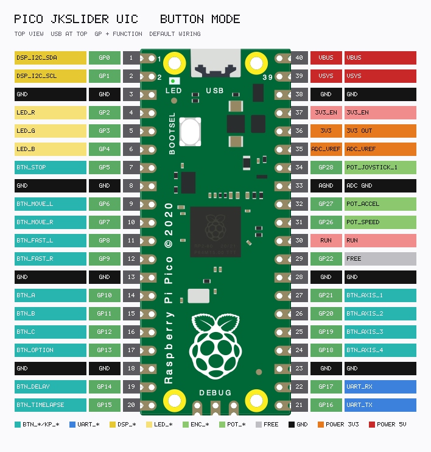
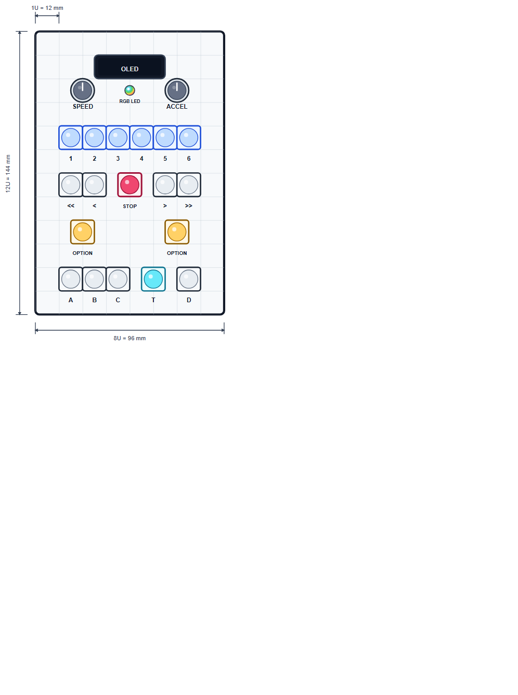

<link rel="stylesheet" type="text/css" href="../tools/SliderCtrl.css">
<style>
:root {
  --doc-title: "Distinct Buttons";
  --doc-path: ".\\SliderDoc\\components\\buttons.md";
}
</style>

# Distinct Buttons

[← Components index](index.md)

**UIC** wiring (panel Pico). Motion axis is on SliderMC — see [ARCHITECTURE.md](../architecture/overview.md.

Discrete one-GPIO-per-switch panel (`JKS_INPUT_MODE = "button"`). Active-low to GND; Pico internal pull-ups.



| Function | Default GP | Config |
|----------|------------|--------|
| STOP | 5 | `PIN_BTN_STOP` |
| MOVE_L / MOVE_R | 6 / 7 | `PIN_BTN_MOVE_L` / `PIN_BTN_MOVE_R` |
| FAST_L / FAST_R | 8 / 9 | `PIN_BTN_FAST_L` / `PIN_BTN_FAST_R` |
| A / B / C | 10 / 11 / 12 | `PIN_BTN_A` / `B` / `C` |
| OPTION | 13 | `PIN_BTN_OPTION` |
| DELAY | 14 | `PIN_BTN_DELAY` (optional) |
| TIMELAPSE | 15 | `PIN_BTN_TIMELAPSE` (optional) |

Recommended panel (12 mm / 1U grid; pots and buttons Ø12 mm; RGB LED Ø5 mm). Clear edge-to-edge gaps; 1U margin to the plate (8U × 12U / 96 × 144 mm). Silk shows AXIS 1–6 above the buttons; Pico button-mode firmware only wires AXIS_1..4. Wire both OPTION switches in parallel to `PIN_BTN_OPTION`.



| Silk | Function |
|------|----------|
| OLED | Symbolic display (above the RGB LED) |
| SPEED / ACCEL | Speed / accel pots |
| `1` … `6` | AXIS_1..6 (sticky selection; Pico GPIOs 1–4 only) |
| ` << ` ` < ` STOP ` > ` ` >> ` | FAST_L / MOVE_L / STOP / MOVE_R / FAST_R |
| OPTION | Modifier (both pads) |
| A / B / C / T / D | Marks / timelapse / delay |

##### Rocker panel (compact)

Three momentary `(ON)-OFF-(ON)` rockers (19 × 13 mm cutouts) plus Ø12 mm STOP / OPTION. No `C`, `DELAY`, or `TIMELAPSE`. Plate ≈ 88 × 118 mm.


| Silk | Function |
|------|----------|
| SPEED / ACCEL | Speed / accel pots |
| RGB LED | Status |
| ` < ` / ` > ` | MOVE_L / MOVE_R |
| ` << ` / ` >> ` | FAST_L / FAST_R |
| A / B | Marks A / B |
| STOP / OPTION | Round pushbuttons |

Keypad alternative: [KeyPads — recommended silk](../components/keypads.md).

**Status:** Working (default panel layout).

**Config example:**

```python
# JKSliderConfig.py
JKS_INPUT_MODE = "button"
PIN_BTN_STOP = 5
PIN_BTN_MOVE_L = 6
PIN_BTN_MOVE_R = 7
PIN_BTN_FAST_L = 8
PIN_BTN_FAST_R = 9
PIN_BTN_A = 10
PIN_BTN_B = 11
PIN_BTN_C = 12
PIN_BTN_OPTION = 13
PIN_BTN_DELAY = 14
PIN_BTN_TIMELAPSE = 15
PIN_BTN_AXIS_1 = 21
PIN_BTN_AXIS_2 = 20
PIN_BTN_AXIS_3 = 19
PIN_BTN_AXIS_4 = 18
PIN_BTN_AXIS_5 = None
PIN_BTN_AXIS_6 = None
JKS_BTN_DEBOUNCE_MS = 30
```

Omit unused optional buttons by leaving pins unwired (or document your custom pin map here when you change defaults).
