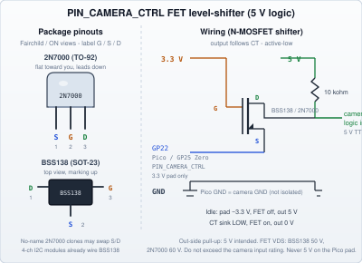

<link rel="stylesheet" type="text/css" href="../tools/SliderCtrl.css">
<style>
:root {
  --doc-title: "Camera Connections (CTRL_CAMERA)";
  --doc-path: ".\\SliderDoc\\components\\camera.md";
}
</style>

# Camera Connections (CTRL_CAMERA)

[← Components index](index.md)

Shutter / intervalometer for timelapse. On the **split stack**, camera is **SliderMC** `PIN_CAMERA_CTRL` / `CT` (Pico **GP22** / Zero **GP25**). UIC `PIN_CTRL_CAMERA` is **None** — do not wire a shutter on the panel Pico. JKSlider Pico GP22 is free; B4Slider Pico GP22 is **AXIS_6**. Zero JKS GP29 is **JOYSTICK_2**. Overview: [ARCHITECTURE.md](../architecture/overview.md) · MC wiring: [pins.md — PIN_CAMERA_CTRL](../mc/pins.md#pin_camera_ctrl-low-active-open-collector).

## SliderMC (`PIN_CAMERA_CTRL`)

Low-active open-collector sink. Two ways to reach the camera:

| Path | Use when |
|------|----------|
| **Optocoupler (PC817)** | Isolated dry contact (typical shutter cable tip/sleeve); no shared ground required |
| **FET level-shifter (BSS138 / 2N7000)** | Camera or box wants **5 V TTL/CMOS**; shared GND OK |




Intended out-side pull-up is **5 V**. FET `V_DS`: BSS138 **50 V**, 2N7000 **60 V**. Pico pad is **3.3 V only** — never put 5 V on `PIN_CAMERA_CTRL`. Full ASCII, pinouts, and voltage notes: [mc/pins.md](../mc/pins.md#pin_camera_ctrl-low-active-open-collector).

## JKSlider MSM (`mc.cameraTrigger` / MC `CT`)

JKSlider does **not** pulse a UIC camera GPIO. MSM `shoot` / `final_shoot` call SliderMC `CT` with `CTRL_CAMERA_PULSE_MS` (kept in `UIC_config.py` as the duration, not a pad). Frame count is local on the panel OLED.

| Mode | Shutter |
|------|---------|
| TL×1 | None — no `CT` during normal / Cont moves |
| TL×N + MSM | `CT` while stopped, then hop |
| TL×N + Cont | Crawl only (SPEED÷N); **no** shutter |
| Idle | None |

Panel / TL settings in `JKSliderConfig.py`: `JKS_CAMERA_FPS`, `JKS_CAMERA_FPS_STEPS`, `JKS_TL_MODE`, `JKS_MSM_EXPOSURE_MS`, `JKS_MSM_SETTLE_MS`. Toggle MSM ↔ Cont with `T`+`D`+`OPTION` (saved).

Wire the camera on the **motion board**. Full write-up: [Technical Manual — camera](../uic/projects/jkslider/technical/panel.md#wiring-schematics--ctrl_camera-shutter--intervalometer).

**Config example:**

```python
# UIC_config.py
PIN_CTRL_CAMERA = None
CTRL_CAMERA_PULSE_MS = 100   # duration passed to mc.cameraTrigger / CT

# JKSliderConfig.py
JKS_CAMERA_FPS = 24
JKS_TL_MODE = "msm"
```

**Photos:** add camera-remote adapters under `../assets/img/components/` when documented.
