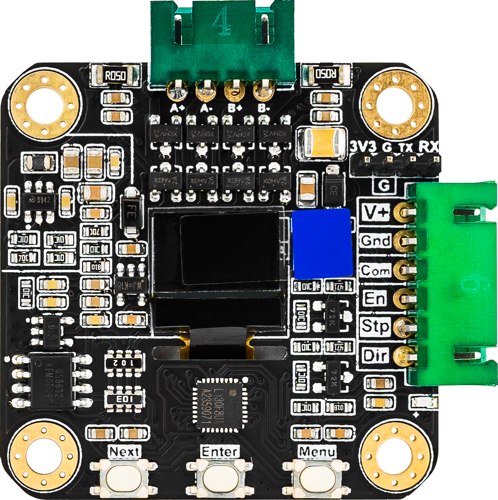

<link rel="stylesheet" type="text/css" href="../tools/SliderCtrl.css">
<style>
:root {
  --doc-title: "Servos and Stepper Motors with integrated Drivers";
  --doc-path: ".\\SliderDoc\\components\\integrated-drivers.md";
}
</style>

# Servos and Stepper Motors with integrated Drivers

[← Components index](index.md)

JKSlider / SliderMC drive motion as **open-loop STEP/DIR** (plus EN and optional ERROR). Integrated closed-loop steppers / BLDC or servo drives that expose a STEP/DIR interface work the same way; the host does **not** read an encoder.

Wire the axis to the **SliderMC** Pico. Pinout: [PINS.md](../mc/pins.md) · [pico_pinout_mc.png](../assets/img/pico_pinout_mc.png) · [CONFIG.md](../mc/config.md) · [ARCHITECTURE.md](../architecture/overview.md)

### Shared SliderMC nets (axis)

| Net | Default GP | Config |
|-----|------------|--------|
| `DRV_STEP` | 18 | `DRV_STEP_active` |
| `DRV_DIR` | 19 | `DRV_DIR_active` |
| `DRV_EN` | 20 | `DRV_EN_active` (typical `0` = active-low) |
| `DRV_ERROR` | **21** | `DRV_ERROR_active` (always polled) |

Mechanics (must match the integrated drive’s microstep/setting) — set on SliderMC as `steps_per_unit` (and related home keys). UIC `UIC_config.py` may keep matching `MICROSTEPS` / `MM_PER_REV` for display helpers only.

| Symbol | Default | Role |
|--------|---------|------|
| Full steps / rev | 200 | 1.8° motor |
| Microsteps | 8 | Must match driver straps / menu |
| mm per rev | 5.0 | Lead / belt pitch × teeth |
| `steps_per_unit` | 320 | e.g. `(200 × 8) / 5` |

### Closed-loop STEP/DIR + alarm → `DRV_ERROR`

**Status:** Working (interface pattern documented in Technical Manual). Concrete SKU: [MKS SERVO42C](#mks-servo42c-nema17-closed-loop) below.

Alarm / stall / OC from the integrated driver → SliderMC `PIN_DRV_ERROR` (**GP21**). Asserting it halts and disables the driver.

```
  Closed-loop driver          SliderMC
  STEP  <-------------------  GP18
  DIR   <-------------------  GP19
  EN    <-------------------  GP20
  GND   --------------------  GND
  ALARM / ERR ---------------> GP21  DRV_ERROR
```

Full notes: [Technical Manual — Closed-loop drivers](../uic/projects/jkslider/technical/motion-installer.md#closed-loop-drivers-and-stall--alarm--drv_error).

**Config example (SliderMC):**

```ini
# mc.ini
steps_per_unit=320
DRV_STEP_active=1
DRV_DIR_active=1
DRV_EN_active=0
DRV_ERROR_active=0
```

### MKS SERVO42C (NEMA17 closed-loop)

| Field | Content |
|-------|---------|
| **Name** | MKS SERVO42C — NEMA17 stepper with integrated closed-loop driver |
| **Status** | `Documented` — wiring and menu from MKS manual + JKSlider STEP/DIR pattern; end-to-end build not yet marked Working |
| **Photos** | [`../assets/img/components/mks-servo42c.png`](../assets/img/components/mks-servo42c.png) (Makerbase product / pinout photo) |
| **Manufacturer** | [Makerbase MKS-SERVO42C](https://github.com/makerbase-mks/MKS-SERVO42C), [wiki](https://github.com/makerbase-mks/MKS-SERVO42C/wiki), [Product introduction](https://github.com/makerbase-mks/MKS-SERVO42C/wiki/Product-introduction) |



JKSlider / SliderMC drive this unit as a normal STEP/DIR axis. The host does **not** use the SERVO42C UART API or read its encoder; closed-loop control stays on the motor board.

#### Pins / schematic

Power the SERVO42C from its own **12–24 V** (or per MKS rating) motor supply — not from the Pico. Share **signal ground**.

Control connector (typical silkscreen order on the board): **V+**, **Gnd**, **Com**, **En**, **Stp**, **Dir**. Motor phases **A+/A−/B+/B−** stay on the SERVO42C — do not wire them to the Pico. The onboard **3V3 / G / Tx / RX** header is for MKS serial tools only (unused by JKSlider/SliderMC).

**`Gnd` vs `Com` (important):**

| Pin | Role | To SliderMC |
|-----|------|-------------|
| **Gnd** | Power / signal ground | **Always** connect to SliderMC **GND** — required common reference |
| **Com** | Signal “common” / high-side reference (MKS: often floating, or 3.3–5 V as opto common) | Usually **leave unconnected** for STEP/DIR; **not** a substitute for `Gnd` |

Connect SliderMC **GND** ↔ SERVO42C **Gnd**, leave **Com** open unless an MKS adapter diagram for your board says otherwise. Connecting only `Com` to GND is wrong for this setup.

| SliderMC net | GP | SERVO42C |
|--------------|-----|----------|
| `DRV_STEP` | 18 | **Stp** |
| `DRV_DIR` | 19 | **Dir** |
| `DRV_EN` | 20 | **En** |
| GND | — | **Gnd** (required); **Com** usually open |
| `DRV_ERROR` (optional) | **21** | Alarm / ERR if your board exposes one |

```
  MKS SERVO42C                SliderMC
  Stp  <--------------------  GP18  DRV_STEP
  Dir  <--------------------  GP19  DRV_DIR
  En   <--------------------  GP20  DRV_EN
  Gnd  ---------------------  GND          (required)
  Com  (usually leave open)
  ALM  ---------------------> GP21  DRV_ERROR   (optional)
  V+ / Gnd  <-- motor supply 12–24 V (separate)
```

Signal inputs accept ~3.3–24 V logic; Pico 3.3 V GPIO is fine when **Gnd** is common with SliderMC GND.

#### Motor menu (SERVO42C OLED)

Calibrate the encoder once per the MKS procedure (shaft free).

| Menu | Recommended |
|------|-------------|
| **Mode** | **`CR_vFOC`** (closed-loop STEP/DIR). Do **not** use `CR_UART` with JKSlider/SliderMC. |
| **MStep** | Fixed microstep (e.g. **8** or **16**) — must match firmware `steps_per_unit`. |
| **En** | **`L`** (low = enabled) to match `DRV_EN_active=0`. Or **Hold** if EN is unused. |
| **Dir** | **CW** or **CCW** so “+mm” matches the mechanics (or flip `DRV_DIR_active`). |
| **Protect** | Optional stall/locked-rotor protection. |
| **0_Mode** | **Disable** — use JKSlider/SliderMC homing, not motor power-on return-to-zero. |
| **MPlyer** | Leave **Enable** (smoother motion); it does **not** change host pulses per rev. |

#### Config (SliderMC)

```ini
steps_per_unit=320
DRV_STEP_active=1
DRV_DIR_active=1
DRV_EN_active=0
DRV_ERROR_active=0
```

`steps_per_unit = (200 × MStep) / mm_per_rev`. Enable with `SE 1`, then test small moves (`MT 10`).

The 42C main header has **no ALM pin**. Do **not** use SliderMC `home_mode` 3/4 (stall-home) on 42C — prefer LIMIT 1/2 or `SP`. If you wire an alarm to `DRV_ERROR`, treat it as EMO only.

### MKS SERVO42D / 57D (STEP/DIR on SliderMC)

These motors can run as a normal pulse axis on SliderMC (STP/DIR/EN + COM). They can also run RS485 with no SliderMC — that path is [mks-servoxx.md](mks-servoxx.md).

Power from the motor supply (typically 12–24 V). Share signal ground. For 3.3 V STEP/DIR, set **COM** to 3.3 V per the MKS pulse-interface note.

| SliderMC net | SERVO42D / 57D |
|--------------|----------------|
| `DRV_STEP` | **Stp** |
| `DRV_DIR` | **Dir** |
| `DRV_EN` | **En** |
| GND | **Gnd** |
| `DRV_ERROR` | **57D `OUT_1`** only (stall: 0 = protected, 1 = unprotected) |

**42D** has no `OUT_1`. Stall (“Wrong”) still latches; clear via screen, UART `3D`, or EN invalid — SliderMC cannot see it. Use `home_mode` 1/2 (`IN_1` / `LIMIT_REMAP`) or `SP`. Do **not** use 3/4.

**57D:** enable **Protect** on the motor menu, wire `OUT_1` → `DRV_ERROR` with `DRV_ERROR_active=0`, set `home_mode` 3 or 4. Firmware pulses EN (MKS pulse-mode clear), waits for `OUT_1` high, then drives out. See [homing-switches.md](homing-switches.md).

Menu: **Mode `CR_vFOC`** (pulse), **En `L`** to match `DRV_EN_active=0`, **Protect** on for stall-home. Do not use 3/4 on `MC_MKS_Client` (RS485).
