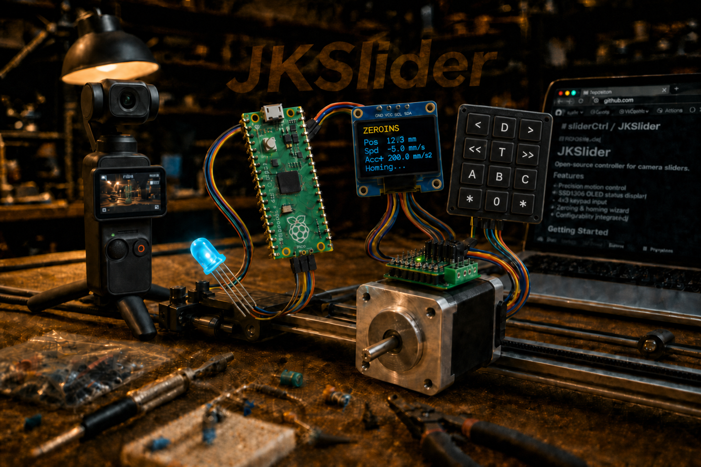

<link rel="stylesheet" type="text/css" href="../tools/SliderCtrl.css">
<style>
:root {
  --doc-title: "Link and handshake (MC ↔ UIC)";
  --doc-path: ".\\SliderDoc\\contract\\link-and-handshake.md";
}
</style>

# Link and handshake (MC ↔ UIC)



UART interconnect and session handshake between the UIC and SliderMC.  
Installer hub: [jkslider/technical/README.md](../uic/projects/jkslider/technical/README.md).

SliderMC wire format: [protocol.md](protocol.md) · [Startup banner](protocol.md#startup-banner) · [Wire rules](protocol.md#wire-rules) · [pins.md](../mc/pins.md).

## Communication MC ↔ UIC

Wire and bring up the UART link before expecting motion from the panel. Full architecture notes: [architecture/overview.md](../architecture/overview.md#interconnect-and-housing). Wire format: [protocol.md](protocol.md). Pins: [pins.md](../mc/pins.md).

### Wiring

**Crossed UART** — Pico TX/RX are GP16/GP17. Waveshare Zero TX/RX are GP12/GP13 (MC env `rp2040zero` / `rp2350zero`, or the UIC `RP2040_ZERO_*` overlay). Cross each board's TX to the other board's RX:

| From | Pico MC | Zero MC |
|------|---------|---------|
| UIC TX (Pico GP16, or Zero GP12) | GP17 | GP13 |
| UIC RX (Pico GP17, or Zero GP13) | GP16 | GP12 |
| UIC GND | GND | GND |

Default baud **115 200**. To change it, edit SliderMC `UART_BAUD` in `include/pins.h` (see [PINS.md](../mc/pins.md)) and match the UIC (`MC_Client` UART). UART is **3.3 V** — do not connect directly to a **5 V** MCU (e.g. classic Arduino) without level shifting.

**Power** — UIC and MC may share **`VSYS`** (+ GND). Example: plug USB into the UIC for debugging; feed the MC from UIC `VSYS` so the motion Pico needs no separate logic supply. Motor VM stays on the driver / motor PSU.

**Stacking** — you can stack the two Picos with jumper pins (e.g. GND pads / headers). Keep **BOOTSEL** accessible for reflashing. Stacking is the compact two-board sandwich; for a long cable between panel and axis, use the **handheld remote** layout below.

**EMO / hard limits** — `DRV_ERROR` and limit switches connect to the **MC** only. The UIC learns emergency stop / hard-limit state from the MC **verbose `#…` status line** (e.g. `#E …`, `#L …`), not from a UIC GPIO.

### Handheld UIC remote (4-wire cable)

The split lets the **UIC** be a **handheld wired remote** while the **MC** sits next to the motor driver and power supply on the rail or base. Only a **4-wire cable** is needed between UIC and MC:

| Conductor | Role |
|-----------|------|
| **5 V** | Logic supply to the far board (usually UIC powered from the MC end) |
| **GND** | Common ground (required) |
| **TX** | UIC TX → MC RX (Pico GP16→GP17, or Zero GP12→GP13) |
| **RX** | UIC RX → MC TX (Pico GP17→GP16, or Zero GP13→GP12) |

**Typical power layout**

1. Motor bus / PSU feeds the driver **VM** and a local **DC/DC buck** to **5 V** at the MC end.
2. That **5 V** + **GND** go over the cable to power the UIC (panel Pico / RP2040 board `VSYS` or equivalent).
3. UART **TX** / **RX** ride the same cable (crossed as in the table above). Logic stays **3.3 V** on the UART pins.

Keep **motor VM** and high current local to the MC / driver — never run motor power through the remote cable. Bench USB on the UIC (MC fed from UIC `VSYS`) remains valid for debugging; the remote layout simply reverses the usual “who supplies 5 V” direction so the handheld panel does not need its own battery.

**Cable length and baud** — default **115 200** baud tolerates longer handheld cables and RS-232 level shifters (MAX232 / MAX3232). For very noisy runs, use a shielded cable, shared GND, or a lower baud (`UART_BAUD` in SliderMC `include/pins.h`, matched in the UIC `MC_Client` UART).

Architecture overview: [../architecture/overview.md](../architecture/overview.md#interconnect-and-housing).

### Session start (handshake)

The MC does **not** send its welcome banner until it sees a `\n` (LF) on the **UIC UART or USB CDC** (whichever arrives first). Bytes before that LF are discarded on both ports. Production panels unlock over UART: the UIC (`MC_Client.start()`) sends **`VH\n`** (the LF also unlocks a waiting MC) and waits for a line starting with `# MC V1 -`, for example:

```text
# MC V1 - Slider Motion Controller - 1+0 axis ['?' for help]
```

The axis suffix is always present (`{motors}+{servos} axis`). When config `name` is set, that name replaces `Slider Motion Controller`. Hosts should match the `# MC V1 -` prefix; see [protocol.md — Startup banner](protocol.md#startup-banner).

If no banner arrives within **100 ms**, the UIC sends another `VH\n`. The default wait is **5 s**. On timeout `start()` prints `UNLINKED` and returns `False`. It does **not** send `SV`. JKSlider and B4Slider still start the panel UI. On success it requires `VP:1`, then sends `SV 1` and reads config. After the protocol loop is running, `VH` reprints the banner. An empty line does not. A UIC-only reboot can re-sync with `VH` and does not need an MC power cycle.

**USB-only bench (no UIC):** open the MC USB serial monitor and press Enter (LF). That unlocks the session and prints the banner so you can type ASCII commands without UART wiring. See [protocol.md — Startup banner](protocol.md#startup-banner).

```mermaid
sequenceDiagram
  participant UIC as MC_Client
  participant MC as SliderMC

  Note over MC: Boot, wait LF on UART or USB
  UIC->>MC: VH_LF
  Note over UIC: wait max 100ms for banner
  alt no banner yet
    UIC->>MC: VH_LF
    Note over UIC: retry until 5s total
  end
  alt banner received
    MC->>UIC: "# MC V1 - …\\n"
    UIC->>MC: "VP\\n"
    MC->>UIC: "VP:1\\n"
    UIC->>MC: "SV 1\\n"
  else timeout 5s
    Note over UIC: print UNLINKED, return False
    Note over UIC: panel UI still starts; no SV
  end
```

After a UIC-only reboot, send `VH` again. The MC reprints the banner without a power cycle. An empty line does not.

## DF_DMC_2_MC (Dragonframe) as a UART client

[DF_DMC_2_MC](https://github.com/fablab-wue/DF_DMC_2_MC) is another host of the same MC UART: it sends **`VH`** then **`CG`** (same as `MC_Client`). USB toward Dragonframe is binary DMC, not this ASCII.

DMC board is always **GP12 TX / GP13 RX**. Cross to the MC:

| DMC | SliderMC Zero | SliderMC Pico |
|-----|---------------|---------------|
| GP12 TX | GP13 RX | GP17 RX |
| GP13 RX | GP12 TX | GP16 TX |
| GND | GND | GND |

Do not connect UIC and DMC to one MC UART at the same time. Slider-side notes: [dmc/README.md](../dmc/README.md). Pinout and wiring: [DF_DMC_2_MC pins](https://github.com/fablab-wue/DF_DMC_2_MC/blob/main/docs/pins.md).

