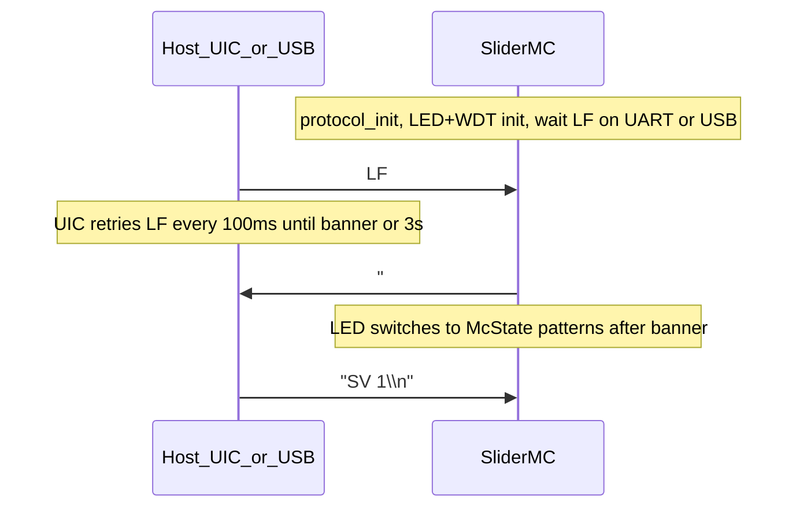

<link rel="stylesheet" type="text/css" href="../tools/SliderCtrl.css">
<style>
:root {
  --doc-title: "SliderMC communication protocol";
  --doc-path: ".\\SliderDoc\\contract\\protocol.md";
}
</style>

# SliderMC communication protocol

ASCII line protocol for the SliderMC motor controller.  
Master/host is the UI controller (or a PC); device is SliderMC.  
Encoding is **byte = ASCII character** (not Unicode).

This document is the source of truth for wire format and commands.

> **Maintainers:** After editing command tables below, regenerate the printable cheat sheet:  
> `python tools/render_command_cheatsheet.py`  
> Keep descriptions aligned with `GROUPS` in that script (see [CONTRIBUTING.md](../CONTRIBUTING.md)).

## Design stance vs GRBL

SliderMC is a **named ASCII CLI** (expert-friendly, UIC-friendly), not a G-code interpreter. It borrows GRBL *ideas*, not G-code syntax.

| GRBL 1.1 | SliderMC |
|----------|----------|
| G-code lines + `$` settings | Two-letter commands (`MT`, `SS`, `CS`); `HL` / `?` = Help |
| Welcome `Grbl X.Xx ['?' for help]` | Startup `# Slider Motion Controller V… ['?' for help]` |
| Realtime single characters outside the line buffer | Same: `#` status, `!` soft stop, ESC halt, `0x18` intercepted before line assembly |
| Status `<Idle\|MPos:…>` on `?` | `#` and verbose push share compact `#…` lines (~3 Hz). `?` is help (needs newline). |
| `ok` / `error:N` per line | Motion/settings **silent** on success; errors `!E:code message`; queries `XX:value` |
| `$N=` EEPROM settings | `CS` / `CG` + `mc.ini` on LittleFS |

**Protocol version:** `VP:1` (does not bump when the wire changes). Short verbs are **exactly two letters** (no `X`/`Y`/`Z` in the verb). Long names (`MoveTo`, `Help`, …) are not accepted. Axis args may be positional or named words (`X`/`Y`/`Z` motors, `A`/`B`/`C` servos — see [Axis args](#axis-args-positional-or-xyz)).

**Not adopted:** full G-code interpreter, spindle/coolant realtime, jog `$J=`, character-count streaming.

**Live channels:** `CS motors 1|2|3` (default 1) and `CS servos 0..3` (default 0). Banner `{motors}+{servos} axis`. `IA` / `CG axis` = packed sum (1..6). **`CS axis` is rejected.** `CS motors` / `CS servos` re-inits GPIO / PIO / PWM **without `RB`**. Letters: motors **X Y Z**, servos **A B C**. See [Live axis count](#live-axis-count-axis), [About dual movement](../mc/dual-movement.md), and [config.md](../mc/config.md) / [pins.md](../mc/pins.md).

## Wire rules

- Line ends with `\n`. `\r` is ignored.
- One command per line, or several separated by `;`.
- Values may be whitespace-separated or glued to the verb (`MT100` / `MT 100` / `MTX20Y50Z100`). Multiple values are whitespace-separated or glued named words.
- Backspace (`0x08` / `0x7F`) edits the current line when typing.
- UART (115200 baud) and USB CDC share the same parser.
- **Debug text is USB-only** — never sent on the UIC UART.
- **Empty line:** ignored (does **not** stop motion). A comment-only line (`/ …`) is also ignored and does **not** reprint the banner.
- **`#` is realtime status**, not a comment. A `#` byte is consumed immediately and never enters the line buffer. Do not paste verbose/banner lines back into the CLI.
- **`/` line comments:** from the first `/` to end of line is discarded (command or `;` chain). `/` is never a value character.
- **`?` without `\n` does nothing** (it is not GRBL status). `?\n` is help, same as `HL`.

### Terminal Mode

**Terminal Mode** (`ST` / session `terminal`, init from config `init_terminal`) is for **experts** who want to watch or type on the MC while a UIC (e.g. JKSlider) drives it over UART.

| Feature | Behavior |
|---------|----------|
| Local echo | Typed characters on the active CLI are echoed when session `terminal=1` |
| UART command sniff | Each complete non-empty command line from the **UIC UART** is **copied to USB only** (via the debug path) **before** it is executed |

Goal: open the MC USB serial monitor and **sniff** UIC→MC command traffic without a separate UART tap. Replies, verbose `#…` status, and errors still use the normal reply path (UART + USB). The sniff copy never loops back onto the UIC UART.

With verbose + terminal together, status lines are still printed only when they change. Use `ST 0` / `CS init_terminal 0` when USB noise or echo is unwanted in production.

### Startup banner

After power-up the protocol task initializes, then **waits for a single `\n` (LF)** on the **UIC UART or USB CDC** (whichever arrives first). Every other byte received on either port before that LF is **discarded** (not parsed as commands).

Only after that LF does the MC send one ready line beginning with `# ` (hash + **space**), distinct from status lines (`#I …`, `#M …`). The banner is mirrored to **USB + UART**.

Base form (1-axis, no device name):

```text
# Slider Motion Controller V1.0 ['?' for help]
```

Optional pieces from config:

| `name` | `motors`+`servos` | Banner |
|--------|-------------------|--------|
| empty | `1+0` | `# Slider Motion Controller V… ['?' for help]` |
| empty | other | `# Slider Motion Controller V… - {motors}+{servos} axis ['?' for help]` |
| set | `1+0` | `# <name> - Slider Motion Controller V… ['?' for help]` |
| set | other | `# <name> - Slider Motion Controller V… - {motors}+{servos} axis ['?' for help]` |

Literal suffix is **`- N+M axis`** (e.g. `1+0 axis`, `1+2 axis`). Config key `name` is printable ASCII (max 31 chars), no `#` or control characters.



**Host recommendation (UIC `SliderBase`):** send `\n` on UART, wait ≤100 ms for a `# ` line, retry; after **3 s** without a banner, report an error on USB/REPL and soft-continue if the panel should still boot offline. Empty `\n` lines after the session is up remain ignored (see Wire rules).

**USB-only bench:** open the MC USB serial monitor and send LF (Enter). The MC LED already blinks the wait pattern (and WDT is armed if `WDT_use=1`) before that LF; Enter unlocks the session, prints the banner, and switches the LED to McState patterns — no UIC or UART wiring required. Then type normal ASCII commands ending in `\n`.

Hosts can treat the banner like GRBL’s welcome string: init finished, ready for commands.

### Reply classes

| Class | Rule | Example |
|-------|------|---------|
| Motion / set / wait success | Silent | `MT 100`, `SS 50`, `WM`, `WP 50`, `WT`, `BE` |
| Error | `!E:<code> <text>` | `!E:soft soft max`, `!E:timeout` |
| Get / Is / Version | `<SHORT>:<value>` | `IM:1`, `GS:50.00`, `VF:1.0`, `VP:1` |
| Config get | `CG:<key>=<value>` | `CG:init_speed=50` |
| Help / Pins dump | Multi-line text (no `ok`) | `?` / `HL` → two-column command table; `VG` → `PIN_*=n`; `IG` → GP / name / desc table |
| Verbose push / `#` | Compact `#` status | `#M 12.5 25 80 100` (1-axis), extra packed channels after ` \| ` (empty `\|\|` = idle 0) |

### State letters

| Letter | Meaning |
|--------|---------|
| `E` | Error (DRV / EMO) |
| `I` | Idle |
| `M` | Moving (cruise) |
| `A` | Accelerating |
| `B` | Decelerating / braking |
| `H` | Homing |
| `P` | Path playback active (`PG`) |
| `L` | Hard-limit alarm |
| `D` | Disabled |
| `T` | Camera trigger (`CT` pulse, or one-shot listen on `PIN_CAMERA_CTRL`) |

`A` / `B` replace `M` only during normal-move ramps (including mid-move speed changes). Homing stays `H`; cruise stays `M`. **`T` overlays** the motion letter: while a `CT` pulse is active (and on verbose push if `SV` is on); listen is one-shot per falling edge. Verbose off → `CT` does not push `#T` (realtime `#` still shows `T` while the pulse is down).

## Realtime characters (no newline)

| Char | Action |
|------|--------|
| `#` | Immediate status — same compact `#…` line as verbose |
| `!` | Soft stop (same urgency as `MS`; does **not** cancel waits/chain) |
| `ESC` (`0x1B`) | Halt (same urgency as `ME`: STEP abort, EN off, cancel waits/chain) |
| `0x18` (Ctrl-X) | Soft reset / clear alarm |

`~` (resume after hold) is reserved. Outgoing verbose/banner lines also start with `#`; that is TX only.

## Units

API values use **mm**, **mm/s**, and **mm/s²** unless a config key says otherwise. Internally the controller uses steps.

## Session vs config

- **S-commands** change **session** RAM only (not written to `mc.ini`), except `SD` which sets live `init_debug_level` (USB debug; not a session field).
- Power-up (and FS load) copies config init (`init_speed`, `init_accel`, `init_terminal`, `init_verbose`) into the session.
- **Bare bool setters** (`SE`, `ST`, `SV`, `EO0`…`EO3`): **toggle** the current logical state.
- **Bare non-bool S-commands** (e.g. `SS`, `SA`, `SD`) reload that parameter from config init (`SD` → default debug level).
- **`SS` / `SA`** reject values above `max_speed_1` / `max_accel_1` with `!E:limit …` (session unchanged).
- **`CS` / `CG`** read/write persistent config keys; `CS` also updates the live session for keys that have a session counterpart (`init_speed`, `init_accel`, `init_terminal`, `init_verbose`).

---

## Commands

Printable one-page overview: [command-cheatsheet.html](command-cheatsheet.html) / [command-cheatsheet.pdf](command-cheatsheet.pdf). Markdown with Call/Reply columns: [command-cheatsheet.md](command-cheatsheet2.md) (regenerate with `python tools/render_command_cheatsheet.py`).

Descriptions below match the printable cheat sheet (`tools/render_command_cheatsheet.py`). Extra notes follow each group. Help (`?` / `HL`) is two columns: short + phrase.

### Axis args (positional or XYZ)

Axis values for the packed live channels (STEP/DIR motors first, then RC servos; up to six). Used by `MT`, `MB`, `MJ`, `SP`, `SL`, `SR`, `PD`. A line is **either** positional **or** named — never mixed (`MT 20 C100` → `!E:parse`).

- **Positional:** one number per channel in order, spaces between them. `_` skips a slot and leaves that channel unchanged (`MT _ _ 100` moves only channel 3). Omitted trailing slots are unchanged (`MT 50` is channel 1 only).
- **Named:** letters `X` `Y` `Z` = motors 1–3, `A` `B` `C` = servos 1–3, then the value (spaces optional: `C100`, `C 100`, `MT C100 B50`). Duplicate letter, unknown letter, or a channel that is not fitted → `!E:parse`.
- `PD` uses the same forms in **µm** (`<axv_um>`); skip `_` or omit named → `0`.
- `MJ` uses signed **percent** (not mm); omitted named extra = `0`; `_` is invalid.
- `SL`/`SR`: `none` clears that side (`SL Z none`, glued `SLnone` / `SLZnone`).
- A huge `MT` target outside the window is **rejected** (`!E:soft`). It does not clip. Hold-to-jog uses `MJ ±100` then `MS`. To run to a rail, `MT` the **known** window end (`GR` / `GL`).

### S — Set (session, silent)

| Short | Phrase | Args | Description |
|-------|--------|------|-------------|
| `SS` | Set Speed | `v` or bare | Cruise speed mm/s (≤ `max_speed_1`); bare reloads `init_speed`; applies live to the next fill (including joy-mode `MJ`). |
| `SA` | Set Accel | `a` or bare | Accel mm/s² (≤ `max_accel_1`); bare reloads `init_accel`; applies live to the next fill (including joy-mode `MJ`). |
| `SE` | Set Enable | `0\|1` or bare | Driver enable 0\|1; bare toggles; required before motion; off stops hard. **`SE 0` also stops servo PWM** (limp); `SE 1` restores the last pulse. |
| `ST` | Set Terminal | `0\|1` or bare | Terminal Mode 0\|1; bare toggles; local echo + UART command sniff to USB. |
| `SV` | Set Verbose | `0\|1` or bare | Verbose status push 0\|1; bare toggles; ~3 Hz `#…` status lines when on. |
| `SD` | Set Debug | `0..5` or bare | USB-only debug level 0..5; bare restores default; never sent on UIC UART. |
| `SL` | Set Left | axis args or bare | Session working-window **min**; bare → envelope (`MOTOR_`/`SERVO_` / packed `axis_min_N`); `none` clears that side (effective → envelope if set). |
| `SR` | Set Right | axis args or bare | Session working-window **max**; bare → envelope; `none` clears that side. |
| `SP` | Set Position | axis args or bare | Redefine the reported pose (no motion). Idle only. Bare or `SP 0` = here is zero. |

`SetMaxSpeed` / max accel / **envelope** soft travel are not session commands — use `CS max_speed_1` / `CS max_accel_1` / `CS MOTOR_N_min` / `CS MOTOR_N_max` / `CS SERVO_N_min` / `CS SERVO_N_max` (packed write-through `axis_min_N` / `axis_max_N`). **`CS slider_*` is rejected.** The live working window is `SL` / `SR` — [working-window.md](../mc/working-window.md). `SP` is the origin tool when `home_mode_N=0` (and is allowed after power-up even if homing is 1–4).

### G — Get (session)

| Short | Phrase | Args | Description |
|-------|--------|------|-------------|
| `GS` | Get Speed | — | Reply `GS:<mm/s>` — current session cruise speed. |
| `GA` | Get Accel | — | Reply `GA:<mm/s2>` — current session acceleration. |
| `GE` | Get Enable | — | Reply `GE:0\|1` — driver enable state. |
| `GT` | Get Terminal | — | Reply `GT:0\|1` — Terminal Mode state. |
| `GV` | Get Verbose | — | Reply `GV:0\|1` — verbose push state. |
| `GD` | Get Debug | — | Reply `GD:<0..5>` — USB debug level. |
| `GL` | Get Left | — | Reply effective left as pipe groups (`GL:0 \| -45`); session None + envelope set → envelope; both None → `-`. Idle 0 is kept explicit. |
| `GR` | Get Right | — | Reply effective right (same pipe / `-` rules as `GL`). |

### I — Is / Info

| Short | Phrase | Args | Description |
|-------|--------|------|-------------|
| `IM` | Is Moving | — | Reply `IM:0\|1` — axis currently moving (or settling). |
| `IH` | Is Homing | — | Reply `IH:0\|1` — homing cycle active. |
| `IL` | Is Limit | — | Reply `IL:0\|1` — at soft-limit position. |
| `IE` | Is Error | — | Reply `IE:0\|1` — `PIN_DRV_ERROR` / EMO latched. |
| `IP` | Is Position | — | Reply `IP:` packed `|` groups, one field per live channel (`IP:10 \| 0 \| -45`). Explicit 0 is kept. |
| `IA` | Is Axis | — | Reply `IA:<n>` — packed live count = `motors+servos` (`CG axis` is the same sum). |
| `IT` | Is Target | — | Reply `IT:<mm>\|-` — axis-1 seek target, or `-` if none. |
| `IR` | Is Ready | — | Reply `IR:1` only if idle, not homing, enabled, and not waiting. |
| `IW` | Is Waiting | — | Reply `IW:1` if any `WT` / `WM` / `WH` / `WP` / `WC` / `WN` wait is active. |
| `ID` | Is Diag | — | Reply underrun count, peak STEP Hz, overshoot steps, min FIFO level. |
| `IC` | Is Cause | — | Reply last chip reset cause (`power\|wdt\|run\|soft\|debug\|brownout\|…`) as `IC:…`. |
| `IG` | Is GPIO | — | ASCII table of GP / name / desc. Extra-axis rows only when that axis is live; `PIN_CAMERA_CTRL` always listed (`CT` / listen); `PIN_BUZZER` when `BUZZER_use=1`. |

Enable state: use `GE` (`GetEnable`). There is no `IsEnabled` command.

### M — Movement (silent)

| Short | Phrase | Args | Description |
|-------|--------|------|-------------|
| `MT` | Move To | axis args | Absolute units; skip `_` or omit named axis idles that axis; needs enable; live-retargets. |
| `MB` | Move By | axis args | Relative units; same skip / named rules as `MT`. |
| `MJ` | Move Joy | axis args | Joystick velocity hold: signed % of session `SS`; omit named extra → `0`; `0` = soft-stop; `SS`/`SA` stay live; clamp to `max_speed_N`. |
| `MH` | Move Home | `[1\|2\|3]` | Homing cycle for a **motor** only; optional axis `1` (default), `2`, or `3`; no-op if that motor `home_mode_N` is `0` (use `SP` for origin); needs `SE 1`; cancel with `MS`/`ME`. Servo letters (`A`/`B`/`C`) → `!E:parse`. There is **no servo homing**. |
| `MS` | Move Stop | — | Soft decelerate to stop; keeps enable; ends joy-mode; does not cancel waits. |
| `ME` | Move E-Stop, Halt | — | Immediate STEP abort; enable off; cancel waits and remaining `;` chain. |

There is **no** `ML` / `MR` jog. Hold-to-jog: `SS` then `MJ ±100` (per-axis `0` on extras), `MS` on release. Run-to-rail: `MT` a known `GL`/`GR` end (a huge target is `!E:soft`, not clipped).

**Skip token** (exact `_` only, positional): on `MT`/`MB`/`SL`/`SR`/`SP` leave that axis unchanged; on `PD` become `0` µm. `none` / `N` / `*` are **not** skips (`!E:parse` on `MT`/`MB`/`PD`). On `SL`/`SR` only, `none` clears that session side (see [working-window.md](../mc/working-window.md)). `MJ` does **not** accept `_` (`!E:parse`). Bare `-` is **not** a skip. 1-arg calls stay valid.

`MH` failures: `!E:home cfg`, `!E:home travel`, `!E:home hard`, `!E:home stall`. Soft-cancel with `MS`; emergency abort with `ME`. `home_mode_N` 1/2 = LIMIT_L/R; 3/4 = stall / `DRV_ERROR` (EN pulse, then drive out). See [config.md](../mc/config.md) / [motion.md](../mc/motion.md).

**`MJ`** is a velocity hold for analogue sticks (typically 5–20 Hz, also acyclic). First `MJ` enters joy-mode; `MT`/`MB`/`MH`/`MS`/`!`/`ME`/`PG` end it. `SS`/`SA` do **not** end joy-mode — they rescale/re-ramp from the last percentages. Soft/hard rails stop like other moves (soft rail is silent; no `!E` spam while the stick stays deflected). It is recommended for the sender (UIC) not to send an `MJ` command if the value has not changed. Integrator guide: [motion-joy.md](../mc/motion-joy.md).

### P — Path (host-authored motion path)

A 2nd, simpler planner for a host-authored motion path: fixed-size time slices, each carrying a signed distance in µm. `PG` plays the buffer at a constant per-slice rate (no accel/decel ramps — the host is trusted to pre-shape speed/accel); `MS`/`ME` end path-mode and decelerate normally from the last path speed, same as a live move.

| Short | Phrase | Args | Description |
|-------|--------|------|-------------|
| `PC` | Path Clear | — | Clear the path buffer (path count → 0); rejected with `!E:busy` while `PG` is active. |
| `PD` | Path Data | axis args | Append signed 16-bit µm sample(s) (-32768..32767); skip `_` or omit named → `0`; increments path count; `!E:parse` / `!E:full`. Allowed while `PG` is active (live-move streaming). |
| `PG` | Path Go | — | Play the path buffer from sample 0 until path count is reached (then auto soft-stop) or `MS`/`ME` is received; needs enable; `!E:disabled` / `!E:empty` / `!E:busy`. May be sent while `PD` is still being streamed in (live move). |
| `PN` | Path Number | — | Reply `PN:<count>` — number of samples currently in the buffer; allowed even while path-mode is active. |
| `PS` | Path Slice | `us` or bare | Set the time-slice length in µs (≥1000); bare reloads `init_path_slice_us`; `!E:parse` below minimum, `!E:busy` while active. |

A sample value of `0` means the axis stands still for that slice. Distance→steps and slice-time→PIO-cycles both use an error-diffusion accumulator so rounding never biases total distance or total playback time. `steps_per_unit_N` and PIO limits apply as usual; speed/accel limits are **not** checked — the host is expected to deliver an already speed/accel-limited path.

While `PG` is active, all other move/session commands are rejected with `!E:busy` — allowed exceptions: `MS`, `ME`, `RB`, `PD` (live-move streaming), `PN`, all `I*`/`G*`/`V*` queries, `IG`, `HL`/`?`, `CG`, `BE`, `CT`. The buffer is retained after playback ends (naturally or via `MS`/`ME`), so `PG` can replay the same data.

Verbose / `#` while in path-mode (state letter `P`) use the same layouts as other moving states (`#P …` with live pos/speed; accel is typically `0` for constant-rate slices).

### E — Extender (silent)

| Short | Phrase | Args | Description |
|-------|--------|------|-------------|
| `EO` | Ext Out | `n [0\|1]` | Channel `0`…`3`; bare `EO0` toggles; `EO0 1` / `EO01` set on; ok during EMO. |

`EO4`… is `!E:parse` (`PIN_EXT_COUNT` is 4). Levels use `EXT_n_active`. Reset to inactive on reboot. Beep / camera pulse are Special (`BE`, `CT`).

### C — Config (persistent)

| Short | Phrase | Args | Description |
|-------|--------|------|-------------|
| `CS` | Config Set | `key value` | Set persistent key value (`mc.ini`); silent ok; updates session init_speed/init_accel/…. |
| `CR` | Config Reset | — | Reset all config to compiled defaults and save `mc.ini`. |
| `CG` | Config Get | `key` or bare | Get key → `CG:key=value`; bare dumps all keys. |

Important keys: `init_speed`, `init_accel`, `max_speed_1`, `max_accel_1`, `max_speed_2`, `max_accel_2`, `max_speed_3`, `max_accel_3`, `steps_per_unit_1`, `unit_name`, `MOTOR_N_min`/`MOTOR_N_max`, `SERVO_N_min`/`SERVO_N_max`, `SERVO_N_min_pulse`/`SERVO_N_max_pulse`/`SERVO_N_swap`, synthesized `axis_min_N`/`axis_max_N`, `motors`, `servos`, `axis` (read-only sum; dump emits it), `name`, `init_verbose`, `init_terminal`, `init_debug_level`, pin keys with the digit **before** the suffix (`DRV_STEP_1_active`, `SW_LIMIT_R_3_use`), `BUZZER_use`, `home_mode_1` / `home_move_out_1` / `home_speed_1` / `home_accel_1`, matching `_2` / `_3` keys, `ramp_start_hz`, `stop_approach_hz`, `dir_change_pause_s`. Synonyms: `steps_per_mm_N`, `soft_min_N` / `soft_max_N` (aliases of packed `axis_min_N`). **`CS axis` and `CS slider_*` are rejected.** See [config.md](../mc/config.md).

A UIC may shrink travel with session `SL` / `SR` (working window) — not by rewriting envelopes. See [working-window.md](../mc/working-window.md) and [marks vs working window](../architecture/marks-vs-working-window.md).

### W — Wait (silent)

| Short | Phrase | Args | Description |
|-------|--------|------|-------------|
| `WT` | Wait Time | `[sec]` | Delay sec then continue `;` chain; bare → 1 s; never `!E:timeout`. |
| `WM` | Wait Moving | `[timeout_s]` | Pause chain until move ends; optional timeout cancels remaining chain. |
| `WH` | Wait Homing | `[timeout_s]` | Pause chain until homing ends; optional timeout cancels remaining chain. |
| `WP` | Wait Pos | `pos [timeout_s]` | Pause until the **time-sync master** position is reached or overstepped; idle → return immediately. |
| `WC` | Wait Cruise | `[timeout_s]` | Pause until status letter `M` (cruise) or idle. |
| `WN` | Wait Not cruise | `[timeout_s]` | Pause until status is not `M`; idle / `A` / `B` → return immediately. |

- Optional timeout in **seconds** (float): `WM100`, `WM 100`, `WP 250 5`, `WC 10`, `WN 3`.
- No timeout arg = wait indefinitely until the condition clears (`WT` is always a delay).
- Success: **silent** (no `OK`); `;` chain continues with the following commands.
- **Timeout** (`WM` / `WH` / `WP` / `WC` / `WN`): `!E:timeout` and **cancel all following commands** on that chain. Motion is not stopped by the timeout alone.
- **`WT` delay expiry:** resumes the chain silently (never `!E:timeout`).
- **`WP`:** **time-sync master** only (first motor with a distance, else first servo). Second number is timeout, not a second-axis pos. Moving `+` → done when `pos >=` mark; moving `−` → `pos <=` mark. Idle / ~0 velocity → return immediately. Bare `WP` → `!E:parse`. `SS`/`SA` are in the master’s units.
- **`WC`:** wait until cruise (`M`); also completes if not moving. While already braking (`B`), waits until idle (or timeout).
- **`WN`:** wait while cruising; already not `M` → return immediately.

In-move scripting (live `SS`/`SA` at waypoints, extender cues): [command chains](../architecture/command-chains.md).

### V — Version

| Short | Phrase | Args | Description |
|-------|--------|------|-------------|
| `VA` | Version About | — | Reply `VA:` about string (name, version, author). |
| `VF` | Version FW | — | Reply `VF:<version>` — firmware version. |
| `VP` | Version Protocol | — | Reply `VP:<n>` — protocol version (`1`). Wire may change without bumping `VP`. |
| `VG` | Version GPIO | — | List `PIN_*=GPIO` lines (machine-readable). Extra-axis pins only when that axis is live; `PIN_CAMERA_CTRL` always listed; `PIN_BUZZER` when `BUZZER_use=1`. |

### Special

| Short | Phrase | Args | Description |
|-------|--------|------|-------------|
| `RB` | Reboot | — | Soft MCU reset (no power cycle); EN off first. Allowed during EMO / path. Next `IC` → `soft`. |
| `BE` | Beep | `[ms]` | Pulse `PIN_BUZZER` (non-blocking). Bare → 100 ms; clamp 1..1000. Not a wait (`IW` unchanged). No-op if `BUZZER_use=0` or the pin aliases `PIN_LED`. OK during EMO / path. Re-issue restarts the pulse. Enable with `CS BUZZER_use 1` (default 0). |
| `CT` | Camera Trigger | `[ms]` | Pulse `PIN_CAMERA_CTRL` low (open-collector sink, 12 mA), then release to pull-up. Bare → 100 ms; clamp 1..60000. Not a wait; motion continues. OK during EMO / path. Status letter `T` while pulsing (verbose on: at least one `#T`; verbose off: silent). Wiring: [pins.md](../mc/pins.md). |
| `HL` / `?` | Help | — | Two-column ASCII table of all commands. `?` needs newline (not realtime). |

Realtime `#` / `!` / `ESC` are not line commands — see [Realtime characters](#realtime-characters-no-newline). Breaking wire (`ME`, `?` help, `#` status only, `/` comments, `CT`) does **not** bump `VP` — still `VP:1`.

### Stop vs Halt

| Command | Deceleration | Enable | Waits / `;` chain |
|---------|--------------|--------|-------------------|
| `MS` / realtime `!` | Soft (accel ramp) | unchanged | not canceled (`!`); `MS` does not cancel waits |
| `ME` / realtime `ESC` | Immediate hard abort | forced `0` | canceled |

Hard-limit trips and `PIN_DRV_ERROR` use the same internal halt path as `ME`.

### `PIN_DRV_ERROR` (E-stop / driver fault)

Polled with ~20 ms debounce (including **already asserted at power-up**). While asserted: `IE:1`, state letter `E`, halt applied, most commands rejected with `!E:emo active`.

Allowed while error active: `IE`, `IA`, `ID`, `IC`, `IG`, `VA`/`VF`/`VP`, `VG`, `HL`/`?`, `CS`/`CR`/`CG`, `ME`, `RB`, `EO0`…`EO3`, `BE`, `CT`, realtime `#` / `0x18`. When the pin releases, `drv_error` clears (`enable` stays 0 until `SE 1`).

---

<a id="live-axis-count-axis"></a>

## Live axis count (`motors` + `servos`)

| Board | Support |
|-------|---------|
| Pico / Pico W / Pico 2 / Pico 2 W | `CS motors 1..3`, `CS servos 0..3`. Servo PWM on GP26/27/18 (GP18 steals EXT_4 when `servos>=3`). |
| RP2040-Zero / RP2350 Mini | Same counts. Servo PWM on GP21–23. |

Packed live channels = `motors + servos` (1..6). `IA` replies that sum; bare `CG` dump includes synthesized `axis=<sum>`. Extra-arg `MT`/`MB`/`PD`/`MJ`/`SL`/`SR`/`SP` apply (motors then servos). `WP` uses the **time-sync master**. `IG` / `VG` list extra motor / servo pins only while fitted; `PIN_CAMERA_CTRL` is always listed (`CT` / listen). See [pins.md](../mc/pins.md). Joy-mode (`MJ`) drives packed channels independently (not dual-MT time-sync) — [motion-joy.md](../mc/motion-joy.md).

**Servo PWM:** 100 Hz, wrap 65535. Envelope ±135° maps onto `SERVO_N_min_pulse`…`max_pulse` (default **500–2500 µs**; analog 1000–2000). Default-span resolution is **~1.25 arc minutes (′)** per PWM count (~0.021°). `SERVO_N_swap` reverses mechanical sense; `SERVO_N_active` inverts polarity. `SE 0` stops PWM (limp); `SE 1` restores the last pulse. Boot pose 0° is clamped to the envelope. Path buffer is split across packed channels (`PATH_AXES` 6).

---

## Verbose push (~3 Hz when session verbose=1)

Verbose mode pushes compact `#…` status so the UIC can refresh a display (e.g. OLED). It also acts as a **heartbeat** that the MC is alive.

Each packed channel is a **1-axis field group**. Extra live channels append the same group after a ` | ` separator. The state letter is **machine-wide** (one `McState`), not per-axis. Idle **lone `0` elides**; empty `||` groups are idle 0 (`#I 10 || -45`). `IP` / `GL` / `GR` keep explicit 0 with ` | `.

### 1-axis group (`motors+servos=1`, or each side of ` | `)

```text
#<state> <pos> [<speed> <accel> [<target>]]
```

Homing (`#H`) includes speed and accel but **omits target**. Servos are never homed.

### Extra packed channels

```text
#<state> <pos1> [<speed1> <accel1> [<target1>]] | <pos2> … [| …]
```

| State | Line |
|-------|------|
| Idle / non-moving (`I`, `E`, `D`, `L`, …) | `#<letter> <pos1> \| <pos2>` (empty group `\|\|` = idle 0) |
| Homing (`H`) | `#H <pos1> <speed1> <accel1> \| <pos2> …` — **no targets** |
| Moving (`M`, `A`, `B`, `P`, …) | `#<letter> <pos1> <speed1> <accel1> <target1> \| <pos2> …` |

- A 1-axis reader can take the first group and ignore everything after ` | `.
- Count of ` | ` separators is packed-count − 1 when groups are not elided; trailing idle 0 may be omitted.
- Numbers use at most **2 decimal digits**, without trailing zeros (`100`, `100.1`, `0.1`).
- When moving/homing, **speed** / **accel** magnitudes use absolute values (`fabs`).
- **accel** is measured `dv/dt` magnitude (lightly smoothed), not the `SA` setpoint; **0** in cruise.
- 1-axis **target** is present only for position seeks (not continuous jog / soft-stop bleed). Multi-axis moving lines emit a target per group.
- With **Terminal Mode + verbose** together, a status line is printed only when it **differs** from the previous one.
- With verbose alone (terminal off), lines are still pushed every ~3 Hz even if unchanged.

Examples (1 packed channel):

```text
#I 12.5
#A 12.5 10 80 100
#M 12.5 25 0 100
#H 10 25 20
#L 0
```

Examples (2 packed channels):

```text
#I 123.45 | 67.8
#H 10 25 20 | 0 25 20
#M 123.45 10 50 200 | 67.8 5 25 90
```

Examples (1 motor + 2 servos, idle 0 elided in the middle):

```text
#I 10 || -45
#M 10 25 0 100 | 0 0 0 0 | -45 5 20 -45
```

## Status report (`?`)

Same format as verbose push (one immediate `#…` line).

---

## Error codes

| Code | Meaning |
|------|---------|
| `parse` | Unknown command or bad arguments |
| `disabled` | Motion while disabled |
| `soft` | Soft-limit rejection |
| `hard` | Hard-limit / alarm |
| `emo` | `PIN_DRV_ERROR` active / command blocked (`active`) |
| `busy` | Illegal during homing/alarm |
| `cfg` | Unknown config key or bad value |
| `home` | Homing rejected/aborted (`cfg`, `travel`, `hard`) |
| `timeout` | `WM` / `WH` / `WP` / `WC` / `WN` timed out; remainder of `;` chain canceled |

Format: `!E:<code> <short text>`

---

## Examples

```text
SE 1
SS 50
SA 200
MT 100;WM
IM
VA
```

Typical replies:

```text
IM:0
VA:Slider Motion Controller V1.0 by Jochen Krapf
```

```text
MT 500;WM 30;SS 10
```

If the move is not finished within 30 s → `!E:timeout` and `SS 10` is not executed.

```text
MT 100;WM;SS 12
ME
```

`ME` emergency-halts (EN off) and cancels the wait / following `SS 12`.

```text
WT;GS
```

After ~1 s delay, `GS` runs.

```text
SS20;MT300;WP100;SS50;WP200;SS20;WM
SA100;MT300;WC;SA5;WM
MT 500; WP 250; EO1 1; WM
```

In-move retarget and cues (no stop between marks): [command chains](../architecture/command-chains.md).

```text
#
#I 100
```

```text
SV 1
#I 100
```

Joystick hold (see [motion-joy.md](../mc/motion-joy.md)). UIC should **not** resend `MJ` if the value is unchanged:

```text
SE 1
SS 30
MJ 5
MJ 10
MJ 100
SS 50
MJ 100
MJ 50
MJ 0
MS
```
