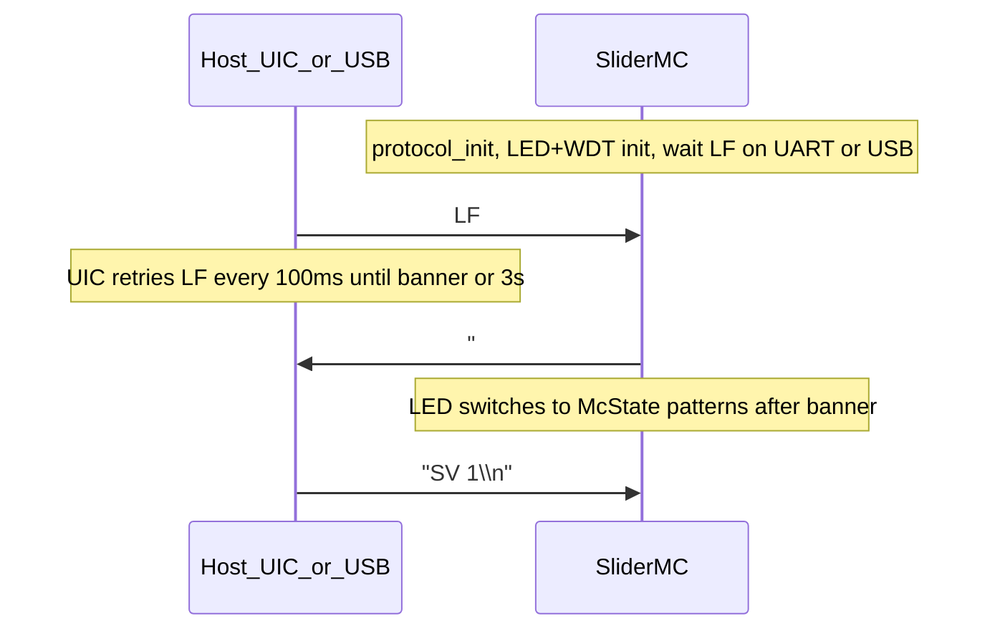

# SliderMC communication protocol

ASCII line protocol for the SliderMC motor controller.  
Master/host is the UI controller (or a PC); device is SliderMC.  
Encoding is **byte = ASCII character** (not Unicode).

This document is the source of truth for wire format and commands.

> **Maintainers:** After editing command tables below, regenerate the printable cheat sheet:  
> `python tools/render_command_cheatsheet.py`  
> Keep descriptions aligned with `GROUPS` in that script (see [CONTRIBUTING.md](../CONTRIBUTING.md)).

## Design stance vs GRBL

SliderMC is a **named ASCII CLI** (expert-friendly, UIC-friendly), not a G-code interpreter. It borrows GRBL *ideas*, not G-code syntax.

| GRBL 1.1 | SliderMC |
|----------|----------|
| G-code lines + `$` settings | Short named commands (`MT`, `SS`, `CS`); `$` = Help |
| Welcome `Grbl X.Xx ['$' for help]` | Startup `# Slider Motion Controller V… ['$' for help]` |
| Realtime single characters outside the line buffer | Same: `?`, `!`, `0x18` intercepted before line assembly |
| Status `<Idle\|MPos:…>` on `?` | `?` and verbose push share compact `#…` lines (~3 Hz) |
| `ok` / `error:N` per line | Motion/settings **silent** on success; errors `!E:code message`; queries `XX:value` |
| `$N=` EEPROM settings | `CS` / `CG` + `mc.ini` on LittleFS |

**Not adopted in v1:** full G-code (incl. multi-axis XYZ words), spindle/coolant realtime, jog `$J=`, character-count streaming.

**Optional 2nd STEP/DIR axis:** enable with config `axis2_use=1` on **Pico / Pico W / RP2040-Zero**. When active, dual-arg motion/`PD`, dual verbose/`?`/`IP` fields, and a `- 2 Axis` banner suffix apply. See [Optional 2nd axis](#optional-2nd-axis-axis2_use), [About dual movement](../mc/dual-movement.md), and [config.md](../mc/config.md) / [pins.md](../mc/pins.md).

## Wire rules

- Line ends with `\n`. `\r` is ignored.
- One command per line, or several separated by `;`.
- Values may be whitespace-separated or glued to the verb (`MT100` / `MT 100`). Multiple values are whitespace-separated.
- Backspace (`0x08` / `0x7F`) edits the current line when typing.
- UART (1 Mbaud) and USB CDC share the same parser.
- **Debug text is USB-only** — never sent on the UIC UART.
- **Empty line:** ignored (does **not** stop motion).
- **Comments:** `#` starts a Python-style comment to end of line; that text is ignored. A line that is only a comment (or whitespace + comment) is ignored with **no** error. Inline comments work (`mt100 # go home`). Pasted verbose/status lines that begin with `#` (`#M …`, `#A …`, `#I …`, startup banner) are likewise ignored when replayed into the CLI.

### Terminal Mode

**Terminal Mode** (`ST` / session `terminal`, init from config `init_terminal`) is for **experts** who want to watch or type on the MC while a UIC (e.g. JKSlider) drives it over UART.

| Feature | Behavior |
|---------|----------|
| Local echo | Typed characters on the active CLI are echoed when session `terminal=1` |
| UART command sniff | Each complete non-empty command line from the **UIC UART** is **copied to USB only** (via the debug path) **before** it is executed |

Goal: open the MC USB serial monitor and **sniff** UIC→MC command traffic without a separate UART tap. Replies, verbose `#…` status, and errors still use the normal reply path (UART + USB). The sniff copy never loops back onto the UIC UART.

With verbose + terminal together, status lines are still printed only when they change. Use `ST 0` / `CS init_terminal 0` when USB noise or echo is unwanted in production.

### Startup banner

After power-up the protocol task initializes, then **waits for a single `\n` (LF)** on the **UIC UART or USB CDC** (whichever arrives first). Every other byte received on either port before that LF is **discarded** (not parsed as commands).

Only after that LF does the MC send one ready line beginning with `# ` (hash + **space**), distinct from status lines (`#I …`, `#M …`). The banner is mirrored to **USB + UART**.

Base form (1-axis, no device name):

```text
# Slider Motion Controller V1.0 ['$' for help]
```

Optional pieces from config:

| `name` | `axis2_use` (and board supports it) | Banner |
|--------|--------------------------------------|--------|
| empty | off | `# Slider Motion Controller V… ['$' for help]` |
| empty | on | `# Slider Motion Controller V… - 2 Axis ['$' for help]` |
| set | off | `# <name> - Slider Motion Controller V… ['$' for help]` |
| set | on | `# <name> - Slider Motion Controller V… - 2 Axis ['$' for help]` |

Literal suffix is **`- 2 Axis`** (space before `2`). Config key `name` is printable ASCII (max 31 chars), no `#` or control characters.



**Host recommendation (UIC `SliderBase`):** send `\n` on UART, wait ≤100 ms for a `# ` line, retry; after **3 s** without a banner, report an error on USB/REPL and soft-continue if the panel should still boot offline. Empty `\n` lines after the session is up remain ignored (see Wire rules).

**USB-only bench:** open the MC USB serial monitor and send LF (Enter). The MC LED already blinks the wait pattern (and WDT is armed if `WDT_use=1`) before that LF; Enter unlocks the session, prints the banner, and switches the LED to McState patterns — no UIC or UART wiring required. Then type normal ASCII commands ending in `\n`.

Hosts can treat the banner like GRBL’s welcome string: init finished, ready for commands.

### Reply classes

| Class | Rule | Example |
|-------|------|---------|
| Motion / set / wait success | Silent | `MT 100`, `SS 50`, `WM`, `W` |
| Error | `!E:<code> <text>` | `!E:soft soft max`, `!E:timeout` |
| Get / Is / Version | `<SHORT>:<value>` | `IM:1`, `GS:50.00`, `VF:1.0` |
| Config get | `CG:<key>=<value>` | `CG:init_speed=50` |
| Help / Pins dump | Multi-line text (no `ok`) | `$` / `Help` / `HL` → ASCII command table; `VG` / `VersionGPIO` → `PIN_*=n`; `IX` / `Pinout` → GP / name / desc table |
| Verbose push / `?` | Compact `#` status | `#M 12.5 25 80 100` (1-axis) or `#M 12.5 67.8 10 5 50 25 200 90` (2-axis) |

### State letters

| Letter | Meaning |
|--------|---------|
| `E` | Error (DRV / EMO) |
| `I` | Idle |
| `M` | Moving (cruise) |
| `A` | Accelerating |
| `B` | Decelerating / braking |
| `H` | Homing |
| `P` | Path playback active (`PG`) |
| `L` | Hard-limit alarm |
| `D` | Disabled |

`A` / `B` replace `M` only during normal-move ramps (including mid-move speed changes). Homing stays `H`; cruise stays `M`.

## Realtime characters (no newline)

| Char | Action |
|------|--------|
| `?` | Immediate status — same compact `#…` line as verbose |
| `!` | Soft stop (same urgency as `MS`; does **not** cancel waits/chain) |
| `0x18` (Ctrl-X) | Soft reset / clear alarm |

`~` (resume after hold) is reserved.

## Units

API values use **mm**, **mm/s**, and **mm/s²** unless a config key says otherwise. Internally the controller uses steps.

## Session vs config

- **S-commands** change **session** RAM only (not written to `mc.ini`), except `SD` which sets live `init_debug_level` (USB debug; not a session field).
- Power-up (and FS load) copies config init (`init_speed`, `init_accel`, `init_terminal`, `init_verbose`) into the session.
- **Bare bool setters** (`SE`, `ST`, `SV`, `Xn` / `Extn`): **toggle** the current logical state.
- **Bare non-bool S-commands** (e.g. `SS`, `SA`, `SD`) reload that parameter from config init (`SD` → default debug level).
- **`SS` / `SA`** reject values above `max_speed` / `max_accel` with `!E:limit …` (session unchanged).
- **`CS` / `CG`** read/write persistent config keys; `CS` also updates the live session for keys that have a session counterpart (`init_speed`, `init_accel`, `init_terminal`, `init_verbose`).

---

## Commands

Printable one-page overview: [command-cheatsheet.html](command-cheatsheet.html) / [command-cheatsheet.pdf](command-cheatsheet.pdf). Markdown with Call/Reply columns: [command-cheatsheet.md](command-cheatsheet.md) (regenerate with `python tools/render_command_cheatsheet.py`).

Descriptions below match the printable cheat sheet (`tools/render_command_cheatsheet.py`). Extra notes follow each group.

### S — Set (session, silent)

| Short | Long | Args | Description |
|-------|------|------|-------------|
| `SS` | `SetSpeed` | `v` or bare | Set cruise speed mm/s (≤ `max_speed`); bare reloads `init_speed`; applies live to the next fill. |
| `SA` | `SetAccel` | `a` or bare | Set accel mm/s² (≤ `max_accel`); bare reloads `init_accel`; applies live to the next fill. |
| `SE` | `SetEnable` | `0\|1` or bare | Driver enable 0\|1; bare toggles; required before motion; off stops hard. |
| `ST` | `SetTerminal` | `0\|1` or bare | Terminal Mode 0\|1; bare toggles; local echo + UART command sniff to USB. |
| `SV` | `SetVerbose` | `0\|1` or bare | Verbose status push 0\|1; bare toggles; ~3 Hz `#…` status lines when on. |
| `SD` | `SetDebug` | `0..5` or bare | USB-only debug level 0..5; bare restores default; never sent on UIC UART. |

`SetMaxSpeed` / max accel / soft limits are not session commands — use `CS max_speed` / `CS max_accel` / `CS slider_min` / `CS slider_max`.

### G — Get (session)

| Short | Long | Args | Description |
|-------|------|------|-------------|
| `GS` | `GetSpeed` | — | Reply `GS:<mm/s>` — current session cruise speed. |
| `GA` | `GetAccel` | — | Reply `GA:<mm/s2>` — current session acceleration. |
| `GE` | `GetEnable` | — | Reply `GE:0\|1` — driver enable state. |
| `GT` | `GetTerminal` | — | Reply `GT:0\|1` — Terminal Mode state. |
| `GV` | `GetVerbose` | — | Reply `GV:0\|1` — verbose push state. |
| `GD` | `GetDebug` | — | Reply `GD:<0..5>` — USB debug level. |

### I — Is / Info

| Short | Long | Args | Description |
|-------|------|------|-------------|
| `IM` | `IsMoving` | — | Reply `IM:0\|1` — axis currently moving (or settling). |
| `IH` | `IsHoming` | — | Reply `IH:0\|1` — homing cycle active. |
| `IL` | `IsLimit` | — | Reply `IL:0\|1` — at soft-limit position. |
| `IE` | `IsError` | — | Reply `IE:0\|1` — `PIN_DRV_ERROR` / EMO latched. |
| `IP` | `IsPosition` | — | Reply `IP:<mm>` — axis-1 position; with axis2 on: `IP:<mm1> <mm2>`. |
| `IA` | `IsAxis` / `Axis` | — | Reply `IA:1` or `IA:2` — active axis count (`config_axis2_enabled()`). |
| `IT` | `IsTarget` | — | Reply `IT:<mm>\|-` — axis-1 seek target, or `-` if none. |
| `IR` | `IsReady` | — | Reply `IR:1` only if idle, not homing, enabled, and not waiting. |
| `IW` | `IsWaiting` | — | Reply `IW:1` if any `W` / `WM` / `WH` wait is active. |
| `ID` | `IsDiag` | — | Reply underrun count, peak STEP Hz, overshoot steps, min FIFO level. |
| `IZ` | `IsReset` | — | Reply last chip reset cause (`power\|wdt\|run\|soft\|debug\|brownout\|…`). |
| `IX` | `Pinout` | — | ASCII table of GP / name / desc. Axis-2 rows only when `axis2_use=1`; Pico omits overlapping DBG while axis2 is on. |

Enable state: use `GE` (`GetEnable`). There is no `IsEnabled` command.

### M — Movement (silent)

| Short | Long | Args | Description |
|-------|------|------|-------------|
| `MT` | `MoveTo` | `x [y]` | Absolute mm; optional 2nd arg = axis2 when enabled; skip tokens idle that axis; needs enable; live-retargets. |
| `M` | `Move` / `MoveBy` | `x [y]` | Relative mm (alias `MoveBy`); dual-arg same as `MT` when axis2 on. |
| `ML` | `MoveLeft` | `[0\|1\|2]` | Continuous jog negative; optional mask (axis2 on): `0`=both, `1`=axis1, `2`=axis2; soft-stop with `MS` or `!`. |
| `MR` | `MoveRight` | `[0\|1\|2]` | Continuous jog positive; mask same as `ML`. |
| `MH` | `MoveHome` | `[1\|2]` | Homing cycle; optional axis `1` (default) or `2` when axis2 on; no-op if that axis `home_mode` is `0`; needs `SE 1`; cancel with `MS`/`H`. |
| `MS` | `MoveStop` | — | Soft decelerate to stop; keeps enable; does not cancel waits. |

**Skip tokens** (case-insensitive `none`/`N`, or exact `_`/`*`): on `MT`/`M` leave that axis idle; on `PD` become `0` µm. Bare `-` is **not** a skip (parses as a number).

`MH` / `MoveHome` failures: `!E:home cfg`, `!E:home travel`, `!E:home hard`. Soft-cancel with `MS`; emergency abort with `H`/`HT`/`Halt`.

### P — Path (host-authored motion path)

A 2nd, simpler planner for a host-authored motion path: fixed-size time slices, each carrying a signed distance in µm. `PG` plays the buffer at a constant per-slice rate (no accel/decel ramps — the host is trusted to pre-shape speed/accel); `MS`/`H` end path-mode and decelerate normally from the last path speed, same as a live move.

| Short | Long | Args | Description |
|-------|------|------|-------------|
| `PC` | `PathClear` | — | Clear the path buffer (path count → 0); rejected with `!E:busy` while `PG` is active. |
| `PD` | `PathData` | `um [um2]` | Append signed 16-bit µm sample(s) (-32768..32767); with axis2 on, optional 2nd sample for axis2 (skip → `0`; single arg → `(a, 0)`); increments path count; `!E:parse` / `!E:full`. Allowed while `PG` is active (live-move streaming). |
| `PG` | `PathGo` | — | Play the path buffer from sample 0 until path count is reached (then auto soft-stop) or `MS`/`H` is received; needs enable; `!E:disabled` / `!E:empty` / `!E:busy`. May be sent while `PD` is still being streamed in (live move). |
| `PN` | `PathNumber` | — | Reply `PN:<count>` — number of samples currently in the buffer; allowed even while path-mode is active. |
| `PS` | `PathSlice` | `us` or bare | Set the time-slice length in µs (≥1000); bare reloads `init_path_slice_us`; `!E:parse` below minimum, `!E:busy` while active. |

A sample value of `0` means the axis stands still for that slice. Distance→steps and slice-time→PIO-cycles both use an error-diffusion accumulator so rounding never biases total distance or total playback time. `steps_per_unit` and PIO limits apply as usual; speed/accel limits are **not** checked — the host is expected to deliver an already speed/accel-limited path.

While `PG` is active, all other move/session commands are rejected with `!E:busy` — allowed exceptions: `MS`, `H`/`HT`/`Halt`, `RB`/`Reboot`, `PD`/`PathData` (live-move streaming), `PN`/`PathNumber`, all `I*`/`G*`/`V*` queries, `IX`/`Pinout`, `Help`/`HL`/`$`, `CG`/`ConfigGet`. The buffer is retained after playback ends (naturally or via `MS`/`H`), so `PG` can replay the same data.

Verbose / `?` while in path-mode (state letter `P`) use the same layouts as other moving states (`#P …` with live pos/speed; accel is typically `0` for constant-rate slices).
### X — Extender outputs (silent)

| Short | Long | Args | Description |
|-------|------|------|-------------|
| `X0`…`X3` | `Ext0`…`Ext3` | `0` \| `1` or bare | Ext out n logical 0\|1; bare toggles; glued `X00`≡`X0 0`; ok during EMO. |

Glued args work like other commands: `X00` ≡ `X0 0`, `X01` ≡ `X0 1`, `X10` ≡ `X1 0`. Levels use `EXT_n_active`. Reset to inactive on reboot. **`X4`…`X9` / `Ext4`…`Ext9` are rejected** (`!E:parse`) — `PIN_EXT_COUNT` is 4.

### C — Config (persistent)

| Short | Long | Args | Description |
|-------|------|------|-------------|
| `CS` | `ConfigSet` | `key value` | Set persistent key value (`mc.ini`); silent ok; updates session init_speed/init_accel/…. |
| `CR` | `ConfigReset` | — | Reset all config to compiled defaults and save `mc.ini`. |
| `CG` | `ConfigGet` | `key` or bare | Get key → `CG:key=value`; bare dumps all keys. |
| `RB` | `Reboot` | — | Soft MCU reset (no power cycle): halt/EN off, then reboot. Next `IZ` → `soft`. |

Important keys: `init_speed`, `init_accel`, `max_speed`, `max_accel`, `steps_per_unit`, `unit_name`, `slider_min`, `slider_max`, `axis2_use`, `name`, `init_verbose`, `init_terminal`, `init_debug_level`, pin `*_active` levels (incl. `EXT_0_active`…`EXT_3_active`), `home_mode` / `home_move_out` / `home_speed` / `home_accel`, matching `*_2` keys when using axis2, `ramp_start_hz`, `stop_approach_hz`, `dir_change_pause_s`. Legacy aliases `steps_per_mm` / `steps_per_mm_2` still work on `CS`/`CG`. See [config.md](../mc/config.md).

### W — Wait (silent)

| Short | Long | Args | Description |
|-------|------|------|-------------|
| `W` | `Wait` | `[sec]` | Delay sec then continue `;` chain; bare → 1 s; never `!E:timeout`. |
| `WM` | `WaitMoving` | `[timeout_s]` | Pause chain until move ends; optional timeout cancels remaining chain. |
| `WH` | `WaitHoming` | `[timeout_s]` | Pause chain until homing ends; optional timeout cancels remaining chain. |

- `WM` / `WH` optional timeout in **seconds** (float): `WM100`, `WM 100`, `WH 5.5`.
- No timeout arg on `WM`/`WH` = wait indefinitely until the condition clears.
- Success: **silent** (no `OK`); `;` chain continues with the following commands.
- **`WM`/`WH` timeout:** `!E:timeout` and **cancel all following commands** on that chain. Motion is not stopped by the timeout alone.
- **`W` delay expiry:** resumes the chain silently (never `!E:timeout`).

### V — Version

| Short | Long | Args | Description |
|-------|------|------|-------------|
| `VA` | `VersionAbout` | — | Reply `VA:` about string (name, version, author). |
| `VF` | `VersionFW` | — | Reply `VF:<version>` — firmware version. |
| `VP` | `VersionProtocol` | — | Reply `VP:<n>` — protocol version. |

### Special

| Short | Long | Args | Description |
|-------|------|------|-------------|
| `H` / `HT` | `Halt` | — | Immediate STEP abort; enable off; cancel waits and remaining `;` chain. |
| `RB` | `Reboot` | — | Soft MCU reset (no power cycle); EN off first. Allowed during EMO / path. |
| `VG` | `VersionGPIO` | — | List `PIN_*=GPIO` lines (machine-readable). Axis-2 pins only when `axis2_use=1`; Pico omits overlapping DBG while axis2 is on. |
| `IX` | `Pinout` | — | ASCII table of GP / name / desc. Axis-2 rows only when `axis2_use=1`; Pico omits overlapping DBG while axis2 is on. |
| `$` / `HL` | `Help` | — | ASCII table of all commands (≤80 columns). |

### Stop vs Halt

| Command | Deceleration | Enable | Waits / `;` chain |
|---------|--------------|--------|-------------------|
| `MS` / realtime `!` | Soft (accel ramp) | unchanged | not canceled (`!`); `MS` does not cancel waits |
| `H` / `HT` / `Halt` | Immediate hard abort | forced `0` | canceled |

Hard-limit trips and `PIN_DRV_ERROR` use the same internal halt path as `H`/`HT`.

### `PIN_DRV_ERROR` (E-stop / driver fault)

Polled with ~20 ms debounce (including **already asserted at power-up**). While asserted: `IE:1`, state letter `E`, halt applied, most commands rejected with `!E:emo active`.

Allowed while error active: `IE`, `IA`/`Axis`/`IsAxis`, `ID`, `IZ`, `IX`/`Pinout`, `VA`/`VF`/`VP`, `VG`, `Help`/`HL`/`$`, `CS`/`CR`/`CG`, `H`/`HT`/`Halt`, `RB`/`Reboot`, `X0`…`X3` / `Ext0`…`Ext3`, realtime `?` / `0x18`. When the pin releases, `drv_error` clears (`enable` stays 0 until `SE 1`).

---

## Optional 2nd axis (`axis2_use`)

| Board | Support |
|-------|---------|
| Pico / Pico W | Yes — `CS axis2_use 1` enables dual STEP/DIR (DBG GP10–13 reclaimed) |
| RP2040-Zero | Yes — dual STEP/DIR; DBG GP18–23 remain usable with axis2 |

When enabled: dual planner axes, dual path buffers, `IA` replies `IA:2`. `IX` / `VG` list axis-2 pins only while enabled. See [pins.md](../mc/pins.md).

**Reboot required for HW:** `CS axis2_use` updates config/`IA` immediately, but the second STEP PIO SM and axis-2 pins are initialized only at boot. After changing `axis2_use`, send `RB` / `Reboot` (or power-cycle) before dual-axis motion. Narrative guide: [About dual movement](../mc/dual-movement.md). See also [config.md](../mc/config.md#optional-2nd-axis-axis2_use).

---

## Verbose push (~3 Hz when session verbose=1)

Verbose mode pushes compact `#…` status so the UIC can refresh a display (e.g. OLED). It also acts as a **heartbeat** that the MC is alive.

### 1-axis (`axis2` off)

```text
#<state> <pos_mm> [<speed_mm_s> <accel_mm_s2> [<target_mm>]]
```

Homing (`#H`) includes speed and accel but **omits target**.

### 2-axis (`axis2` on)

| State | Line |
|-------|------|
| Idle / non-moving (`I`, `E`, `D`, `L`, …) | `#<letter> <pos1> <pos2>` |
| Homing (`H`) | `#H <pos1> <pos2> <speed1> <speed2> <accel1> <accel2>` — **no targets** |
| Moving (`M`, `A`, `B`, `P`, …) | `#<letter> <pos1> <pos2> <speed1> <speed2> <accel1> <accel2> <target1> <target2>` |

- Numbers use at most **2 decimal digits**, without trailing zeros (`100`, `100.1`, `0.1`).
- When moving/homing, **speed** / **accel** magnitudes use absolute values (`fabs`).
- **accel** is measured `dv/dt` magnitude (lightly smoothed), not the `SA` setpoint; **0** in cruise.
- 1-axis **target** is present only for position seeks (not continuous jog / soft-stop bleed). 2-axis moving lines always emit both targets.
- With **Terminal Mode + verbose** together, a status line is printed only when it **differs** from the previous one.
- With verbose alone (terminal off), lines are still pushed every ~3 Hz even if unchanged.

Examples (1-axis):

```text
#I 12.5
#A 12.5 10 80 100
#M 12.5 25 0 100
#H 10 25 20
#L 0
```

Examples (2-axis):

```text
#I 123.45 67.8
#H 10 0 25 25 20 20
#M 123.45 67.8 10 5 50 25 200 90
```

## Status report (`?`)

Same format as verbose push (one immediate `#…` line).

---

## Error codes

| Code | Meaning |
|------|---------|
| `parse` | Unknown command or bad arguments |
| `disabled` | Motion while disabled |
| `soft` | Soft-limit rejection |
| `hard` | Hard-limit / alarm |
| `emo` | `PIN_DRV_ERROR` active / command blocked (`active`) |
| `busy` | Illegal during homing/alarm |
| `cfg` | Unknown config key or bad value |
| `home` | Homing rejected/aborted (`cfg`, `travel`, `hard`) |
| `timeout` | `WM` / `WH` timed out; remainder of `;` chain canceled |

Format: `!E:<code> <short text>`

---

## Examples

```text
SE 1
SS 50
SA 200
MT 100;WM
IM
VA
```

Typical replies:

```text
IM:0
VA:Slider Motion Controller V1.0 by Jochen Krapf
```

```text
MT 500;WM 30;SS 10
```

If the move is not finished within 30 s → `!E:timeout` and `SS 10` is not executed.

```text
MT 100;WM;SS 12
HT
```

`HT` / `H` emergency-halts (EN off) and cancels the wait / following `SS 12`.

```text
W;GS
```

After ~1 s delay, `GS` runs.

```text
?
#I 100
```

```text
SV 1
#I 100
```
