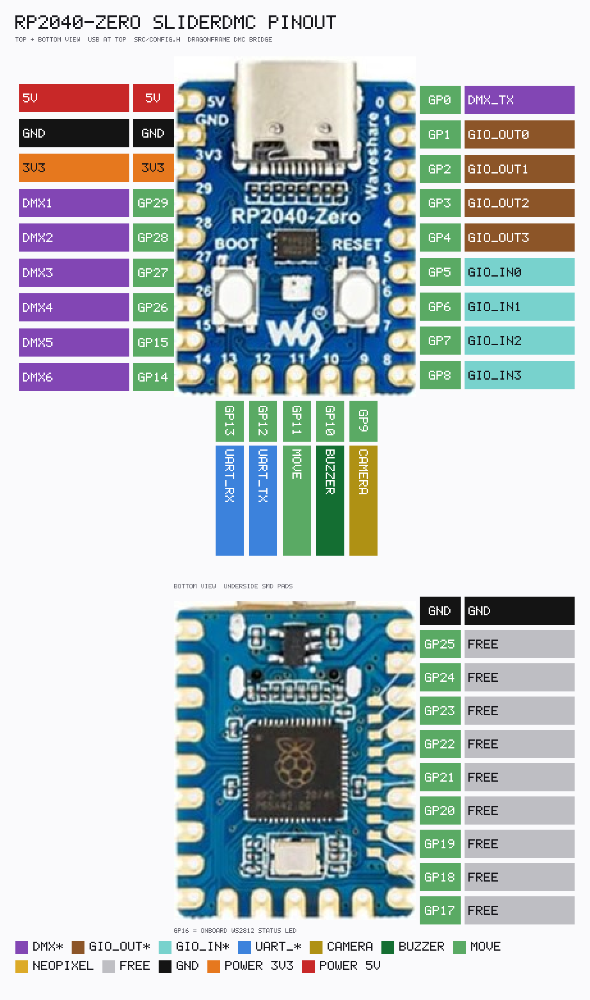

<link rel="stylesheet" type="text/css" href="../tools/SliderCtrl.css">
<style>
:root {
  --doc-title: "SliderDMC pin map";
  --doc-path: ".\\SliderDoc\\dmc\\pins.md";
}
</style>

# SliderDMC pin map

[← Index](README.md)

Pins are fixed in SliderDMC `src/config.h`. Shipping board: **Waveshare RP2040-Zero**.



Regenerate: `python tools/render_rp2040zero_pinout_SliderDMC.py` → [`DMC_RP2040zero_pinout.txt`](../assets/DMC_RP2040zero_pinout.txt) + PNG.

| Pad | Function |
|-----|----------|
| GP0 | DMX512 TX (PIO UART 250000 8N2 + BREAK/MAB). MAX485 for a real universe; TTL is enough on the bench |
| GP1–GP4 | DMC GIO **OUT** bits 0–3 (open-collector + pull-up) |
| GP5–GP8 | DMC GIO **IN** bits 0–3 (pull-up; unsolicited `MSG_GIO_IN` after Connect) |
| GP9 | Camera shutter (open-collector + pull-up); also MC `CT` on `MSG_GIO_CAM` shutter |
| GP10 | Preroll/bloop buzzer; also MC `BE` from `RUN_MOVE` |
| GP11 | **MOVE** — push-pull, high while the verbose status letter is `M`, `A`, `B`, `H`, or `P`; low on `I`, `E`, `D`, `L`. `T` (camera overlay) leaves the pin as it is |
| GP12 | UART TX to SliderMC (115200) |
| GP13 | UART RX from SliderMC |
| GP14 | DMX6 PWM (channel 6) |
| GP15 | DMX5 PWM (channel 5) |
| GP16 | Onboard WS2812 status LED |
| GP26 | DMX4 PWM (channel 4) |
| GP27 | DMX3 PWM (channel 3) |
| GP28 | DMX2 PWM (channel 2) |
| GP29 | DMX1 PWM (channel 1) |
| USB CDC | Dragonframe DMC |

GP17–20 are **not** DMC GIO. SliderMC extender pins (`ED`/`EI`/`EO`) stay on the **motion** Zero. Do not share those pads with this board’s GIO.

UART baud **115 200**, 3.3 V logic.

---

## UART to SliderMC

Cross TX↔RX. Shared GND. DMC side is always **GP12 TX / GP13 RX**.

### SliderMC on RP2040-Zero (`rp2040zero`)

MC UART is also GP12/13 — **two boards**, crossed:

| From | To |
|------|-----|
| DMC GP12 (`UART_TX`) | MC GP13 (`UART_RX`) |
| DMC GP13 (`UART_RX`) | MC GP12 (`UART_TX`) |
| DMC GND | MC GND |

### SliderMC on Raspberry Pi Pico (`pico`)

MC UART is GP16/17:

| From | To |
|------|-----|
| DMC GP12 (`UART_TX`) | MC GP17 (`UART_RX`) |
| DMC GP13 (`UART_RX`) | MC GP16 (`UART_TX`) |
| DMC GND | MC GND |

Handshake: DMC sends `VH` then `CG` (same as UIC `MC_Client`). Details: [link-and-handshake.md](../contract/link-and-handshake.md). MC pin maps: [mc/pins.md](../mc/pins.md).

Do not attach SliderCtrl and SliderDMC to the same MC UART at the same time.

---

## DMX512 — MAX485 + XLR3 + termination

GP0 is **TX only** (PIO UART). A MAX485 (or SN75176 / similar) turns TTL into RS-485. `DE` and `/RE` tied high = driver always on, receiver off.

XLR3 (DMX512): **pin 1** shield/GND, **pin 2** Data− (A), **pin 3** Data+ (B). Put **120 Ω** between A and B at the **last fixture**. If the DMC is a bus end, terminate there too. Do not terminate every fixture.

```text
  RP2040-Zero                         MAX485                 XLR3 (female, to fixtures)
  3.3V ------------------------------- VCC
  GND  ------------------------------- GND --------------- pin 1  shield / GND
  GP0  ------------------------------- DI
  3.3V ------------------------------- DE
  3.3V ------------------------------- /RE
                                       RO  (leave open)
                                       A  ---------------- pin 2  Data−
                                       B  ---------------- pin 3  Data+

  Last fixture (or DMC if it is a bus end):
       A ---- 120 Ω ---- B
```

A/B polarity: if dimmers ignore the universe, swap A/B. Bench without a transceiver: GP0 TTL is enough to probe BREAK/slots; it is not a legal DMX line.

---

## DMX1–DMX6 PWM

Channels **1–6** of the same 512-byte buffer also drive PWM, so a dimmer can sit on the Zero without a DMX receiver. Channels 7–512 stay on the GP0 UART only.

| Name | Pad | Channel |
|------|-----|---------|
| DMX1 | GP29 | 1 |
| DMX2 | GP28 | 2 |
| DMX3 | GP27 | 3 |
| DMX4 | GP26 | 4 |
| DMX5 | GP15 | 5 |
| DMX6 | GP14 | 6 |

18 kHz, high-active, 255 counts per period. Level 0 is steady low, level 255 is steady high, and a level *n* is high for *n*/255 of the period (1 → 1/255, 10 → 10/255, 254 → 254/255).

---

## Camera GP9 — 2N7000 level-shifter (5 V) and GPIO protection

Firmware drives GP9 as **open-collector + pull-up** (same idea as SliderMC `PIN_CAMERA_CTRL`). The pad is **3.3 V only**. Use this FET path when the camera or box wants **5 V TTL/CMOS** and shared GND is OK.

**GPIO protection:** series 220–470 Ω from GP9 to the gate; optional BAT54 (or Schottky) clamp from the pad to 3.3 V and GND. Never put 5 V on GP9.

Isolated dry-contact shutter cables: use a **PC817** instead — [components/camera.md](../components/camera.md) and [mc/pins.md](../mc/pins.md#pin_camera_ctrl-low-active-open-collector).

```text
        3.3 V                         5 V (VBUS / rail, not a GPIO)
          |                            |
         BAT54*                       10k
          |                            |
  GP9 -- 330 Ω -- G (2N7000)          |
                    S -------- D ------+---- camera TTL in
                    |
                   GND

  Pico/Zero GND -------------------------------- camera GND

  2N7000 TO-92, flat toward you, leads down:  1 S · 2 G · 3 D
  * optional Schottky clamp on the pad to 3.3 V / GND
```

Idle (pad released ~3.3 V): FET off → output **5 V**. Shutter (pad LOW): FET on → output **0 V**. `MSG_GIO_CAM` shutter also sends SliderMC `CT` so you can keep the shutter on the **MC** instead of (or as well as) this FET.

---

## Buzzer GP10 — BC3xx NPN driver

Do not hang a 5 V buzzer on the GPIO. Use an NPN low-side switch (`BC337` / `BC547`; not PNP `BC327`). Firmware also pulses MC `BE` — **one physical buzzer** is enough (this board **or** the MC).

```text
  5 V ---- buzzer+ ----+
                       |   (magnetic: 1N4148 across the buzzer,
                       |    cathode to 5 V)
                   collector
                      BC337 / BC547
                   emitter ---- GND
                      base
                       |
                      1 kΩ
                       |
                      GP10
```

Active (self-drive) buzzers: omit the flyback diode. Passive piezo: this is an on/off driver, not a tone generator.

MC buzzer pin: Pico GP28 / Zero GP28 (`PIN_BUZZER`, `BUZZER_use`). See [mc/pins.md](../mc/pins.md).
