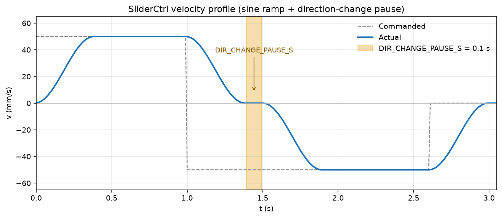

# SliderCtrl API

Non-blocking millimetre motion API for the **UIC** Raspberry Pi Pico  
(or compact **RP2040-Zero**; MicroPython + `uasyncio`), talking to **SliderMC** over UART.

Public interface units are always **mm**, **mm/s**, or **mm/s²**.  
Shipped defaults: [`MC_config.py`](../MC_config.py) (link) and [`UIC_config.py`](../UIC_config.py) (display/LED/camera).  
**User hardware profile:** copy [`SliderPins.example.py`](../SliderPins.example.py) → `SliderPins.py` and edit **that file only**.

---

## Modules

| Module | Role |
|--------|------|
| `MC_config.py` | Shipped defaults for `MC_Client` (UART, `MIN_SPEED_MM_S`) |
| `MC_MKS_config.py` | Defaults for `MC_MKS_Client` (RS485 pins, `MM_PER_ROT`, soft limits) |
| `UIC_config.py` | Shipped defaults for `UIC_Base` (OLED/LED/camera/WDT/debug) |
| `MC_client.py` | `MC_Client` class — UART client to SliderMC (`MC_API`) |
| `MC_MKS_client.py` | `MC_MKS_Client` — RS485 to MKS SERVO42D/57D (`MC_API`, F5-only) |
| `UIC_base.py` | `UIC_Base` class — OLED / RGB / camera / WDT; status callback |
| `JKSliderConfig.py` | JKSlider panel defaults (`JKS_*`) |
| `JKSlider.py` | Camera-slider control panel application |
| `B4SliderConfig.py` | B4Slider panel defaults (`B4S_*`) |
| `B4Slider.py` | 4-button slider app (L/R/OPTION/SET + SPEED pot) |
| `SliderPins.example.py` | Template for one full overlay file per slider HW |
| `QD.py` | `QD` quadrature decoder + `Denoiser` — see [QD.md](QD.md) |
| `SpaceBall.py` | Serial SpaceMouse / Spaceball / SpaceOrb UART reader — see [SpaceBall.md](SpaceBall.md) |
| `MPU6050.py` | I2C MPU6050 accel/gyro + tilt/roll — see [MPU6050.md](MPU6050.md) |

Architecture (UIC ↔ SliderMC): [ARCHITECTURE.md](ARCHITECTURE.md).

For the panel app on a **SliderMC** UIC, copy `MC_client.py`, `UIC_base.py`, `MC_config.py`, `UIC_config.py`, `JKSliderConfig.py`, and `JKSlider.py` (plus OLED drivers as needed). Optional: `SliderPins.py` from `SliderPins.example.py`.

---

## Composition (recommended)

Apps instantiate **`MC_Client`** and **`UIC_Base` separately** and wire status updates with a callback (no inheritance):

```python
from MC_client import MC_Client
from UIC_base import UIC_Base

mc = MC_Client()
ui = UIC_Base()
mc.set_status_callback(ui.on_status)
await mc.start()
await ui.start()
ui.set_soft_limits(mc.slider_min, mc.slider_max)
mc.setSpeed(40)
mc.enable(True)
mc.moveTo(100)
await mc.wait()
```

**`MC_MKS_Client`** implements the same **`MC_API`** names and drops in for `MC_Client` when the axis is MKS SERVO42D/57D over RS485 (no SliderMC). See [MKS_SERVO_RS485.md](MKS_SERVO_RS485.md).

---

## Class `MC_Client` (UART to SliderMC)

Standalone MicroPython client. Talks to **SliderMC** over UART0 @ 1 000 000 baud (TX GP16 / RX GP17). Millimetre motion/config surface without OLED/RGB.

Wire format: [PROTOCOL.md](../../SliderMC/docs/PROTOCOL.md) (commands `MT`, `M`, `MS`, `MH`, `SE`, `SS`, `SA`, `H`, …; status `#…`; errors `!E:`; replies `TAG:value`).

```python
from MC_client import MC_Client

mc = MC_Client()                       # UART0, GP16/17, 1 Mbaud
await mc.start()                       # unlock MC with \n, wait for `# …`, then SV 1 + CG
mc.setSpeed(40)
mc.enable(True)
mc.moveTo(100)
await mc.wait()
```

| Method | Notes |
|--------|-------|
| `await start(banner_timeout_s=3.0)` | Sends `\n` every 100 ms until welcome `# …` or timeout; on timeout prints to USB/REPL and soft-continues without MC; seeds `SS`/`SA` from CG |
| `await send(command, arg=None, wait_answer=False, timeout_s=1.0)` | Raw MC line; with `wait_answer` returns payload of matching `TAG:…` |
| `set_status_callback` / `set_error_callback` / `set_answer_callback` | Assignable hooks from the RX task (composition) |
| `moveTo` / `moveBy` / `move` / `home` / `stop` / `halt` / `wait` | Map to MC motion commands; getters prefer cached `#` status |

`setPosition` is not supported on the MC wire protocol (`NotImplementedError`).

---

## Class `MC_MKS_Client` (RS485 to MKS SERVO)

Same millimetre `MC_API` surface as `MC_Client`, talking to **MKS SERVO42D/57D** via MAX485 (native `FA/FB`, **F5 only**). Defaults: UART0 GP16/17, **DE on GP18**, **38400** baud. Config: [`MC_MKS_config.py`](../MC_MKS_config.py).

```python
from MC_MKS_client import MC_MKS_Client

mc = MC_MKS_Client()
await mc.start()          # SR_vFOC, optional home/limit setup, ~5 Hz status task
mc.setSpeed(40)
mc.enable(True)
mc.moveTo(100)
await mc.wait()
```

| Difference vs `MC_Client` | Notes |
|---------------------------|--------|
| No SliderMC banner / `SV` / `CG` | Soft limits & caps from `MC_MKS_config` / `setSoftLimits` |
| `move(±v)` | Seeks `SLIDER_MAX` / `SLIDER_MIN` with F5 (no F6) |
| `setPosition(mm)` | Supported via motor `92H` + UIC bias |
| `estimateMoveTime` / `estimateMoveTimeTo` | Simple constant-`a` trapezoid (display-grade) |
| Status | Polled / synthesized at `STATUS_HZ` (default 5), not `#…` lines |

Wiring and menu: [JKSlider_Components_MKS_SERVOxx.md](../manuals/JKSlider_Components_MKS_SERVOxx.md).

---

## Class `UIC_Base`

Local OLED, RGB/NeoPixel, camera shutter, and WDT on the UIC. **Not** a subclass of `MC_Client`.

- Register `mc.set_status_callback(ui.on_status)` so verbose MC `#…` lines refresh OLED/LED.
- `await ui.start()` starts the UI loop (LED / camera / WDT).
- App may call `ui.set_soft_limits(...)` and `ui.set_commanded(speed=..., accel=...)` so idle OLED Spd/Acc and soft-limit LED warn stay in sync.
- `PIN_CTRL_CAMERA` defaults to GP22 (skipped only if it equals UART TX/RX).
- See [ARCHITECTURE.md](ARCHITECTURE.md) for UIC ↔ SliderMC split.

```python
from UIC_base import UIC_Base

ui = UIC_Base()
await ui.start()
ui.setOledText("Ready")
```

### Motion (on `MC_Client`, non-blocking)

All motion calls return immediately. Use `isMoving()`, `await mc.wait()`, or poll from another coroutine.

| Method | Description |
|--------|-------------|
| `moveTo(position)` | Absolute move to `position` mm (soft-limit clamped). Live-retargetable. |
| `moveBy(dist)` | Relative move by `dist` millimetres. Live-retargetable. |
| `move(speed)` | Continuous velocity mode (mm/s). See below. |
| `home()` | Home to `SW_HOME`, then set position to `0`. Returns the asyncio task. |
| `stop()` | Decelerate to standstill using `setAcceleration()`. Non-blocking. |
| `halt()` | Emergency halt (`H`) — hard abort, enable off. Non-blocking. |
| `await wait()` | Wait until the current motion finishes. |

### Configuration

| Method | Description |
|--------|-------------|
| `setSpeed(mm_per_sec)` | Cruise speed for later moves (mm/s). On `MC_Client`. |
| `setMaxSpeed(mm_per_sec)` | Persistent MC `max_speed` via `CS` (planner ceiling). |
| `setAcceleration(accel)` | Peak acceleration for motion ramps (mm/s²). |
| `setSoftLimits(min_limit, max_limit)` | Soft limits in mm; either side may be `None` to disable. Also call `ui.set_soft_limits`. |
| `setOledText(text)` | Application string for the lower OLED band (small font). `""` / `None` clears. On `UIC_Base`. |
| `setOledUnit("mm"\|"inch")` | OLED Pos/Spd/Acc display unit only (API remains mm). |
| `getOledUnit()` | `"mm"` or `"inch"`. |
| `setOledBadges(tl, delay, mark=None)` | Yellow upper-right badges concatenated: `D`, `TL`, mark (`A` / `->A`). |
| `estimateMoveTime(distance_mm, speed, accel)` | Stop-to-stop travel time (s) for a sine-ramp move. On `MC_Client`. |
| `estimateMoveTimeTo(position_mm, speed=None, accel=None)` | Same sine-ramp estimate from current position to `position_mm`. Speed/accel default to session `SS`/`SA` when omitted. On `MC_Client`. |
| `setCameraMode(tl_div, fps)` | CTRL_CAMERA: hold-high while moving if `tl_div==1`; else pulse every `tl_div/fps` s while moving. JKSlider Cont mode calls this with `tl_div=1` so Cont is hold-high; MSM uses `pulseCamera()` while stopped. |
| `setCameraMotionActive(active)` | Keep CTRL_CAMERA in-motion (hold-high / pulses) while the axis is soft-paused (video / Cont / legacy continuous TL). |
| `setCameraManual(manual)` | When True, disable auto intervalometer / hold-high (MSM owns shutter). |
| `pulseCamera()` | Fire one CTRL_CAMERA pulse; increments pulse count. |
| `getCameraPulseCount()` | TL shutter pulse count for the current take. |
| `resetCameraPulseCount()` | Clear the TL frame counter. |
| `ledAddColor(r,g,b)` | Sticky additive RGB overlay on status base (`0…255` per channel). |
| `ledClearAdd()` | Clear sticky overlay. |
| `ledFlash(rgb, count, on_ms, off_ms=None)` | Timed flashes; preempts status LED until done. |
| `ledBlip(rgb, ms)` | Single pulse, then restore status LED. |
| `ledPingPong(rgb_a, rgb_b, period_ms, duration_ms=None)` | Alternate colours; `duration_ms=None` until `ledEffectClear()`. |
| `ledEffectClear()` | Cancel timed LED effect early. |
| `setLuminosity(scale)` | Global LED + OLED brightness (0.0..1.0). `1.0` = full; typical dim = `0.25`. |
| `getLuminosity()` | Current brightness scale. |
| `playLedRainbow(ms)` | Awaitable one-shot rainbow (default `LED_RAINBOW_MS`). |
| `startLedRainbowLoop(ms)` | Continuous rainbow until `stopLedEffect()` / `ledEffectClear()`. |
| `stopLedEffect()` | End rainbow / LED effect (`ledEffectClear`). |
| `driveLed()` | Refresh RGB LED once (UI loop also ticks effects ~50 Hz). |
| `enable(on)` | Drive `EN` on the MC (`True` = enabled). Polarity from MC config. Ignored while `DRV_ERROR` is active. On `MC_Client`. |

### Status / position

| Method | Description |
|--------|-------------|
| `isMoving()` | `True` while a move or homing is active. |
| `isDecelerating()` | `True` while moving and slowing (incl. stop/halt to standstill). |
| `isHoming()` | `True` while `home()` / homing is in progress. |
| `isAtSoftLimit()` | `True` while the axis is at a soft limit. |
| `isNearSoftLimit()` | `True` within `SOFT_LIMIT_WARN_MM` of a soft limit. |
| `isAtHardLimit()` | `True` while a hard limit is active outside of homing. |
| `isDRVErrorActive()` | `True` while the MC `DRV_ERROR` input is held (motion APIs ignored). |
| `getPosition()` | Current position in mm. |
| `setPosition(position_mm)` | Not supported on SliderMC (`NotImplementedError`). |

### Helpers

Conversion helpers use MC `steps_per_mm` from `mc_config` when present (optional app-side). Soft-limit warn for LED lives on `UIC_Base` after `set_soft_limits`.

---

## Behaviour notes

### Non-blocking model

```python
mc.moveTo(120.0)
# other work…
while mc.isMoving():
    await asyncio.sleep_ms(10)

# or
mc.moveBy(25.0)
await mc.wait()
```

`moveTo` / `moveBy` may be called again while moving: the new target is taken
immediately while **keeping current speed**, then the axis accelerates / decelerates
(and reverses if needed) toward the new position using `setAcceleration()`.

`home()` cancels the current motion and starts homing.  
`stop()` / `halt()` convert the current motion into a decelerating stop (do not hard-abort).  
`move(speed)` repeated calls only update the speed target (see below).

### Decelerating stop — `stop()` / `halt()`

```python
mc.setAcceleration(200.0)
mc.move(50.0)
await asyncio.sleep_ms(500)
mc.stop()                       # soft decelerate (MS)
await mc.wait()

mc.move(50.0)
await asyncio.sleep_ms(500)
mc.halt()                       # emergency H — enable off
await mc.wait()
```

- `stop()` and `move(0)` soft-decelerate on the MC.
- `halt()` sends emergency `H` (enable off).
- Both are non-blocking on the UIC.
### DRV_ERROR input pin

| Config | Meaning |
|--------|---------|
| `PIN_DRV_ERROR` | GPIO for driver alarm / stall / E-stop interlock |
| `DRV_ERROR_ACTIVE_HIGH` | `True` = active high, `False` = active low |
| `DRV_ERROR_PULL` | `1` pull-up, `0` pull-down |

When `DRV_ERROR` becomes active:

1. Same decelerating stop as `halt()`.
2. After standstill, the driver is **disabled** (`enable(False)`).
3. While `DRV_ERROR` remains active, `moveTo` / `moveBy` / `move` / `home` / `enable(True)` are ignored.

Release `DRV_ERROR` to allow motion again (re-enable explicitly or via a move that calls `enable(True)`).

### Watchdog + onboard LED heartbeat

When the asyncio I/O monitor starts, a hardware WDT is armed (if `WDT_ENABLED`). The Pico **onboard LED** toggles at **1 Hz** (`WDT_HEARTBEAT_MS`) and each toggle feeds the WDT. If the monitor stalls longer than `WDT_TIMEOUT_MS`, the Pico resets.

| Symbol | Meaning |
|--------|---------|
| `WDT_ENABLED` | Arm hardware WDT with I/O services (default `True`) |
| `WDT_TIMEOUT_MS` | Reset timeout (default 3000; RP2040 max ≈ 8388) |
| `WDT_HEARTBEAT_MS` | Onboard LED toggle + WDT feed period (default 1000 = 1 Hz) |
| `PIN_LED_ONBOARD` | `"LED"` (Pico / Pico W) or GPIO number (classic Pico: 25) |

### RGB status LED (`LED_R` / `LED_G` / `LED_B`) + optional NeoPixel

| Config | Meaning |
|--------|---------|
| `PIN_LED_R` / `PIN_LED_G` / `PIN_LED_B` | RGB LED GPIOs (always used) |
| `PIN_NEOPIXEL` | Optional single WS2812 GPIO (`None` = off); mirrors RGB colours |
| `PIO_NEOPIXEL_SM_ID` | PIO SM for NeoPixel (default `1`; must ≠ `PIO_SM_ID`) |
| `LED_ACTIVE_HIGH` | Polarity for PWM RGB channels (NeoPixel unaffected) |
| `LED_BLINK_MS` | Red blink half-period while homing |
| `LED_BLINK_HARD_LIMIT_MS` | Red on/off half-period on hard limit |
| `LED_DIM_WHITE` | Idle enabled white duty (0..1; docs ~12%) |
| `LED_DIM_ORANGE` | Driver disabled duty |
| `LED_DIM_CYAN` / `LED_DIM_MAGENTA` | JKSlider panel Delay / TL duties (app `ledPingPong`) |
| `LED_BLINK_DELAY_WAIT_MS` | Cyan blink half-period; JKSlider uses `2×` as ping-pong period |
| `LED_RAINBOW_MS` | Default `playLedRainbow()` duration |
| `LED_SOFT_NEAR_BLUE_ADD` | Add to B when near soft limit (`0…255`, default 76 ≈ 30%) |
| `LED_SOFT_AT_BLUE_ADD` | Add to B when at soft limit (`0…255`, default 255 = 100%) |
| `DSP_CONTRAST_FULL` | SSD1306 contrast at full luminosity (default 0xFF) |
| `SOFT_LIMIT_WARN_MM` | Approach distance for near-soft blue mix (default 10 mm; B4Slider often 3) |

| Colour | Meaning |
|--------|---------|
| Dim orange | Driver disabled |
| Dim white | Driver enabled, idle |
| Dim cyan (solid) | JKSlider: Delay armed (`ledPingPong`) |
| Cyan blink 1 Hz | JKSlider: Delay countdown / wait (`ledPingPong`) |
| Dim magenta | JKSlider: timelapse idle TL ≠ 1 (`ledPingPong`) |
| Dim white ↔ dim blue | JKSlider: AB/AC/BC loop idle / dwell |
| + ~10% blue | JKSlider / B4Slider: loop running (`ledAddColor`) |
| Yellow | Accelerating or decelerating |
| Green | Moving at constant speed |
| + ~30% / 100% blue | Near soft / at soft on top of base (UIC mix) |
| Red fast blink | Hard limit |
| Red blink | Homing in progress |
| Red | DRV_ERROR input active |
| Timed flash/blip/ping-pong | `ledFlash` / `ledBlip` / `ledPingPong` (preempt status) |
| Rainbow | `playLedRainbow()` / boot unlock |

Priority (highest first): DRV_ERROR → cam blank → **timed effect** → hard limit → homing → status base + soft blue mix + `ledAddColor`.

API RGB channels are **0…255**; docs often describe mixes as **percent**. Apps (JKSlider, B4Slider) own Delay/TL/loop panel colours via the effect API — not UIC status base.

### B4Slider (4-button app)

Minimal panel: MOVE_L / MOVE_R / OPTION / SET + SPEED pot (optional ACCEL pot via `B4S_USE_ACCEL_POT`). Soft limits are the A/B working window. Config: [`B4SliderConfig.py`](../B4SliderConfig.py) (`B4S_*`); run `B4Slider.run()`.

Homing / `home()` is **aborted** if the `DRV_ERROR` input becomes active (position is not forced to 0).

Outside of homing, `SW_HOME` is a **hard limit**: motion into the switch (`HOME_DIRECTION`) stops **immediately**; further into-switch `move` / `moveTo` commands are ignored; motion out of the switch is allowed.

### Optional OLED (128×64 I2C)

Set `DSP_ENABLED = True` in `UIC_config.py`, choose `DSP_DRIVER`, and copy `oledfont.py` plus the matching driver (`ssd1306.py`, `sh1106.py`, or `ssd1309.py`) to the Pico.  
If no display is found on the I2C bus (or init fails), OLED support is disabled silently and the motor continues normally.

| Typical size | Controller | `DSP_DRIVER` |
|--------------|------------|---------------|
| 0.96″ | SSD1306 | `"ssd1306"` |
| 1.3″ | SH1106 (alias **SSH1106**); **CH1115/CH1116** clones | `"sh1106"` |
| 1.54″ / 2.42″ | SSD1309 | `"ssd1309"` |

Same pixel layout for all sizes. `DSP_ROTATE_180 = True` when the module is mounted upside-down vs the default panel artwork.

Dual-colour modules use **yellow** for the top 16 rows and **blue** for the rest.

| Config | Meaning |
|--------|---------|
| `DSP_ENABLED` | Enable OLED init |
| `DSP_DRIVER` | `"ssd1306"` \| `"sh1106"` \| `"ssd1309"` |
| `DSP_ROTATE_180` | Flip SEG/COM for 180° mechanical mount |
| `PIN_DSP_I2C_SDA` / `PIN_DSP_I2C_SCL` | I2C pins (default GP0 / GP1) |
| `DSP_I2C_ID` / `DSP_I2C_ADDR` / `DSP_I2C_FREQ` | I2C bus setup (addr default `0x3C`) |
| `DSP_WIDTH` / `DSP_HEIGHT` | `128` / `64` |
| `DSP_UPDATE_MS` | Refresh period |
| `DSP_LIVE_POS` | During motion: `True` (default) also refresh Pos; `False` keep last Pos and only refresh Spd/Acc (lighter STEP FIFO load) |

| Rows | Content |
|------|---------|
| 0–15 (yellow) | Left: `HOMING` / `HARD LIMIT` / `DISABLED` / `LIMIT`. Right: concatenated badges via `setOledBadges` — `D`, `TL`, mark (`A` / `->A`) |
| 16–47 (blue) | `Pos` / `Spd`/`Spd*` / `Acc`/`Acc*` — idle: commanded Spd/Acc; moving: live Spd* and approximate Acc*. Units `mm`/`mm/s`/`mm/s2` or `in`/`in/s`/`in/s2` (`JKS_DSP_UNIT`) |
| 48–63 (blue) | Application text (small font), set via `setOledText()` |

```python
ui.setOledText("Cruise L")   # lower band
ui.setOledText("")           # clear
ui.ledPingPong((0, 31, 31), (0, 31, 31), 600)  # solid dim cyan (Delay armed)
await ui.playLedRainbow(1000)
```

Example screens (`docs/img/oled/` — flat active-area mockups; regenerate with `python docs/oled/render_examples.py`). Panel extras (`Delay` / `Wait` / `TL` / remain) come from `JKSlider` via `setOledText()`.

**Idle** — Ready:


**Delay + TL** — armed delay and timelapse divider:


**Wait** — delay countdown before motion:


**Moving** — cruise with `Near limit`:


**Goto** — remaining distance:


**Loop dwell**:


**Homing** — yellow `HOMING`:


**Driver off** — yellow `DISABLED`:


**Soft limit** — yellow `LIMIT`:


**Hard limit** — yellow `HARD LIMIT` (`SW_HOME`):


### Continuous velocity — `move(speed)`

```python
mc.setAcceleration(200.0)
mc.move(40.0)     # forward 40 mm/s
mc.move(-25.0)    # reverse toward -25 mm/s (decel → reverse → accel)
mc.move(0.0)      # decelerate to stop
await mc.wait()
```

| Argument | Effect |
|----------|--------|
| `> 0` | Forward (increasing position) |
| `< 0` | Backward (decreasing position) |
| `0` | Decelerate to a stop using `setAcceleration()` |

- Non-blocking; returns immediately.
- Speed is ramped with `|a|` from `setAcceleration()`.
- Extra calls adapt the target on the fly (including direction changes through zero).
- Clamped to `±setMaxSpeed()` and `MAX_STEP_RATE_HZ`.
- Soft limits: allowed speed is reduced by sine-ramp stopping distance
  \(v = \sqrt{4 a d / \pi}\) so the axis decelerates before `min` / `max`.
- `move(0)` and `stop()` decelerate with `setAcceleration()`; `halt()` uses `DRV_ERROR_DECEL_MM_S2`.
- Calling `moveTo` / `moveBy` while in velocity mode switches to position seek
  (keeps current speed). `home()` cancels velocity mode.

### Position moves — live retargeting

```python
mc.moveTo(200.0)
await asyncio.sleep_ms(300)
mc.moveTo(50.0)    # reverse toward 50 mm without stopping first
await mc.wait()
```

- Remaining distance limits speed via \(v = \sqrt{4 a d / \pi}\) so the axis can stop on target.
- Direction changes use a sine ramp through zero with `setAcceleration()`.

### Acceleration profile

`moveTo` / `moveBy` / `move` share one accel-limited velocity controller with a
**sine acceleration / cosine velocity** ramp:

\[
v(\varphi) = v_0 + (v_1 - v_0)\,\frac{1 - \cos\varphi}{2},\quad \varphi: 0 \rightarrow \pi
\]

- Instantaneous acceleration is sinusoidal; **peak** \(|a|\) is `setAcceleration()`
  (default `DEFAULT_ACCEL_MM_S2`, e.g. 200 mm/s²).
- Velocity is an S-shaped blend (zero accel at the start and end of each ramp).
- Leaving standstill toward a faster command snaps the first speed to
  `RAMP_START_HZ` / `STEPS_PER_MM` (default **1000 Hz**, ~3.1 mm/s @ 320 steps/mm)
  so the first STEP FIFO words are not multi-second crawl pulses. Set
  `RAMP_START_HZ = 0` to disable. Commands slower than that floor keep true crawl.
- Cruise speed from `setSpeed()` / `setMaxSpeed()` (position moves) or `move(speed)`.
- Stop-distance limiting near the target and soft limits uses
  \(d = \pi v^2 / (4 a)\) (and \(v_{\max} = \sqrt{4 a d / \pi}\)).
- Live retargeting keeps current speed and starts a new sine segment toward the
  new command (small seek/soft-limit drifts track without a hard reset).
- **Direction change:** if the new command has the opposite sign to the current
  speed, the axis decelerates to 0, pauses for `DIR_CHANGE_PAUSE_S` (default
  **0.1 s**), then accelerates the other way. Pure stops (`stop()` / `move(0)`)
  do not add this pause. Set `DIR_CHANGE_PAUSE_S = 0` to disable.

#### Typical velocity over time

Example with peak \(a = 200\,\mathrm{mm/s^2}\), cruise \(\pm 50\,\mathrm{mm/s}\),
`DIR_CHANGE_PAUSE_S = 0.1`:

| Phase | Time (example) | Velocity |
|-------|----------------|----------|
| Accel + | 0 → 0.39 s | 0 → +50 mm/s (cosine blend) |
| Cruise + | 0.39 → 1.0 s | +50 mm/s held |
| Decel to 0 | 1.0 → 1.39 s | +50 → 0 (reverse requested) |
| Dir-change pause | 1.39 → 1.49 s | hold **0** for 0.1 s |
| Accel − | 1.49 → 1.89 s | 0 → −50 mm/s |
| Cruise − | 1.89 → 2.60 s | −50 mm/s held |
| Decel stop | 2.60 → 2.99 s | −50 → 0 (`stop()` / `move(0)`, no pause) |



*Sine / cosine velocity ramps; amber band = `DIR_CHANGE_PAUSE_S` (default 0.1 s) at zero before reversing. Regenerate with `python docs/render_dir_change_pause.py`.*

Useful timing (peak accel \(a\), speed change \(\Delta v\)):

- Ramp duration: \(T = \pi\,|\Delta v| / (2 a)\)  
  (0 → cruise: \(\pi v / (2 a)\); here \(\pi\cdot 50 / 400 \approx\) **0.39 s**).
- Reverse +v → −v: two ramps + pause ≈ \(2T + \mathtt{DIR\_CHANGE\_PAUSE\_S}\)  
  (here ≈ **0.39 + 0.1 + 0.39 = 0.88 s**).
- Stopping distance from speed \(v\): \(d = \pi v^2 / (4 a)\).
- `stop()` / `move(0)` use peak \(a\) from `setAcceleration()` (no dir-change pause).
- `halt()` / `DRV_ERROR` use peak \(a\) from `DRV_ERROR_DECEL_MM_S2`.

### Speed limits (min / max)

| Bound | Source | Default / typical |
|-------|--------|-------------------|
| Minimum usable speed | `MIN_SPEED_MM_S` | **0.006 mm/s** (~21.6 mm/h; matches 26-bit PIO delay floor @ 320 steps/mm) |
| Maximum step rate | `MAX_STEP_RATE_HZ` | **100 kHz** (5 µs STEP high + 5 µs low) |
| Maximum speed | `MAX_STEP_RATE_HZ / STEPS_PER_MM` | e.g. **312.5 mm/s** at 320 steps/mm |

- Speeds below `MIN_SPEED_MM_S` are treated as stop / idle (planning and status).
- `setSpeed()` / `setMaxSpeed()` / `setAcceleration()` clamp to at least `MIN_SPEED_MM_S`.
- `setMaxSpeed()` cannot exceed the mm/s equivalent of `MAX_STEP_RATE_HZ`.
- With default mechanics `(200 × 8) / 5 = 320` steps/mm, 0.006 mm/s ≈ **1.92 step/s**.

JKSlider: cruise / goto / loop only start when the SPEED pot (after deadzone + gamma) is ≥ `MIN_SPEED_MM_S`.

### Soft limits

`moveTo` / `moveBy` clamp the target into `[min_limit, max_limit]` when set.  
`move(speed)` respects limits by cutting speed toward a boundary (stop-distance limited).  
Homing (`home`) ignores soft limits while seeking the switch.

### Homing (`home`)

1. If already on the switch → back off (sine-ramped).  
2. Seek switch at `HOME_SPEED_MM_S` (sine accel to cruise; stop when switch hits).  
3. Back off by `HOME_BACKOFF_MM` (sine accel / cruise / decel).  
4. Slow approach at `HOME_APPROACH_SPEED_MM_S` (sine-ramped).  
5. Set position to **0 mm**.

Homing peak accel: `HOME_ACCEL_MM_S2` (default 200 mm/s²). Direction and speeds are in `UIC_config.py`.

### PIO

STEP pulses are generated by a PIO state machine (`PIO_SM_ID` @ `PIO_FREQ_HZ`, default 125 MHz).  
DIR and EN are ordinary GPIO.

- Each FIFO word is packed: **`delay[25:0]`** (post-pulse delay cycles) + **`repeat[31:26]`** (`0` → 1 pulse … `63` → 64). Shift direction is `SHIFT_RIGHT`.
- Pulse high time is 625 cycles (**5 µs**), spread over 20 instructions because a single PIO instruction delay caps at 31 cycles (`set[31]` + 18×`nop[31]` + `nop[16]`). Period ≈ `delay + STEP_PULSE_CYCLES` (629 = 625 high + 4 loop-overhead cycles).
- The STEP program uses **27 of 32** PIO instruction slots; with the optional 4-instruction WS2812 SM on the same PIO block that leaves **1 slot** free.
- Both STEP and NeoPixel SMs use `fifo_join=PIO.JOIN_TX` → **8-deep** TX FIFO (RX unused).
- Delay is clamped to 1 … `2^26−1`. At 320 steps/mm that floors crawl near **~0.0058 mm/s**; **`MIN_SPEED_MM_S` (default 0.006)** is the software floor.
- Python cannot refill one pulse per loop fast enough for high cruise (~4–10 kHz planning vs up to `MAX_STEP_RATE_HZ`). At high step rates the filler **packs** multiple pulses per word (rate-based burst during accel/cruise/decel) and keeps only about `STEP_FIFO_TIME_BUDGET_MS` of motion queued.
- Position moves (`moveTo` / `moveBy`) **encode** the stop-distance law into each FIFO word: issued step rate is capped by \(v \le \sqrt{4 a\,d/\pi}\) from remaining travel, floored at `STOP_APPROACH_HZ`. Packing is also limited to about 20 % of remaining steps per word so the brake staircase keeps enough samples near the target. Live retarget and mid-move speed changes still work because the cap is recomputed every iteration.
- Soft STOP / halt **drains** the FIFO (including the in-flight packed word) and then soft-releases the SM. Hard limit / abort restarts the SM and rewinds unissued TX words; an in-flight packed word may leave position leading by up to **63 steps**.
- Position advances when steps are **queued**. Before a DIR change the FIFO is drained (including in-flight time); on abort/hard-limit unissued TX words are rewound.
- After a DIR change, `DIR_SETUP_US` (default 5 µs) elapses before the next STEP.
- Default OLED refresh: `DSP_UPDATE_MS = 250` (4 Hz). While moving, the framebuffer is redrawn on that period and transferred **one page at a time** (~3 ms I2C) so the STEP FIFO is not starved; idle uses a full `show()`. Set `DSP_LIVE_POS = False` to freeze Pos during motion and only push Spd/Acc pages.

---

## Configuration

Shipped defaults live in `MC_config.py` / `UIC_config.py` / `JKSliderConfig.py`.  
**For your hardware, copy `SliderPins.example.py` → `SliderPins.py` and edit that file only** (pins + behaviour). Axis STEP/DIR/EN, home, and DRV_ERROR live on **SliderMC** ([PINS.md](../../SliderMC/docs/PINS.md) / [CONFIG.md](../../SliderMC/docs/CONFIG.md)).

### `MC_config.py` (link)

| Symbol | Default | Meaning |
|--------|---------|---------|
| `PIN_UART_TX` / `PIN_UART_RX` | 16 / 17 | UART to SliderMC |
| `UART_BAUD` | 1_000_000 | Must match SliderMC |
| `MIN_SPEED_MM_S` | 0.006 | UIC command floor (mm/s) |
| `SOFT_LIMIT_WARN_MM` | 10.0 | Near-limit distance for `isNearSoftLimit` |
| `LED_ACCEL_SPEED_EPS_MM_S` | 3.0 | Accel/decel detect when MC letter is not A/B |

### `UIC_config.py` (display / LED / camera / WDT)

| Symbol | Default GPIO | Meaning |
|--------|--------------|---------|
| `PIN_LED_R` / `PIN_LED_G` / `PIN_LED_B` | 2 / 3 / 4 | RGB status LED (UIC) |
| `PIN_NEOPIXEL` / `PIO_NEOPIXEL_SM_ID` | `None` / 1 | Optional WS2812 |
| `PIN_CTRL_CAMERA` | 22 | Shutter / intervalometer on UIC (active-high) |
| `CTRL_CAMERA_PULSE_MS` | 100 | TL pulse width (ms) |
| `CTRL_CAMERA_ACTIVE_HIGH` | `True` | CTRL_CAMERA polarity |
| `PIN_DSP_I2C_SDA` / `PIN_DSP_I2C_SCL` | 0 / 1 | Optional OLED I2C |
| `DSP_DRIVER` | `"ssd1306"` | `"ssd1306"` \| `"sh1106"` \| `"ssd1309"` (CH1115/CH1116/SSH1106 → `sh1106`) |
| `DSP_ROTATE_180` | `False` | 180° mechanical mount |
| `LED_ACTIVE_HIGH` | | RGB LED polarity (all channels) |
| `DSP_LIVE_POS` | | During motion: refresh Pos with Spd/Acc (`True`) or freeze Pos (`False`) |
| `WDT_ENABLED` / `WDT_TIMEOUT_MS` / `WDT_HEARTBEAT_MS` | | Hardware WDT + 1 Hz onboard LED heartbeat |
| `PIN_LED_ONBOARD` | `"LED"` | Pico onboard LED (heartbeat) |
| `DEBUG_LEVEL` | 3 | USB debug verbosity |

Mechanics (`steps_per_mm`), `max_speed` / `max_accel`, and `slider_min` / `slider_max` live on **SliderMC** and are loaded into `MC_Client` via `CG` after the welcome banner (`mc_config`, `max_speed`, `max_accel`, `slider_min`, `slider_max`). `status` tracks McState (`MC_STATE_*` / `MC_STATE_CHARS`).

### JKSlider panel (`JKSliderConfig.py`)

| Symbol | Default GPIO | Meaning |
|--------|--------------|---------|
| `PIN_POT_SPEED` / `PIN_POT_ACCEL` | 26 / 27 | SPEED / ACCEL pots (ADC0 / ADC1) |
| `PIN_POT_JOYSTICK` | 28 | Optional joystick pot (`None` = off) |
| `PIN_BTN_STOP` | 5 | BTN_STOP (always; ORed with matrix in keypad mode) |
| `PIN_BTN_MOVE_L` / `PIN_BTN_MOVE_R` | 6 / 7 | BTN_MOVE_L / BTN_MOVE_R |
| `PIN_BTN_FAST_L` / `PIN_BTN_FAST_R` | 8 / 9 | BTN_FAST_L / BTN_FAST_R |
| `PIN_BTN_A` / `PIN_BTN_B` / `PIN_BTN_C` | 10 / 11 / 12 | BTN_A / BTN_B / BTN_C |
| `PIN_BTN_OPTION` | 13 | BTN_OPTION (always; ORed with matrix `*` in keypad mode) |
| `PIN_BTN_DELAY` / `PIN_BTN_TIMELAPSE` | 14 / 15 | BTN_DELAY / BTN_TIMELAPSE |
| `JOYSTICK_DEADZONE` | | Centre deadzone for the JOYSTICK pot |
| `JKS_SPEED_MIN_MM_S` | 1.0 | SPEED pot floor; full scale = clamped `mc.max_speed` |
| `JKS_SPEED_MAX_MM_S` | 100 | Panel ceiling: `mc.max_speed = min(MC max_speed, this)` after CG |
| `JKS_ACCEL_MIN_MM_S2` / `JKS_ACCEL_MAX_MM_S2` | 50 / 500 | ACCEL pot floor; max clamps `mc.max_accel` |

Panel behaviour flags use the `JKS_*` prefix, e.g. `JKS_MOVE_TAP_MS`, `JKS_SWAP_LR`, `JKS_TL_MODE` (`"msm"` / `"continuous"`), `JKS_LOOP_DWELL_MS`, `JKS_BOOT_TEXT`. See [JKSlider_Technical_Manual_Config.md](../manuals/JKSlider_Technical_Manual_Config.md).

### One file per slider HW (`SliderPins.py`)

Copy [`SliderPins.example.py`](../SliderPins.example.py) to `SliderPins.py` on the device. Edit **that file only** — pins **and** behaviour overrides. The overlay is **data only**: dicts named `MC_config`, `UIC_config`, and `JKSlider` (future apps add their own dict). Each defaults module cherry-picks its dict at import time; missing keys / missing file = keep built-in defaults. `SliderPins.py` is gitignored. Keep one profile file per physical slider build.

`JoystickExample.py` defines its own `PIN_POT_JOYSTICK_ADC` (default GP28) and `JOYSTICK_DEADZONE`.

---

## Pins

| Signal | Board | Purpose |
|--------|-------|---------|
| UART TX/RX GP16/17 | UIC + MC | 1 Mbaud link |
| `CTRL_CAMERA` | UIC | Shutter / intervalometer (`PIN_CTRL_CAMERA`, default GP22) |
| `LED_R` / `LED_G` / `LED_B` | UIC | RGB status |
| `NEOPIXEL` | UIC | Optional WS2812 |
| `DSP_I2C_SDA` / `DSP_I2C_SCL` | UIC | Optional OLED |
| `POT_SPEED` / `POT_ACCEL` / `POT_JOYSTICK` | UIC | Panel pots |
| Onboard LED | UIC | 1 Hz watchdog heartbeat |
| `DRV_STEP` / `DRV_DIR` / `DRV_EN` | MC | STEP/DIR/EN (GP18/19/20) |
| `SW_HOME` | MC | Homing reference (GP22) |
| `DRV_ERROR` | MC | Driver alarm / E-stop (GP21) |
| `SW_LIMIT_L` / `SW_LIMIT_R` | MC | Optional hard limits (GP26/27) |
| `EXT_0`…`EXT_9` | MC | General-purpose outputs |

Full MC map: [PINS.md](../../SliderMC/docs/PINS.md).

---

## Errors

| Condition | Behaviour |
|-----------|-----------|
| `setPosition` while moving / on MC | Raises `RuntimeError` / `NotImplementedError` |
| Target outside soft limits | Clamped silently |
| `move` / `moveTo` into active hard limit | Ignored (out of switch allowed) |
| Homing switch never hit | Stops after a travel-based step budget |
