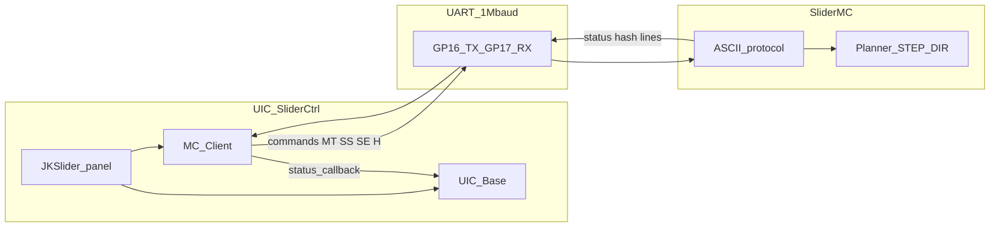

# Architecture — UIC and SliderMC

JKSlider runs as a **split** system: a UI controller (UIC) plus a dedicated motion controller (SliderMC).

**Preferred UIC stack (this project):** Raspberry Pi Pico (or compact **RP2040-Zero** for smaller designs) + **MicroPython** + `uasyncio`. Makers may **fork or expand** with another controller, language, or framework as a UART client to SliderMC — welcome DIY, not a shipping port of this repo.

## Philosophy

- Each controller has a **dedicated purpose**: the MC runs motion only; the UIC runs the panel, display, camera shutter, and optional WLAN.
- The MC is **not disturbed** by OLED redraws, switch/keypad scanning, WLAN, or other UIC work — STEP timing never shares that CPU.
- This project prefers **Pico + MicroPython** on the UIC for DIY/maker friendliness (Thonny, REPL, `mpremote`, edit-on-device). A compact **RP2040-Zero** (or similar RP2040 mini board) is fine for smaller enclosures — use the same GPIO numbers as the Pico pinouts; silk and USB differ, so flash a matching MicroPython UF2.
- Forks may use ESP8266/ESP32, Raspberry Pi / Linux SBCs, or other DIY boards (large or touch displays) as long as they speak the SliderMC UART protocol — same motion board, replaceable face.
- The UIC keeps **more free pins** (up to ~26 usable GPIOs on a Pico after UART) for inputs and outputs.
- **Easier debugging:** USB per board; bring up motion and panel separately.

## Connected components

What may attach to each board (same ownership as the overview diagram):

### UIC — may connect

- Buttons (discrete)
- KeyPads (matrix)
- OLED / displays
- RGB_LEDs / NeoPixel
- Potentiometers
- JoySticks
- Camera (`CTRL_CAMERA`)
- Optional WLAN / network (Pico W or fork host)
- USB debug (host PC)
- UART to MC

### MC — may connect

- Motor / STEP·DIR driver (integrated or external)
- Home switch (`SW_HOME`)
- Hard limit switch(es) (`SW_LIMIT_*`)
- Ext outputs (`EXT_0`…`EXT_9`)
- `DRV_ERROR` / E-stop interlock
- USB debug (host PC)
- UART to UIC

## Isolation model

| Side | Responsibility |
|------|----------------|
| **Must not run on MC** | Display I2C, button/keypad scan, ADC pots, NeoPixel / UI LED effects, WLAN, camera shutter timing |
| **MC owns exclusively** | STEP/DIR/EN, planner / FIFO, home / limits, `DRV_ERROR`, EXT |
| **Contract** | UIC talks **millimetres** over UART; MC owns steps and ramps |

## Software stacks

| Board | Stack | Why |
|-------|-------|-----|
| **UIC** | MicroPython + AsyncIO (`uasyncio`) — `JKSlider` / `MC_Client` / `UIC_Base` | Easy panel programming; rapid UI iteration without reflashing motion firmware |
| **MC** | C++ / PlatformIO — SliderMC | Deterministic planner and PIO STEP path |

UIC API: [API.md](API.md). MC protocol / build: [PROTOCOL.md](../../SliderMC/docs/PROTOCOL.md), [BUILD.md](../../SliderMC/docs/BUILD.md).

## Pros

- Build, test, and debug UIC and MC **separately**
- More **reliable motion** (less jitter / stutter from UI load)
- UIC keeps **more free pins** for inputs and outputs
- **Replaceable UIC** without rewiring the axis
- **Handheld wired remote:** UIC in hand, MC by driver/PSU — only a **4-wire** cable (**5 V**, **GND**, **TX**, **RX**)
- **Easy programming** on the UIC with **MicroPython** and **AsyncIO**
- MicroPython DIY workflow (Thonny / REPL) while the MC stays stable compiled firmware
- Clear DIY ownership (who wires what)
- Optional WLAN only on the UIC — the MC stays off the network
- Bring up the MC alone (USB CLI) before the panel exists

## Cons

- Second controller (extra Pico) — about **€5**
- Slightly **more wiring** (UART + two boards)
- Slightly **more housing** volume
- Two firmwares / two flash steps
- UART link is an extra failure point (baud, shared GND, cable)
- Slightly higher idle power
- Docs and pinouts stay dual-board aware

## Debugging and bring-up

Recommended order:

1. Flash and test **SliderMC** (USB serial / status)
2. Wire **UART** (GP16/17 both sides, shared GND)
3. Flash the **UIC** (MicroPython + project files)
4. Run the panel (`JKSlider` / examples)

Optional USB debug to both Picos (see overview diagram). UIC uses the MicroPython REPL / Thonny; MC uses its USB CLI — different tools, no shared interrupt load on the motion CPU.

## Pin budget

- **UIC:** After GP16/17 UART (and default camera / OLED / RGB), remaining GPIOs are free for panel I/O — see [UIC button](img/pico_pinout_button.png) and [keypad](img/pico_pinout_keypad.png) pinouts.
- **MC:** Default map in [PINS.md](../../SliderMC/docs/PINS.md). GPIO assignment is fixed in SliderMC source (`include/pins.h`) and is **not** changeable via protocol commands.

## UIC platform path

- **Shipping / preferred:** Pico (or Pico W) + MicroPython `JKSlider` / `MC_Client` / `UIC_Base`. Compact **RP2040-Zero** (same GPIOs) for smaller designs — matching MicroPython UF2; project pinouts remain the Pico reference.
- **Forks welcome:** other MCU / SBC + any language or framework that implements a SliderMC UART client. Those are not first-class ports in this repo unless contributed later.

## Interconnect and housing

### Crossed UART

Both Picos use **GP16 = UART TX** and **GP17 = UART RX**. Board-to-board wiring is **crossed**:

| From | To |
|------|-----|
| `UIC_TX` (GP16) | `MC_RX` (GP17) |
| `UIC_RX` (GP17) | `MC_TX` (GP16) |
| UIC GND | MC GND |

Default baud: **1 000 000**. Changeable in SliderMC source (`UART_BAUD` in `include/pins.h`); the UIC client (`MC_Client` / `MC_config.UART_BAUD`) must use the same rate.

UART is **3.3 V** logic. Do **not** connect it directly to a **5 V** MCU (e.g. classic Arduino) without level shifting.

**Session start:** the MC waits for a `\n` on the **UIC UART or USB CDC** before sending the welcome `# …` banner (bytes before that LF are discarded on both). The UIC retries `\n` on UART every 100 ms for up to 3 s; on timeout it prints an error and soft-continues. For USB-only bench, press Enter in the MC serial monitor. Details: [Technical Manual — Link](../manuals/JKSlider_Technical_Manual_Link.md#communication-mc--uic) and [PROTOCOL.md](../../SliderMC/docs/PROTOCOL.md#startup-banner).

### Power / VSYS

MC and UIC **may share `VSYS`** (and GND). Example: debug the UIC over USB so the UIC is USB-powered; the MC can take 5 V from the UIC **`VSYS`** pin without a separate logic supply. Keep **motor VM** on the driver / motor PSU — do not run the motor rail from UIC USB alone.

### Stacking

The two controllers can be **stacked** with jumper pins (e.g. through **GND** pads / header stacks). Keep the **BOOTSEL** button accessible on each Pico you may need to reflash.

### Remote panel (4-wire cable)

Alternatively, design the **UIC as a handheld wired remote** and keep the **MC** next to the motor driver and power supply. The interconnect is only four wires — **5 V**, **GND**, **TX**, **RX** (UART crossed). Typical: buck to 5 V at the MC end, feed the UIC over the cable; keep motor **VM** local to the axis. Full wiring, power, and baud notes: [Technical Manual — Link](../manuals/JKSlider_Technical_Manual_Link.md#handheld-uic-remote-4-wire-cable).

### Housing

Two boards need a bit more enclosure space and cable routing than a single-Pico panel — or a small rail enclosure for the MC plus a slim handheld UIC on a 4-wire cable.

### DRV_ERROR / limits → UIC

Hardware `DRV_ERROR` and hard limits are handled on the **MC**. The UIC is informed of emergency stop / hard-limit (and other axis) state via the **verbose `#…` status line** (e.g. state letter `E` for EMO, `L` for hard limit — see [PROTOCOL.md](../../SliderMC/docs/PROTOCOL.md)), not via a dedicated UIC GPIO.

## Failure modes

- **UIC reboot or hang:** the MC keeps running its own firmware. In-flight motion continues until the MC finishes the move, hits a limit / `DRV_ERROR`, or receives a new command after the UIC recovers. The UIC must re-establish the UART session via `start()` (sends unlock `\n`, waits for the welcome banner). The MC sends the banner **only once per MC boot** — a UIC-only reboot does not get a new banner unless the MC is also reset / power-cycled. If no banner arrives within 3 s, `start()` prints an error and soft-continues without motion.
- **UART disconnect:** the UIC can no longer send commands or reliably read status; `DRV_ERROR` and hard limits still act **locally on the MC**.
- **`DRV_ERROR` / hard limits:** handled on the MC regardless of UIC health. While the link is up and verbose status is enabled (`SV 1`), the UIC learns EMO / hard-limit state from `#…` status lines (not a local EMO pin).
- **No MC / banner timeout:** panel firmware can still start (OLED/LED); motion commands will not work until the link and handshake succeed.

## Roles

| Board | Firmware | Owns |
|-------|----------|------|
| **UIC** | MicroPython: `JKSlider` + `MC_Client` / `UIC_Base` | Pots, buttons/keypad, OLED, RGB/NeoPixel, camera shutter, UART host, optional WLAN |
| **MC** | C++/PlatformIO: SliderMC | STEP/DIR/EN, home/limits, DRV_ERROR, EXT outputs, planner, UART device |

## Pinouts

| Board | Drawing |
|-------|---------|
| **UIC** (button) | [img/pico_pinout_button.png](img/pico_pinout_button.png) |
| **UIC** (keypad) | [img/pico_pinout_keypad.png](img/pico_pinout_keypad.png) |
| **MC** | [SliderMC `docs/img/pico_pinout_mc.png`](../../SliderMC/docs/img/pico_pinout_mc.png) (see [PINS.md](../../SliderMC/docs/PINS.md)) |

Sibling clone paths: `../../SliderMC/docs/img/pico_pinout_mc.png`, `../../SliderMC/docs/PINS.md`.

## Wire protocol (summary)

- ASCII lines @ **1 000 000** baud; default pins **GP16 (TX) / GP17 (RX)** on each board — **cross** TX↔RX between UIC and MC (see [Interconnect and housing](#interconnect-and-housing)).
- **Startup:** a `\n` on UIC UART or USB unlocks the MC; MC replies with welcome `# …` banner; UIC then sends `SV 1`.
- Commands: `MT`, `M`, `MS`, `MH`, `SE`, `SS`, `SA`, `H`, …
- Verbose status (~3 Hz when `SV 1`): `#<state> <pos> [<speed> <accel> [<target>]]`
- Errors: `!E:<code> <text>`

Details: [PROTOCOL.md](../../SliderMC/docs/PROTOCOL.md). UIC API: [API.md](API.md).

**Alternate axis (no SliderMC):** [`MC_MKS_Client`](../MC_MKS_client.py) drives MKS SERVO42D/57D over RS485 with the same `MC_API` — see [MKS_SERVO_RS485.md](MKS_SERVO_RS485.md). Caller swaps `MC_Client` ↔ `MC_MKS_Client`; JKSlider does not auto-select.

## Camera pin

`PIN_CTRL_CAMERA` defaults to **GP22** on the UIC. With SliderMC, EMO / `PIN_DRV_ERROR` stays on **GP21 of the MC**, so UIC GP22 remains independent and free for the shutter.
