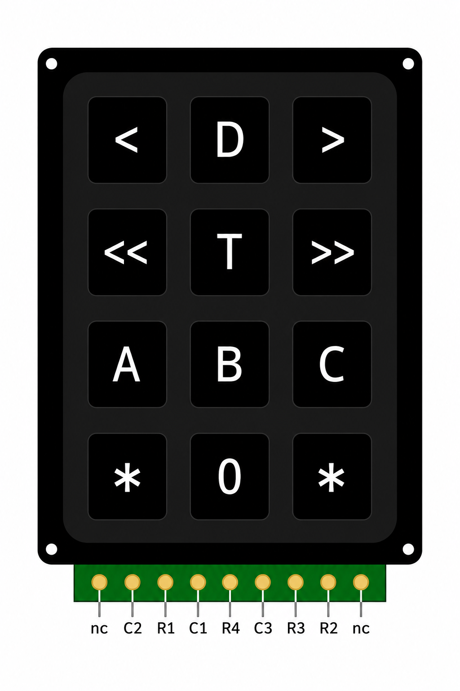
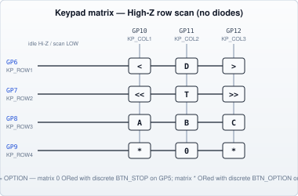
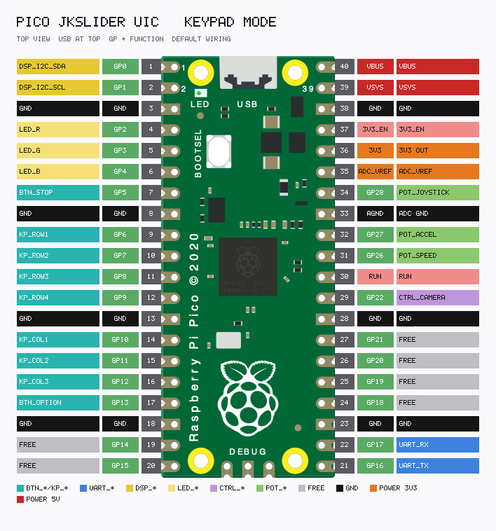
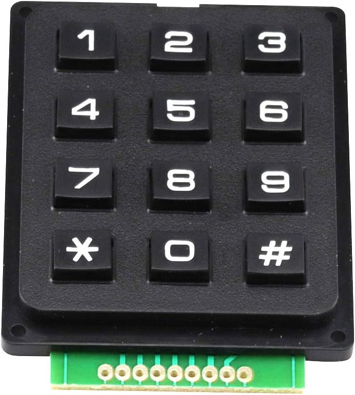

# KeyPads

[← Components index](JKSlider_Components.md)

**UIC** wiring (panel Pico). Motion axis is on SliderMC — see [ARCHITECTURE.md](../docs/ARCHITECTURE.md).

4×3 matrix mode: `JKS_INPUT_MODE = "keypad"`. Rows use **High-Z idle scan** (no row diodes): idle rows are inputs; the scanned row is driven LOW; columns read with pull-ups. Discrete **STOP** on GP5 is ORed with matrix `0`. Discrete **OPTION** on GP13 is ORed with matrix `*`.

| Matrix | Default | Config |
|--------|---------|--------|
| Rows KP_ROW1…4 | GP6…9 | `PIN_KEYPAD_ROWS = (6, 7, 8, 9)` |
| Cols KP_COL1…3 | GP10…12 | `PIN_KEYPAD_COLS = (10, 11, 12)` |
| STOP (discrete) | GP5 | `PIN_BTN_STOP` |
| OPTION (discrete) | GP13 | `PIN_BTN_OPTION` |

Recommended silk (Technical Manual):



Discrete button / pot or rocker panel alternatives: [Distinct Buttons — recommended layouts](JKSlider_Components_Buttons.md).



Ghosting / dual OPTION behaviour: [Technical Manual — Keypad ghosting](JKSlider_Technical_Manual_Panel.md#keypad-ghosting).



### PCB 4×3 membrane keypad (9-pin header)

**Status:** Working (layout and connector order match Technical Manual; qualify your exact seller SKU).



**Connector** (left → right, top view, keys facing you):

```
nc  C2  R1  C1  R4  C3  R3  R2  nc
```

Map to Pico nets:

| Header | Keypad net | Pico |
|--------|------------|------|
| C1 | KP_COL1 | GP10 |
| C2 | KP_COL2 | GP11 |
| C3 | KP_COL3 | GP12 |
| R1 | KP_ROW1 | GP6 |
| R2 | KP_ROW2 | GP7 |
| R3 | KP_ROW3 | GP8 |
| R4 | KP_ROW4 | GP9 |
| nc | unused | — |

Silk labels: use the recommended map above (relabel or overlay if the factory print is `1…9 * 0 #`).

**Manufacturer:** generic Amazon / marketplace 3×4 / 4×3 membrane modules (photo filename from listing). Add a stable product URL when confirmed.

**Config:**

```python
# JKSliderConfig.py
JKS_INPUT_MODE = "keypad"
PIN_KEYPAD_ROWS = (6, 7, 8, 9)   # KP_ROW1..4, upper row = GP6
PIN_KEYPAD_COLS = (10, 11, 12)   # KP_COL1..3
PIN_BTN_STOP = 5                 # discrete STOP; ORed with matrix 0
PIN_BTN_OPTION = 13              # discrete OPTION; ORed with matrix *
```
