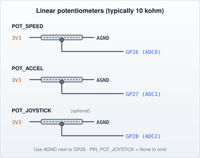

# Potentiometers

[← Components index](JKSlider_Components.md)

**UIC** wiring (panel Pico). Motion axis is on SliderMC — see [ARCHITECTURE.md](../docs/ARCHITECTURE.md).

Analogue panel controls on Pico ADC pins.

| Control | Default GP | Config |
|---------|------------|--------|
| SPEED | 26 (ADC0) | `PIN_POT_SPEED` |
| ACCEL | 27 (ADC1) | `PIN_POT_ACCEL` |

Typical **10 kΩ linear** pots (wiper → ADC; outer legs **3V3** and **AGND**):



**Status:** Working (default panel).

Related behaviour in `JKSliderConfig.py` / `SliderPins.JKSlider`: `JKS_SPEED_MIN_MM_S`, `JKS_SPEED_MAX_MM_S` (clamps `mc.max_speed` after CG), `JKS_ACCEL_MIN_MM_S2` / `JKS_ACCEL_MAX_MM_S2` (clamps `mc.max_accel`), `JKS_SPEED_CURVE_GAMMA`, `JKS_SPEED_DEADZONE`, pot denoise (`JKS_POT_*`). SPEED pot full scale is the clamped `mc.max_speed`.

**Config example:**

```python
# JKSliderConfig.py
PIN_POT_SPEED = 26
PIN_POT_ACCEL = 27
JKS_SPEED_MIN_MM_S = 1.0       # SPEED pot floor; full scale = slider.max_speed
JKS_SPEED_MAX_MM_S = 100.0     # clamps slider.max_speed ≤ MC max_speed
JKS_ACCEL_MIN_MM_S2 = 50.0
JKS_ACCEL_MAX_MM_S2 = 500.0    # clamps slider.max_accel ≤ MC max_accel
```

**Photos:** add under `docs/img/components/` for specific pot / panel modules.
