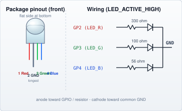
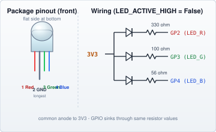
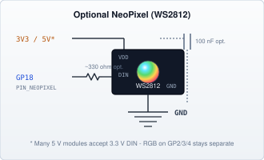

# RGB-LEDs

[← Components index](JKSlider_Components.md)

**UIC** wiring (panel Pico). Motion axis is on SliderMC — see [ARCHITECTURE.md](../docs/ARCHITECTURE.md).

PWM status LED on GP2/3/4. Optional WS2812 NeoPixel mirrors the same colours ([User Manual — Status LED](JKSlider_User_Manual.md#status-led-if-fitted)).

| Net | Default GP | Config |
|-----|------------|--------|
| LED_R / G / B | 2 / 3 / 4 | `PIN_LED_R` / `G` / `B` |
| Polarity | common-cathode | `LED_ACTIVE_HIGH = True` |
| NeoPixel | off | `PIN_NEOPIXEL = None` or e.g. `18` |

### Discrete common-cathode RGB (≈ 5 mA / channel)

**Status:** Working (default schematic).

4-pin 5 mm RGB LED: three anodes (R, G, B) and one shared cathode (GND). The common pin is usually the **longest leg** and goes to ground. Drive each colour HIGH through a resistor (`LED_ACTIVE_HIGH = True`).

Typical pinout (front view, flat side of housing at the bottom — SparkFun COM-00105 and many hobby parts; verify with datasheet):

| Pin | Name | Notes |
|-----|------|--------|
| 1 | Red | Anode → GPIO via resistor |
| 2 | GND | Common cathode (longest leg) |
| 3 | Green | Anode → GPIO via resistor |
| 4 | Blue | Anode → GPIO via resistor |

Target **≈ 5 mA** per channel from the Pico **3.3 V** GPIO.  
`R = (3.3 V − Vf) / 5 mA` — use different resistors per colour:

| Channel | Typical Vf @ 5 mA | R calc | E12 pick |
|---------|-------------------|--------|----------|
| LED_R | ≈ 1.8 V | 300 Ω | **330 Ω** (~4.5 mA) |
| LED_G | ≈ 2.8 V | 100 Ω | **100 Ω** (~5.0 mA) |
| LED_B | ≈ 3.0 V | 60 Ω | **56 Ω** (~5.4 mA) |



Common-anode variant (`LED_ACTIVE_HIGH = False`): tie the common anode to **3V3**; GPIO sinks through the same resistor values.



**Config:**

```python
# UIC_config.py
PIN_LED_R = 2
PIN_LED_G = 3
PIN_LED_B = 4
LED_ACTIVE_HIGH = True
```

### WS2812 NeoPixel (optional)

**Status:** Working when `PIN_NEOPIXEL` is set. Uses UIC PIO SM `PIO_NEOPIXEL_SM_ID` only (motor STEP PIO runs on SliderMC).

```python
PIN_NEOPIXEL = 18
PIO_NEOPIXEL_SM_ID = 1
```



RGB on GP2/3/4 remains wired as above — NeoPixel is additional, not a replacement. Details: [Technical Manual — NeoPixel](JKSlider_Technical_Manual_Panel.md#wiring-schematics--optional-neopixel-ws2812).
