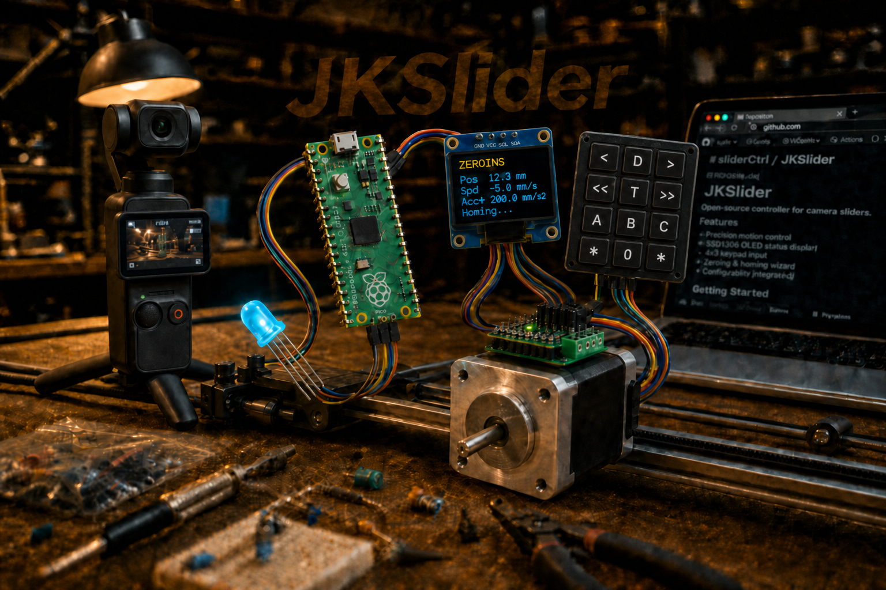
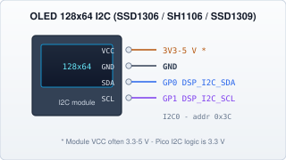

# JKSlider — Technical Manual: Bring-up



**JKSlider V1 by JK**

Flash MicroPython / SliderMC, copy files with Thonny, and configure via `SliderPins.py`.  
Hub: [JKSlider_Technical_Manual.md](JKSlider_Technical_Manual.md).

SliderMC flash & tasks: [BUILD.md](../../SliderMC/docs/BUILD.md) · persistent keys: [CONFIG.md](../../SliderMC/docs/CONFIG.md) · pins: [PINS.md](../../SliderMC/docs/PINS.md).

## Prepare the Pico with Thonny

[Thonny](https://thonny.org/) is a simple editor made for learning and for boards like the Pico. Think of it as: “window into the Pico’s tiny hard disk + a place to start programs.”

### What you need

- Raspberry Pi **Pico** or **Pico W** for the **UIC** (panel) — or a compact **RP2040-Zero** for smaller designs
- Second Pico (or **RP2040-Zero**) for **SliderMC** (motion)
- USB cable that carries **data** (not charge-only)
- A PC (Windows, Mac, or Linux)
- This project folder on your PC (from GitHub or a copy)
- SliderMC firmware from the sibling clone [`../../SliderMC`](../../SliderMC/docs/BUILD.md) ([BUILD.md](../../SliderMC/docs/BUILD.md))

Pin silk and the USB connector differ on an RP2040-Zero vs a full Pico; use the **same GPIO numbers** as in the project pinouts (e.g. GP16/17 UART) and flash a matching MicroPython **`.uf2`** for that board.

### 1. Install Thonny

1. Download Thonny from [https://thonny.org/](https://thonny.org/) and install it.
2. Start Thonny.
3. Menu **Tools → Options → Interpreter**.
4. Choose **MicroPython (Raspberry Pi Pico)**.
5. Click **OK**.

### 2. Put MicroPython on the Pico (first time only)

If the Pico is brand new, or you are not sure what is on it:

1. Hold down the white **BOOTSEL** button on the Pico.
2. While holding it, plug the USB cable into the PC — then release BOOTSEL.
3. A USB drive named something like **RPI-RP2** appears (like a USB stick).
4. On your PC browser, open [MicroPython downloads for Pico](https://micropython.org/download/RPI_PICO/)  
   (for Pico W use the **RPI_PICO_W** page instead).
5. Download the latest **`.uf2`** firmware file.
6. Drag that `.uf2` file onto the **RPI-RP2** drive.
7. The Pico reboots by itself; the USB stick disappears. That is normal.
8. In Thonny, click the stop/restart icon (or unplug/replug USB).  
   Bottom of Thonny should show a MicroPython “hello” line (the **Shell**).

If Thonny says it cannot find the device: try another USB cable/port, and check **Tools → Options → Interpreter → Port** (pick the Pico’s COM port).

### 3. See files on the Pico

1. Menu **View → Files** (so you see two file lists).
2. **Left** (or “This computer”) = files on your PC.  
   **Right** (or “Raspberry Pi Pico”) = files **on the Pico**.
3. You will copy project files from left → right.

### 4. Edit the config files on your PC first

Open these in Thonny (or any editor) **from the project folder on your PC**:

| File | Purpose |
|------|---------|
| `SliderPins.py` | **Edit this only** — full HW profile (copy from `SliderPins.example.py`) |
| `MC_config.py` / `UIC_config.py` | Shipped defaults (UART / OLED·LED·camera) — rarely edit |
| `JKSliderConfig.py` | Shipped panel defaults — rarely edit |

Work through the [Motor / slider checklist](#checklist--new-motor--slider-slidermc) below (axis on SliderMC), then set the panel options in `SliderPins.py` ([variants](JKSlider_Technical_Manual_Panel.md#configuration-variants), pins).

Tip: lines starting with `#` are comments (notes for humans). Changing numbers/text **without** a `#` in front is what the Pico uses.

### 5. Copy files onto the Pico

From the project folder, copy **at least** these onto the Pico (right-click → **Upload to /** or drag):

**Always**

- `MC_client.py`
- `UIC_base.py`
- `MC_config.py`
- `UIC_config.py`
- `JKSlider.py`
- `JKSliderConfig.py`
- `SliderPins.py` (from `SliderPins.example.py` — your HW profile)

**If you use the OLED**

- `oledfont.py`
- Driver for your chip (see table below): `ssd1306.py`, `sh1106.py`, or `ssd1309.py`

| Typical size | Controller | `DSP_DRIVER` | File |
|--------------|------------|---------------|------|
| 0.96″ | SSD1306 | `"ssd1306"` | `ssd1306.py` |
| 1.3″ | SH1106 (also sold as **SSH1106**) | `"sh1106"` | `sh1106.py` |
| 1.3″ | **CH1115 / CH1116** (SH1106 clones) | `"sh1106"` | `sh1106.py` |
| 1.54″ / 2.42″ | SSD1309 | `"ssd1309"` | `ssd1309.py` |

All are **I2C**, **128×64**, same on-screen layout. Set `DSP_DRIVER` and optional `DSP_ROTATE_180` in `UIC_config.py`. Module VCC is typically **3.3 V–5 V** (check the board; Pico I2C logic is 3.3 V).



Optional later: `SimpleExample.py` (small motion test without the full panel).

After upload, those names must appear in the **Pico** file list.

### 6. Make JKSlider start by itself (recommended)

So the slider runs when you power the Pico (without a PC):

1. On the Pico, create a file named exactly `main.py`.
2. Put only these two lines in it:

```python
import JKSlider
JKSlider.run()
```

3. **Save to the Pico** (not only to the PC).  
   In Thonny: while editing `main.py`, use **File → Save as… → Raspberry Pi Pico**.

Next power-up (USB power or your 5 V supply to the Pico), MicroPython runs `main.py` automatically.

### 7. First test run

1. Driver and motor wired and powered as your driver board requires (logic from Pico, motor power separate — follow your driver datasheet).
2. In Thonny Shell, you can start once by hand:

```python
import JKSlider
JKSlider.run()
```

   Or press the Pico reset / power-cycle if `main.py` is installed.
3. Release any stuck buttons if OLED says **Release …**.
4. Wait for homing; try SPEED + MOVE, then **STOP**.
5. If direction is wrong, see checklist item **DIR** below — flip `DIR_POSITIVE_HIGH` or swap motor wires (one change at a time).
6. If Thonny shows **`SliderMC banner timeout … continuing without MC`**, the panel UI started but the motion board did not answer — check the [Communication MC ↔ UIC](JKSlider_Technical_Manual_Link.md#communication-mc--uic) wiring checklist in the pitfalls table.

### Common Thonny pitfalls

| Problem | What to try |
|---------|-------------|
| “Device is busy” / upload fails | Click stop in Thonny; close the running program; try again |
| Edited config but behaviour unchanged | You edited the PC copy — upload `SliderPins.py` (and any changed defaults) to the Pico again |
| Shell shows errors about missing module | That `.py` file is not on the Pico — upload it |
| Want to stop a running slider from PC | Click Thonny’s red stop button, or unplug USB briefly |
| Files on Pico vs PC mixed up | Always check **which side** you saved to (Pico vs computer) |
| `SliderMC banner timeout … continuing without MC` | UART **crossed** (UIC TX→MC RX, UIC RX→MC TX)? Shared **GND**? Both at **1 000 000** baud? SliderMC firmware flashed and powered? Panel continues without motion until the link works |

---

## Checklist — new motor / slider (SliderMC)

Use this when you build a **new** mechanical slider or change the motor/driver.  
Tick each item. Values below are examples; use **your** hardware.

### A. Mechanics (how far one motor turn moves the carriage)

These live on **SliderMC** (not UIC `UIC_config.py`). See [CONFIG.md](../../SliderMC/docs/CONFIG.md).

- [ ] **Motor steps per turn** — usual NEMA17 = `200` (1.8°).
- [ ] **Microstepping** — must match the **driver DIP / MS straps / SPI config**. Project default is often **8**.
- [ ] **Travel per motor revolution (mm)** — leadscrew pitch or belt pitch × pulley teeth.
- [ ] Confirm: `steps_per_mm = (MOTOR_STEPS_PER_REV × MICROSTEPS) ÷ MM_PER_REV`  
  Example: 200 × 8 ÷ 5 → **320 steps/mm**.

### B. How far the carriage may travel

- [ ] Measure usable travel in mm (after end stops / hard stops with a safety margin).
- [ ] Set MC `slider_min` (often `0.0` after homing) and `slider_max` (e.g. `600.0` for a 60 cm usable run) via `CS` / mc.ini.
- [ ] UIC reads these via `CG` after the welcome banner (`slider.slider_min` / `slider.slider_max`).
- [ ] Optional (UIC): `SOFT_LIMIT_WARN_MM` — how many mm before the end the LED starts “near limit” blink (default 10).

### C. Speeds and “feel”

- [ ] MC `max_speed` — fastest SPEED pot / FAST may request (start **conservative**, e.g. 50–100). UIC uses this as pot full scale.
- [ ] MC `max_accel` / `init_accel` — planner ceiling and session default; panel ACCEL pot uses `JKS_ACCEL_MIN_MM_S2`…`min(JKS_ACCEL_MAX_MM_S2, max_accel)`.
- [ ] Optional UIC clamps: `JKS_SPEED_MAX_MM_S`, `JKS_ACCEL_MAX_MM_S2`, `JKS_SPEED_MIN_MM_S`.
- [ ] Homing / DRV_ERROR / home direction — **SliderMC** config (`HOME_*`, halt decel, etc.).
- [ ] If motion feels rough at high speed: lower MC `max_speed`, or check microstepping / power / mechanical binding.  
  See SliderMC motion docs and [Technical Manual — Motion](JKSlider_Technical_Manual_Motion.md).

### D. Driver and switch logic (must match your electronics)

- [ ] `PIN_DRV_STEP` / `PIN_DRV_DIR` / `PIN_DRV_EN` / `PIN_SW_HOME` / `PIN_DRV_ERROR` — on the **SliderMC** Pico (see [PINS.md](../../SliderMC/docs/PINS.md)); not on the UIC.
- [ ] `EN_ACTIVE_LOW` — `True` for most A4988 / DRV8825 / TMC boards (enable when pin is low).
- [ ] `DIR_POSITIVE_HIGH` — if “right” on the panel moves the wrong way, flip this to `True`/`False` (or swap A/B motor wires once mechanics are fixed).
- [ ] `SW_HOME_ACTIVE_HIGH` / `SW_HOME_PULL` — match your home switch (many are to GND with pull-up → active low).
- [ ] `DRV_ERROR_ACTIVE_HIGH` / `DRV_ERROR_PULL` — match your E-stop wiring (or leave unused pin safe).
- [ ] LED pins / `LED_ACTIVE_HIGH` if you fit an RGB LED (UIC `UIC_config.py`).
- [ ] OLED: `DSP_ENABLED = True` only if wired; set `DSP_DRIVER` / `DSP_ROTATE_180` and SDA/SCL if not using the defaults.

### E. Quick prove-out (before trusting a shoot)

- [ ] Power motor supply + Pico; homing finds the switch and stops cleanly.
- [ ] From soft min, a known move (e.g. 100 mm) matches a ruler within a millimetre or two.  
  If distance is wrong by a **factor** (e.g. half/double): recheck `MICROSTEPS` and `MM_PER_REV`.
- [ ] Soft max stops gently; STOP tap and STOP hold behave as in the User Manual.
- [ ] DRV_ERROR / E-stop (if fitted) kills motion and leaves the driver safe.

### F. Panel file (after axis works)

- [ ] Set `SliderPins.py` for your [variant](JKSlider_Technical_Manual_Panel.md#configuration-variants) (`JKS_INPUT_MODE`, pins, joystick `None` if unused).
- [ ] Upload panel files; run JKSlider; store PosA/B/C as needed.
- [ ] On the Pico, `jks_positions.txt` appears after the first save (marks / TL / delay / joy centre / camera FPS / tl_mode).  
  Format: `PosA,PosB,PosC[,tl_div,swap_lr,delay_s,joy_center,camera_fps[,tl_mode]]`  
  `tl_mode` is `msm` or `continuous` (UI: Cont).

---

