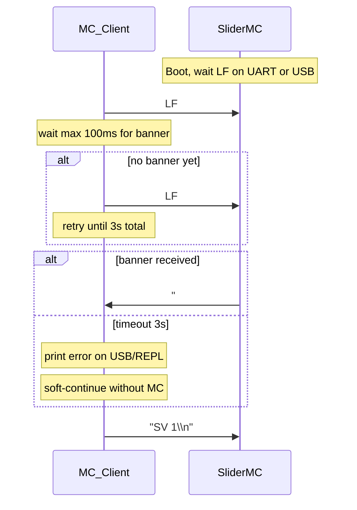

# JKSlider — Technical Manual: Link (MC ↔ UIC)


**JKSlider V1 by JK**

UART interconnect and session handshake between the UIC and SliderMC.  
Hub: [JKSlider_Technical_Manual.md](JKSlider_Technical_Manual.md).

SliderMC wire format: [PROTOCOL.md](../../SliderMC/docs/PROTOCOL.md) · [Startup banner](../../SliderMC/docs/PROTOCOL.md#startup-banner) · [Wire rules](../../SliderMC/docs/PROTOCOL.md#wire-rules) · [PINS.md](../../SliderMC/docs/PINS.md).

## Communication MC ↔ UIC

Wire and bring up the UART link before expecting motion from the panel. Full architecture notes: [docs/ARCHITECTURE.md](../docs/ARCHITECTURE.md#interconnect-and-housing). Wire format: [PROTOCOL.md](../../SliderMC/docs/PROTOCOL.md) ([Startup banner](../../SliderMC/docs/PROTOCOL.md#startup-banner), [Wire rules](../../SliderMC/docs/PROTOCOL.md#wire-rules)). Pins: [PINS.md](../../SliderMC/docs/PINS.md).

### Wiring

**Crossed UART** — each Pico uses GP16 = TX and GP17 = RX; the cables **cross**:

| From | To |
|------|-----|
| UIC GP16 (`UART_TX`) | MC GP17 (`UART_RX`) |
| UIC GP17 (`UART_RX`) | MC GP16 (`UART_TX`) |
| UIC GND | MC GND |

Default baud **1 000 000**. To change it, edit SliderMC `UART_BAUD` in `include/pins.h` (see [PINS.md](../../SliderMC/docs/PINS.md)) and match the UIC (`MC_Client` UART). UART is **3.3 V** — do not connect directly to a **5 V** MCU (e.g. classic Arduino) without level shifting.

**Power** — UIC and MC may share **`VSYS`** (+ GND). Example: plug USB into the UIC for debugging; feed the MC from UIC `VSYS` so the motion Pico needs no separate logic supply. Motor VM stays on the driver / motor PSU.

**Stacking** — you can stack the two Picos with jumper pins (e.g. GND pads / headers). Keep **BOOTSEL** accessible for reflashing. Stacking is the compact two-board sandwich; for a long cable between panel and axis, use the **handheld remote** layout below.

**EMO / hard limits** — `DRV_ERROR` and limit switches connect to the **MC** only. The UIC learns emergency stop / hard-limit state from the MC **verbose `#…` status line** (e.g. `#E …`, `#L …`), not from a UIC GPIO.

### Handheld UIC remote (4-wire cable)

The split lets the **UIC** be a **handheld wired remote** while the **MC** sits next to the motor driver and power supply on the rail or base. Only a **4-wire cable** is needed between UIC and MC:

| Conductor | Role |
|-----------|------|
| **5 V** | Logic supply to the far board (usually UIC powered from the MC end) |
| **GND** | Common ground (required) |
| **TX** | UIC GP16 → MC GP17 (crossed) |
| **RX** | UIC GP17 → MC GP16 (crossed) |

**Typical power layout**

1. Motor bus / PSU feeds the driver **VM** and a local **DC/DC buck** to **5 V** at the MC end.
2. That **5 V** + **GND** go over the cable to power the UIC (panel Pico / RP2040 board `VSYS` or equivalent).
3. UART **TX** / **RX** ride the same cable (crossed as in the table above). Logic stays **3.3 V** on the UART pins.

Keep **motor VM** and high current local to the MC / driver — never run motor power through the remote cable. Bench USB on the UIC (MC fed from UIC `VSYS`) remains valid for debugging; the remote layout simply reverses the usual “who supplies 5 V” direction so the handheld panel does not need its own battery.

**Cable length and baud** — default **1 000 000** baud assumes a short, clean link. Longer remotes may need a shielded cable, a lower baud (`UART_BAUD` in SliderMC `include/pins.h`, matched in the UIC `MC_Client` UART), or a shorter run. Shared GND is mandatory at either length.

Architecture overview: [docs/ARCHITECTURE.md](../docs/ARCHITECTURE.md#interconnect-and-housing).

### Session start (handshake)

The MC does **not** send its welcome banner until it sees a `\n` (LF) on the **UIC UART or USB CDC** (whichever arrives first). Bytes before that LF are discarded on both ports. Production panels unlock over UART: the UIC (`MC_Client.start()`) sends `\n` and waits for a line starting with `# ` (hash + space):

```text
# Slider Motion Controller V1.0 ['$' for help]
```

If no banner arrives within **100 ms**, the UIC sends another `\n`. After **3 s** without a banner it prints an error to the USB/REPL shell and **continues** (panel UI can start without motion). On success (or soft-continue) it sends `SV 1` for verbose status.

**USB-only bench (no UIC):** open the MC USB serial monitor and press Enter (LF). That unlocks the session and prints the banner so you can type ASCII commands without UART wiring. See [PROTOCOL.md — Startup banner](../../SliderMC/docs/PROTOCOL.md#startup-banner).



After a UIC-only reboot, the MC does **not** re-send the banner unless the MC also resets — power-cycle both boards or reset the MC when re-establishing the link.

