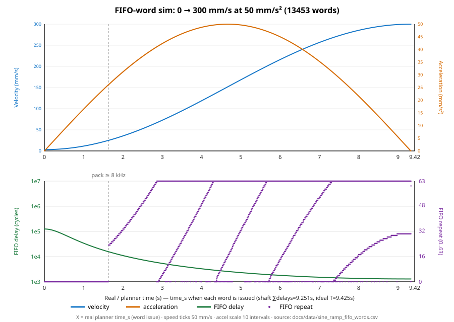
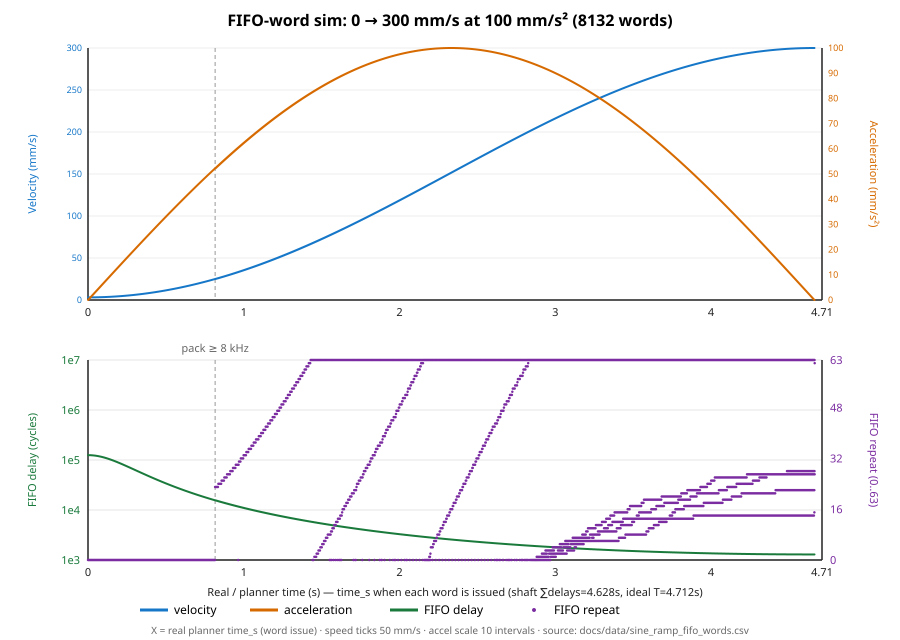
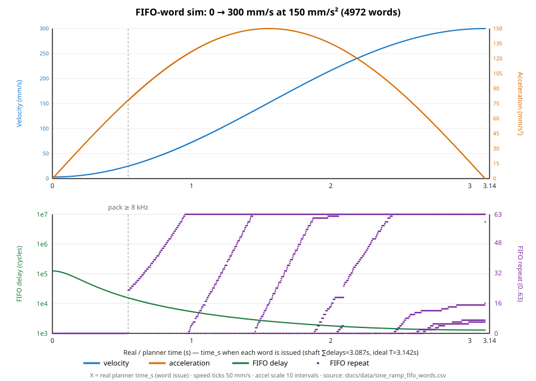
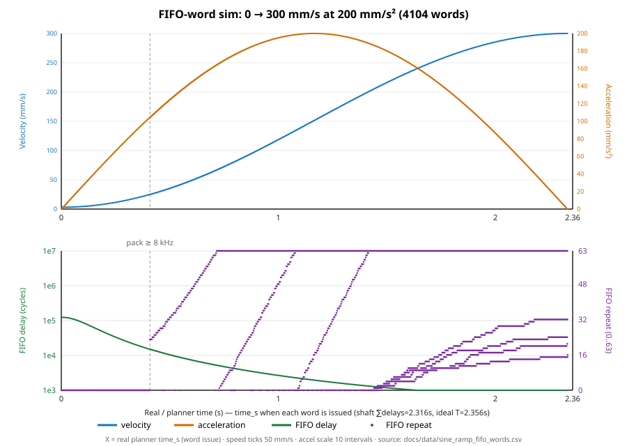
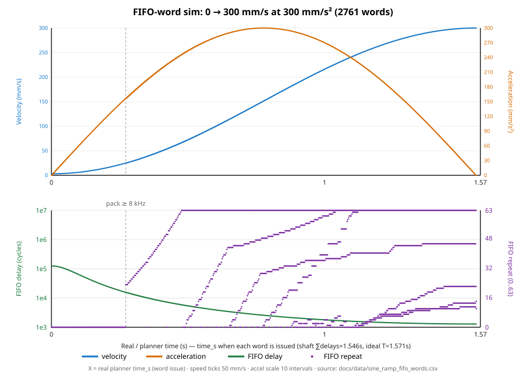
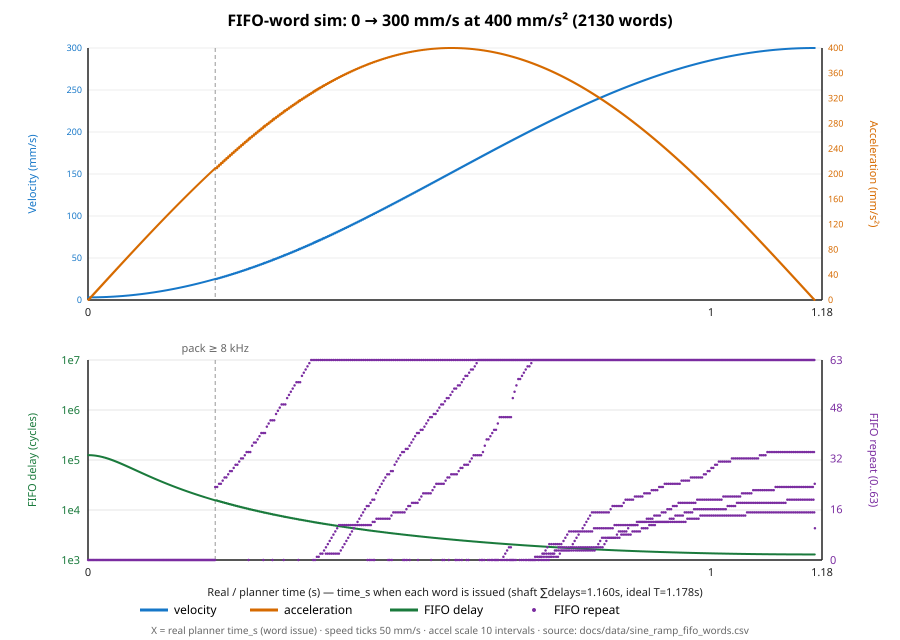
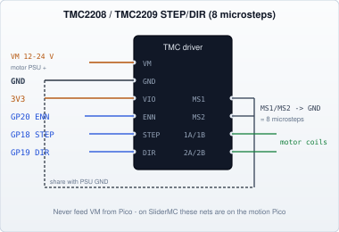

# JKSlider — Technical Manual: Motion


**JKSlider V1 by JK**

Step-rate limits, sine acceleration, and STEP/DIR driver wiring (axis / SliderMC side).  
Hub: [JKSlider_Technical_Manual.md](JKSlider_Technical_Manual.md).

SliderMC planner & PIO: [MOTION.md](../../SliderMC/docs/MOTION.md) · command list: [PROTOCOL — Commands](../../SliderMC/docs/PROTOCOL.md#commands) · limits/homing keys: [CONFIG.md](../../SliderMC/docs/CONFIG.md) (Hard limits, Homing sections).

## Step rates — what limits speed (and crawl)

How fast (and how slowly) the carriage can move is set by **three ceilings**. The slowest one wins.

Numbers below assume the default mechanics **320 steps/mm** (`200` full steps × `8` microsteps / `5` mm per rev). If you change `MICROSTEPS` or `MM_PER_REV`, mm/s scales with `STEPS_PER_MM`.

### 1. Three ceilings

| Ceiling | What it is | Typical limit @ 320 steps/mm |
|---------|------------|------------------------------|
| STEP pulse width | 5 µs high time forces a period of at least ~10 µs | **~312 mm/s** — electrical ceiling at 100 kHz |
| Software cap | `MAX_STEP_RATE_HZ` (default **100 000**) | **~312 mm/s** |
| Python fill + packing | How fast MicroPython can feed the STEP FIFO | Without packing, only ~**12–31 mm/s**; with packing, cruise can reach the software cap |

The SPEED pot asks for a mm/s value; the firmware turns that into a step frequency. If that frequency is higher than Python can feed one pulse at a time, the firmware **packs** several equal pulses into one FIFO word.

### 2. How STEP timing works (short)

- A PIO state machine toggles the STEP pin. Each word in its FIFO is:
  - **delay** (lower 26 bits) — wait after each pulse
  - **repeat** (upper 6 bits) — `0` = one pulse, `63` = sixty-four pulses with that same delay
- Period ≈ `delay + STEP_PULSE_CYCLES` at `PIO_FREQ_HZ` (125 MHz).
- STEP high time is 625 cycles (**5 µs**), built from `set[31]` + 18×`nop[31]` + `nop[16]` (PIO instruction delay caps at 31). `STEP_PULSE_CYCLES` (629) adds the 4 cycles of loop overhead. The STEP program uses 27 of 32 PIO instruction slots.
- Slowest crawl from a full 26-bit delay ≈ **1.86 steps/s** ≈ **0.006 mm/s** → matches `MIN_SPEED_MM_S = 0.006`.
- Only about `STEP_FIFO_TIME_BUDGET_MS` (default **8 ms**) of motion is kept queued ahead, so STOP does not coast for a long time.

### 3. Why high SPEED used to “freeze” or feel wrong

MicroPython’s motion loop can only plan on the order of **thousands** of iterations per second. A SPEED of **100 mm/s** needs **32 000** steps/s. Without packing, the FIFO runs dry, the CPU spins trying to keep up, and the heartbeat / buttons can starve.

Homing at ~20 mm/s (~6400 steps/s) sits near that edge — usually OK, but long seeks are less forgiving.

### 4. After packing (current firmware)

- Up to **64** equal pulses per FIFO word when the step rate is above `STEP_PACK_MIN_HZ` (default 200).
- Homing stays on **one pulse per word** (switch precision). Very slow crawl packs according to the time budget.
- Cruise can sustain up to **`MAX_STEP_RATE_HZ`** (100 kHz). Ramps are approximate staircases of short constant-speed segments.
- For `moveTo` / `moveBy`, each issued word is also capped by the stop-distance law \(v \le \sqrt{4 a\,d/\pi}\) from remaining travel (floor `STOP_APPROACH_HZ`, default 400 Hz). Burst length is limited to about 20 % of remaining steps so the brake staircase keeps enough samples. Soft STOP drains TX **and** the in-flight word before releasing the SM.

| Situation | Step rate | mm/s @ 320 steps/mm |
|-----------|-----------|---------------------|
| `MIN_SPEED_MM_S` | ~1.9 Hz | **0.006** |
| Home approach 5 mm/s | 1.6 kHz | 5 |
| Home seek 20 mm/s | 6.4 kHz | 20 |
| Default max 100 mm/s | 32 kHz | 100 |
| `MAX_STEP_RATE_HZ` | 100 kHz | ~312 |

**Queued buffer vs STOP coast** (soft STOP drains the FIFO; hard limit aborts and drops pulses):

| Queued steps | @ 100 kHz | @ 32 kHz (100 mm/s) | @ 10 kHz |
|--------------|-----------|---------------------|----------|
| ~64 (one full word) | ~0.6 ms | ~2 ms | ~6 ms |
| Budget ~8 ms | ~800 steps | ~256 steps | ~80 steps |

### 5. Config knobs (change carefully)

| Symbol | Role |
|--------|------|
| `MIN_SPEED_MM_S` | Slowest allowed UIC command |
| MC `max_speed` / `max_accel` (via `CG`) | Seed for `MC_Client.max_speed` / `max_accel` |
| `JKS_SPEED_MAX_MM_S` / `JKS_ACCEL_MAX_MM_S2` | Panel clamps: `slider.max_* = min(MC, JKS_*)`; pots, FAST, OPTION use those |
| `JKS_SPEED_MIN_MM_S` | SPEED pot floor |
| Homing / FIFO / pack / ramp floors | **SliderMC** config (not UIC `UIC_config`) |

Raising `MAX_STEP_RATE_HZ` above ~159 kHz does nothing at all: the 5 µs STEP pulse plus loop overhead cannot fit into a shorter period, so the firmware would silently stretch it. Even below that it is pointless if the driver or mechanics cannot follow. Lowering microsteps raises mm/s for the same step rate.

More detail for programmers: [docs/API.md](../docs/API.md) (PIO section). Mechanics: [JKSlider_Hardware_Manual.md](JKSlider_Hardware_Manual.md). MC motion stack: [MOTION.md](../../SliderMC/docs/MOTION.md).

---

## Acceleration profile (sine ramps)

JKSlider does **not** use a linear (constant-acceleration) ramp, and it is **not** a quarter-sine velocity curve (φ → π/2). Each speed change is a **raised-cosine** blend over a half period:

\[
v(\varphi) = v_0 + (v_1 - v_0)\,\frac{1 - \cos\varphi}{2},\quad \varphi: 0 \rightarrow \pi
\]

| Piece | Shape |
|-------|--------|
| Accel / decel ramp | Velocity is an S-curve (raised cosine). Instantaneous acceleration is a **half-sine**: starts at 0, peaks in the middle, returns to 0. No constant-accel (linear-velocity) segment inside the ramp. |
| Long move cruise | Once cruise speed is reached, velocity is **held constant** until braking starts. |

Peak acceleration \(|a|\) is what MC `init_accel` / the ACCEL pot / `setAcceleration()` set. Useful timing (peak \(a\), speed change \(\Delta v\)):

- Ramp duration: \(T = \pi\,|\Delta v| / (2 a)\)
- Stopping distance from speed \(v\): \(d = \pi v^2 / (4 a)\)
- Inverse (max speed that can still stop in distance \(d\)): \(v = \sqrt{4 a\,d / \pi}\)
- Short moves that never reach cruise: symmetric sine peak (no flat middle)

**Position moves:** the seek command and the **issued** STEP rate both use that stop-distance cap, floored at `STOP_APPROACH_HZ`, so a lagging software ramp cannot queue cruise-rate pulses through the brake zone. Live retarget (`moveTo` while moving) and mid-move speed changes still work because the cap is recomputed every planner iteration from the current remaining travel.

**Direction reverse:** decelerate to 0 → pause `DIR_CHANGE_PAUSE_S` (default **0.1 s**) → accelerate the other way. Pure stops (`stop()` / STOP tap) skip that pause. `halt()` / STOP hold / `DRV_ERROR` use `DRV_ERROR_DECEL_MM_S2` instead of the ACCEL pot.

At high step rates the PIO FIFO packs equal pulses, so a ramp is an approximate **staircase** of short constant-speed segments that follow the cosine formula — still the same profile, not a linear middle. With `DEBUG_LEVEL >= 4`, each completed velocity move dumps the last ~48 issued words as `hz:n` pairs (`fifo …`) so the brake staircase is visible on the USB log.

### FIFO-word examples (0 → 300 mm/s)

These plots are from a word-level simulation of the STEP FIFO fill loop (`docs/sim_sine_ramp_fifo.py`): each stair is one packed PIO word (`delay` + `repeat`). X is **planner / real time** when the word is issued. Assumptions: 320 steps/mm, PIO 125 MHz, `STEP_PACK_MIN_HZ = 200`, `RAMP_START_HZ = 1000`, 8 ms FIFO time budget, one queued word per ~200 µs of planner loop.

Leaving standstill snaps the first ramp speed to `RAMP_START_HZ` / `STEPS_PER_MM` (~3.1 mm/s) so the first FIFO words are ~1 ms/pulse instead of ~0.5 s crawl pulses. Each run queues the ramp distance from that floor: \(d = \pi(v^2 - v_{\mathrm{start}}^2)/(4a)\).

Regenerate:

```text
python docs/sim_sine_ramp_fifo.py --accel 50
python docs/sim_sine_ramp_fifo.py --accel 100
python docs/sim_sine_ramp_fifo.py --accel 150
python docs/sim_sine_ramp_fifo.py --accel 200
python docs/sim_sine_ramp_fifo.py --accel 300
python docs/sim_sine_ramp_fifo.py --accel 400
```

| Peak accel | Ideal \(T\) (from start) | Ramp distance | Steps | FIFO words | Simulated total |
|-----------|--------------------------|---------------|-------|------------|-----------------|
| 50 mm/s² | 9.33 s | 1413.6 mm | 452 340 | 13 453 | 9.33 s |
| 100 mm/s² | 4.66 s | 706.8 mm | 226 170 | 8132 | 4.67 s |
| 150 mm/s² | 3.11 s | 471.2 mm | 150 780 | 4972 | 3.11 s |
| 200 mm/s² | 2.33 s | 353.4 mm | 113 085 | 4104 | 2.33 s |
| 300 mm/s² | 1.55 s | 235.6 mm | 75 390 | 2761 | 1.56 s |
| 400 mm/s² | 1.17 s | 176.7 mm | 56 543 | 2130 | 1.17 s |

With `RAMP_START_HZ = 1000`, simulated totals match ideal \(T\) (no multi-second crawl stall). Set `RAMP_START_HZ = 0` in `UIC_config.py` to restore true-zero toe behaviour (not recommended).

#### Peak accel 50 mm/s²



#### Peak accel 100 mm/s²



#### Peak accel 150 mm/s²



#### Peak accel 200 mm/s²



#### Peak accel 300 mm/s²



#### Peak accel 400 mm/s²



Programmer detail and direction-change plot: [docs/API.md](../docs/API.md) (Acceleration profile). Regenerate that plot with `python docs/render_dir_change_pause.py`.

---

### Wiring schematics — TMC stepper drivers (STEP/DIR)

On the **SliderMC** board, the axis is driven as **STEP + DIR + EN** only (no UART/SPI in firmware for microstepping).  
Default MC pins and software defaults (see [PINS.md](../../SliderMC/docs/PINS.md)):

| MC GPIO | Driver | Config |
|---------|--------|--------|
| GP18 | STEP | `PIN_DRV_STEP` ([PINS.md](../../SliderMC/docs/PINS.md)) |
| GP19 | DIR | `PIN_DRV_DIR` |
| GP20 | EN → **ENN** (active-low enable) | `PIN_DRV_EN`, `EN_ACTIVE_LOW = True` |
| GND | GND (logic + power return) | — |
| 3V3 | **VIO** / VCC_IO (logic supply) | — |

Set **`MICROSTEPS = 8`** (UIC `UIC_config.py` / MC steps-per-mm) and configure the driver for **8 microsteps** the same way (pins or SPI).  
Motor supply **VM** is never taken from the Pico — only share **GND**.

Common rules for all modules below:



#### TMC2208 / TMC2209 (SilentStepStick / BTT-style, standalone)

UART is **not** required. Strap **MS1 / MS2** for 8 microsteps (both to GND):

| MS2 | MS1 | Microsteps |
|-----|-----|------------|
| GND | GND | **8** ← use this |
| GND | VIO | 2 |
| VIO | GND | 4 |
| VIO | VIO | 16 |

```
                         +------------------+
   VM (motor PSU +) -----| VM / VMOT        |
   PSU GND --------------| GND              |---- MC GND
                         |                  |
   motor A+ -------------| 1A / A1          |
   motor A− -------------| 1B / A2          |
   motor B+ -------------| 2A / B1          |
   motor B− -------------| 2B / B2          |
                         |                  |
   MC 3V3 -------------| VIO / VDD        |
   MC GP20 ------------| ENN / EN         |   EN_ACTIVE_LOW = True
   MC GP18 ------------| STEP             |
   MC GP19 ------------| DIR              |
                         |                  |
   GND ------------------| MS1              |   8 microsteps
   GND ------------------| MS2              |
                         |                  |
   (optional) float/nc --| PDN_UART / DIAG  |   leave unused if no UART
                         +------------------+

  TMC2209 only (typical): SPREAD → GND = StealthChop, VIO = SpreadCycle
  (board silk / jumpers may rename MS1/MS2 as CFG1/CFG2 — same table).
```

Current: set the module trim pot / heatsink per the board manual (do not exceed motor rating).  
`MICROSTEPS = 8` in `UIC_config.py` must match MS1/MS2 = GND/GND.

#### TMC5160T / TMC5160T Pro (BTT SPI module)

These modules are **SPI-configured**; motion still uses **STEP / DIR / EN**.  
JKSlider does **not** bit-bang SPI — set run current and **microsteps = 8** once with a host that speaks TMC SPI (printer board, USB–SPI adapter, or pre-programmed module), then run STEP/DIR from the Pico.

Pin names follow common BTT dual-row silkscreen (J1 control / J2 power):

```
                         +---------------------------+
   VM (8–56 V Pro*) -----| VM                    J2  |
   PSU GND --------------| GND                       |---- MC GND
                         | A1 / A2 / B1 / B2         |---- stepper coils
   MC 3V3 -------------| VIO / VCC_IO              |
                         +---------------------------+
                         | EN                    J1  |---- MC GP20
                         | STEP                      |---- MC GP18
                         | DIR                       |---- MC GP19
                         | SDI  SCK  CSN  SDO  CLK   |---- SPI host**
                         +---------------------------+

  *  TMC5160T (non-Pro) often rated lower VM (e.g. ≤ 24 V) — check your board.
  ** SPI is required to set CHOPCONF microstep resolution to 8 and motor current.
     After configuration, SPI may stay connected or be left wired but idle;
     STEP/DIR alone will not change the stored microstep setting.
```

Minimal STEP/DIR-only sketch (SPI programmed separately for **8 µsteps**):

```
  MC 3V3 ---- VIO
  MC GND ---- GND (also to motor PSU −)
  MC GP18 --- STEP
  MC GP19 --- DIR
  MC GP20 --- EN   (active-low ENN behaviour; EN_ACTIVE_LOW = True)

  SPI host ---- SDI / SCK / CSN / SDO   (set microsteps = 8, then optional)
  CLK --------- leave open unless your module requires an external clock
```

Firmware checklist for any of these drivers:

- [ ] `MICROSTEPS = 8` matches driver (MS straps or SPI `MRES`)
- [ ] `EN_ACTIVE_LOW = True`
- [ ] `DIR_POSITIVE_HIGH` flipped if travel direction is wrong
- [ ] Shared GND; VM from motor PSU only
- [ ] `steps_per_mm = (MOTOR_STEPS_PER_REV × MICROSTEPS) ÷ MM_PER_REV` on **SliderMC**

### Closed-loop drivers and stall / alarm → DRV_ERROR

JKSlider firmware stays **open-loop STEP/DIR** (no encoder input on the Pico). That is enough when you use a **closed-loop stepper driver** that takes STEP/DIR and keeps its own encoder loop on the motor.

**`PIN_DRV_ERROR`** is the hardware interlock input. With **SliderMC**, the EMO / driver alarm lives on **MC GP21**; the UIC uses GP22 for `PIN_CTRL_CAMERA`. The UIC sees EMO / hard-limit via the MC **verbose `#…` status line** (not a local EMO pin). Use the MC input for:

- **Motor driver error detection** (stall / alarm / OC / fault from a closed-loop or smart driver)
- **Emergency stop** button (or both, diode-OR’d onto the same pin)

When the input asserts, Slider runs the interlock path: **halt** with `DRV_ERROR_DECEL_MM_S2`, then **disable** the driver and block further moves while `DRV_ERROR` stays active.

```
  Closed-loop driver          MC
  STEP  <-------------------  GP18  DRV_STEP
  DIR   <-------------------  GP19  DRV_DIR
  EN    <-------------------  GP20  DRV_EN  (match EN polarity)
  GND   --------------------  GND

  ALARM / ERR / OC  --------> MC GP21 DRV_ERROR
       (open-collector OK)

  Optional panel E-stop ------+
                              |  diode-OR / wired-OR if both fitted
                              v
                            GP22
```

Config:

- Match **`DRV_ERROR_ACTIVE_HIGH`** / **`DRV_ERROR_PULL`** to the alarm polarity (many modules are **open-collector, active-low** → `DRV_ERROR_ACTIVE_HIGH = False`, `DRV_ERROR_PULL = 1`).
- If you also have a panel e-stop on the same pin, use **diode-OR** (or the driver’s recommended parallel wiring) so either source can pull `DRV_ERROR` active.
- Soft limits and stored positions still assume commanded steps were followed **until** the alarm; the alarm stops further motion — it does not rewrite position from an encoder.

No firmware change is required for this setup: any STEP/DIR closed-loop driver + alarm→`DRV_ERROR` is supported.

