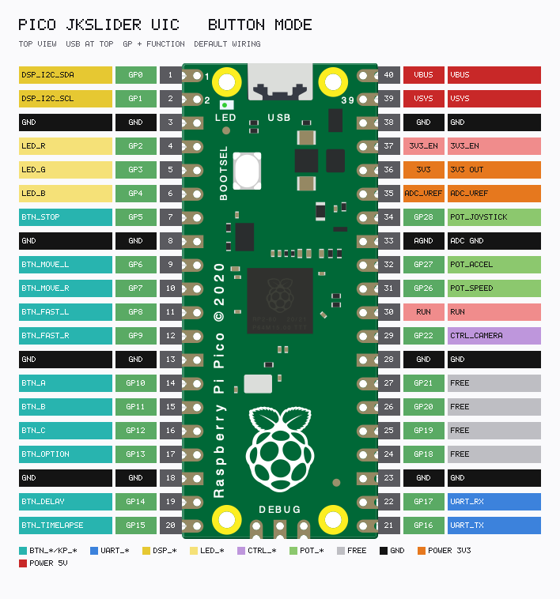
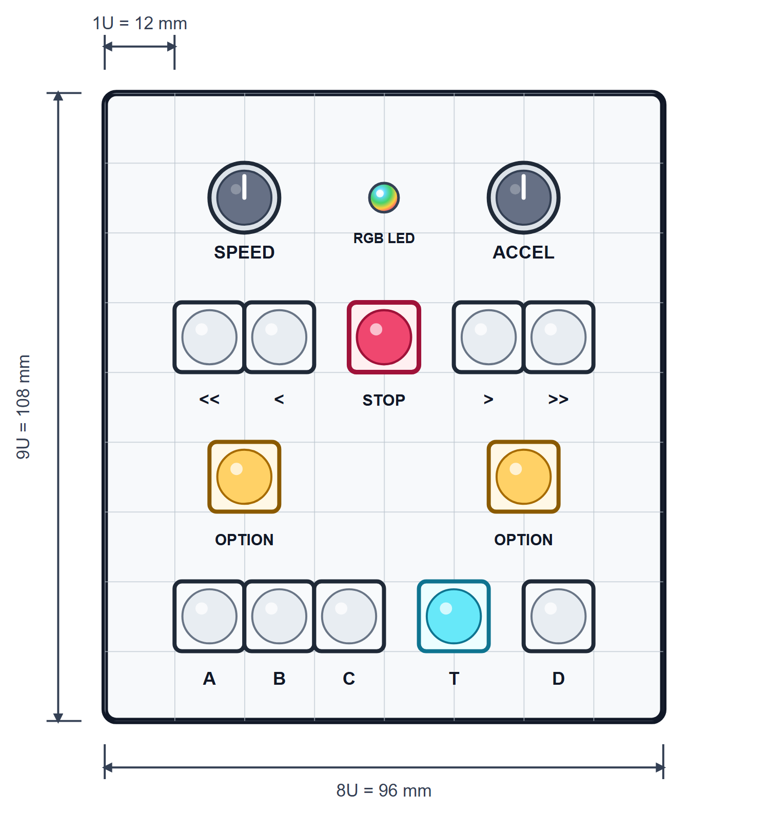
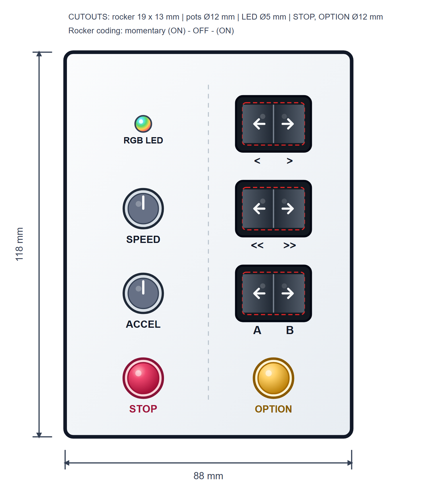
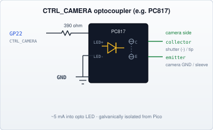

# JKSlider — Technical Manual: Panel


**JKSlider V1 by JK**

UIC panel variants, pinouts, and wiring (buttons, keypad, pots, RGB, camera).  
Hub: [JKSlider_Technical_Manual.md](JKSlider_Technical_Manual.md).

Verbose `#…` status letters (OLED): [PROTOCOL — State letters](../../SliderMC/docs/PROTOCOL.md#state-letters) · [Verbose push](../../SliderMC/docs/PROTOCOL.md#verbose-push-3-hz-when-session-verbose1).

## Configuration variants

Software is the same for all builds. Omit unused switches (leave GPIOs unwired — pull-ups read released). Disable unused options in config.

**LED and OLED are optional on every variant.**

| Feedback | How to omit |
|----------|-------------|
| RGB status LED | Leave GP2–GP4 unwired |
| OLED 128×64 | `DSP_ENABLED = False` in `UIC_config.py`, or leave I2C unwired |

**SPEED**, **ACCEL**, and **BTN_STOP** are assumed on all variants below.

### Full - All you can get

| Include | Notes |
|---------|--------|
| POT_SPEED, POT_ACCEL, POT_JOYSTICK | `PIN_POT_JOYSTICK = 28` (or ADC pin) |
| BTN_STOP, BTN_OPTION | |
| BTN_MOVE_L / R, BTN_FAST_L / R, BTN_A / B / C | |
| BTN_DELAY, BTN_TIMELAPSE | |
| Input | `JKS_INPUT_MODE = "button"` or `"keypad"` |

### Minimum Joystick

| Include | Omit |
|---------|------|
| SPEED, ACCEL, JOYSTICK, BTN_OPTION, BTN_STOP | BTN_MOVE, BTN_FAST, BTN_A/B/C, BTN_DELAY, BTN_TIMELAPSE |

### Minimum Buttons

| Include | Omit |
|---------|------|
| SPEED, ACCEL, BTN_OPTION, BTN_STOP, BTN_MOVE_L / R | JOYSTICK (`None`), BTN_FAST, BTN_A/B/C, BTN_DELAY, BTN_TIMELAPSE |

### Medium Buttons

| Include | Omit |
|---------|------|
| SPEED, ACCEL, BTN_OPTION, BTN_STOP, BTN_MOVE, BTN_FAST, BTN_A/B/C | JOYSTICK (`None`), BTN_DELAY, BTN_TIMELAPSE |

### Medium Keypad

| Include | Omit |
|---------|------|
| SPEED, ACCEL; full keypad; discrete BTN_STOP GP5; discrete BTN_OPTION GP13 | Discrete GP14–15; joystick optional |
| `JKS_INPUT_MODE = "keypad"` | High-Z row scan (no row diodes) |

### Custom - All you want / need

Cherry pick all knobs and buttons (or keypad) you need for your customized slider.

Decide if status LED or OLED display or both.

### Variant summary

| Variant | Stick | MOVE | FAST | A/B/C | DELAY / TL | Input |
|---------|-------|------|------|-------|------------|--------|
| **Full** | yes | yes | yes | yes | yes | button or keypad |
| **Minimum Joystick** | yes | — | — | — | — | button |
| **Minimum Buttons** | — | yes | — | — | — | button |
| **Medium Buttons** | — | yes | yes | yes | — | button |
| **Medium Keypad** | opt. | yes | yes | yes | yes | keypad |

## Available controls (logical)

All logical controls the firmware understands. Physical presence depends on variant.

| Control | Role |
|---------|------|
| SPEED | Cruise / goto / loop / joystick scale |
| ACCEL | Ramp rate |
| JOYSTICK | Analogue jog (optional) |
| BTN_STOP | Stop / halt / enable-disable; +BTN_A home; +BTN_B soft-max; +BTN_OPTION peek |
| BTN_OPTION | Modifier (no action alone) |
| BTN_MOVE_L / R | Cruise (tap ≤⅓s locks; hold >⅓s = hold-to-run); +BTN_OPTION boost max speed/accel; both+BTN_OPTION = L/R swap |
| BTN_FAST_L / R | Max jog / cruise boost; both = L/R swap; both+BTN_OPTION = display dim |
| BTN_A / B / C | Save / goto / loops; +BTN_OPTION = max-speed goto |
| BTN_DELAY | Arm wait before next move; +BTN_OPTION preset / ×5 |
| BTN_TIMELAPSE | Speed÷N; +BTN_OPTION fine step / favourite |
| RGB LED | Status (optional) |
| OLED | Status + numbers (optional) |

Operator-facing details and chords: **User Manual**.

## Input modes and wiring

Set `JKS_INPUT_MODE` in `JKSliderConfig.py`:

- `"button"` — one GPIO per switch (default)
- `"keypad"` — 4×3 matrix; same panel logic

### Naming: `BTN_*` vs operator names

| Context | Example |
|---------|---------|
| Electronics, pinout, `JKSliderConfig.py` (`PIN_BTN_*`) | **BTN_STOP**, **BTN_MOVE_L**, **BTN_OPTION** |
| [User Manual](JKSlider_User_Manual.md), cheat sheet (function) | **STOP**, **MOVE_L**, **OPTION** |
| Keypad silk (physical key) | ` 0 `, ` > `, ` * ` |

When referring to a **physical keypad key**, use the short silk label in inline code with spaces (e.g. ` > `, ` << `).  
When referring to the **function** of that key, use the long name (`MOVE_R`, `FAST_L`, `OPTION`).

### Pico board pinout (default UIC wiring)

Top view, **USB at the top**. Signal names use **BTN_*** for discrete switches; keypad nets use **KP_ROW*** / **KP_COL***.  
UART to SliderMC is on **GP16 (TX) / GP17 (RX)** on this UIC — wire **crossed** to the MC (UIC TX → MC RX, UIC RX → MC TX). See [Communication MC ↔ UIC](JKSlider_Technical_Manual_Link.md#communication-mc--uic). Regenerate: `python docs/render_pico_pinout.py`

#### Button mode



```
Raspberry Pi Pico — JKSlider UIC pinout (top view, USB at top)
BUTTON mode  |  defaults in UIC_config.py + JKSliderConfig.py

        function         pin              pin        function
                         +--- USB ---+
  DSP_I2C_SDA      GP0      1 |o         o| 40 VBUS     VBUS
  DSP_I2C_SCL      GP1      2 |o         o| 39 VSYS     VSYS
  GND              GND      3 |o         o| 38 GND      GND
  LED_R            GP2      4 |o         o| 37 3V3_EN   3V3_EN
  LED_G            GP3      5 |o         o| 36 3V3      3V3 OUT
  LED_B            GP4      6 |o         o| 35 ADC_VREF ADC_VREF
  BTN_STOP         GP5      7 |o         o| 34 GP28     POT_JOYSTICK
  GND              GND      8 |o         o| 33 AGND     ADC GND
  BTN_MOVE_L       GP6      9 |o         o| 32 GP27     POT_ACCEL
  BTN_MOVE_R       GP7     10 |o         o| 31 GP26     POT_SPEED
  BTN_FAST_L       GP8     11 |o         o| 30 RUN      RUN
  BTN_FAST_R       GP9     12 |o         o| 29 GP22     CTRL_CAMERA
  GND              GND     13 |o         o| 28 GND      GND
  BTN_A            GP10    14 |o         o| 27 GP21     free
  BTN_B            GP11    15 |o         o| 26 GP20     free
  BTN_C            GP12    16 |o         o| 25 GP19     free
  BTN_OPTION       GP13    17 |o         o| 24 GP18     free
  GND              GND     18 |o         o| 23 GND      GND
  BTN_DELAY        GP14    19 |o         o| 22 GP17     UART_RX
  BTN_TIMELAPSE    GP15    20 |o         o| 21 GP16     UART_TX
                         +-----------+
```

Note: Do not use the RUN pin! Motion STEP/DIR/EN, SW_HOME, and DRV_ERROR live on the **SliderMC** Pico.  
`GP16`/`GP17` are this board’s UART TX/RX — connect **crossed** to the MC (see [Communication MC ↔ UIC](JKSlider_Technical_Manual_Link.md#communication-mc--uic)).

Also: [docs/pico_pinout_button.txt](../docs/pico_pinout_button.txt).

#### Keypad mode


```
Raspberry Pi Pico — JKSlider UIC pinout (top view, USB at top)
KEYPAD mode  |  defaults in UIC_config.py + JKSliderConfig.py

        function         pin              pin        function
                         +--- USB ---+
  DSP_I2C_SDA      GP0      1 |o         o| 40 VBUS     VBUS
  DSP_I2C_SCL      GP1      2 |o         o| 39 VSYS     VSYS
  GND              GND      3 |o         o| 38 GND      GND
  LED_R            GP2      4 |o         o| 37 3V3_EN   3V3_EN
  LED_G            GP3      5 |o         o| 36 3V3      3V3 OUT
  LED_B            GP4      6 |o         o| 35 ADC_VREF ADC_VREF
  BTN_STOP         GP5      7 |o         o| 34 GP28     POT_JOYSTICK
  GND              GND      8 |o         o| 33 AGND     ADC GND
  KP_ROW1          GP6      9 |o         o| 32 GP27     POT_ACCEL
  KP_ROW2          GP7     10 |o         o| 31 GP26     POT_SPEED
  KP_ROW3          GP8     11 |o         o| 30 RUN      RUN
  KP_ROW4          GP9     12 |o         o| 29 GP22     CTRL_CAMERA
  GND              GND     13 |o         o| 28 GND      GND
  KP_COL1          GP10    14 |o         o| 27 GP21     free
  KP_COL2          GP11    15 |o         o| 26 GP20     free
  KP_COL3          GP12    16 |o         o| 25 GP19     free
  BTN_OPTION       GP13    17 |o         o| 24 GP18     free
  GND              GND     18 |o         o| 23 GND      GND
  free             GP14    19 |o         o| 22 GP17     UART_RX
  free             GP15    20 |o         o| 21 GP16     UART_TX
                         +-----------+

  Rows: High-Z idle; drive LOW one at a time to scan (no row diodes).
  KP_ROW1 (GP6, upper): MOVE_L, DELAY, MOVE_R
  KP_ROW2 (GP7): FAST_L, TIMELAPSE, FAST_R
  KP_ROW3 (GP8): A, B, C
  KP_ROW4 (GP9, lower): OPTION, STOP, OPTION
  Discrete: BTN_STOP GP5; BTN_OPTION GP13 (ORed with matrix).
```

Note: Do not use the RUN pin!  
`GP16`/`GP17` are this board’s UART TX/RX — connect **crossed** to the MC (see [Communication MC ↔ UIC](JKSlider_Technical_Manual_Link.md#communication-mc--uic)).

Also: [docs/pico_pinout_keypad.txt](../docs/pico_pinout_keypad.txt).

### Button mode pins (summary)

| GPIO | Signal |
|------|--------|
| GP26 / GP27 | POT_SPEED / POT_ACCEL |
| GP28 | POT_JOYSTICK (`None` to disable) |
| GP5 | BTN_STOP |
| GP6 / GP7 | BTN_MOVE_L / BTN_MOVE_R |
| GP8 / GP9 | BTN_FAST_L / BTN_FAST_R |
| GP10 / GP11 / GP12 | BTN_A / BTN_B / BTN_C |
| GP13 | BTN_OPTION |
| GP14 / GP15 | BTN_DELAY / BTN_TIMELAPSE |

Buttons: active-low to GND, internal pull-ups. Config names: `PIN_BTN_*`.

#### Recommended discrete panel layout

12 mm (1U) grid; 12 mm pots and buttons; 5 mm RGB LED. Clear edge-to-edge gaps; 1U margin to the plate edge (8U × 9U / 96 × 108 mm).



| Silk | Function |
|------|----------|
| SPEED / ACCEL | `POT_SPEED` / `POT_ACCEL` (centred over left / right OPTION) |
| RGB LED | Status NeoPixel (plate centre) |
| ` << ` / ` < ` / STOP / ` > ` / ` >> ` | FAST_L / MOVE_L / STOP / MOVE_R / FAST_R |
| OPTION | Both buttons → `BTN_OPTION` (wire in parallel) |
| A / B / C / T / D | A / B / C / TIMELAPSE / DELAY |

#### Recommended rocker panel layout

Compact alternative for `JKS_INPUT_MODE = "button"`: three momentary `(ON)-OFF-(ON)` rockers (19 × 13 mm cutouts) plus Ø12 mm STOP / OPTION. Left column: RGB LED, SPEED, ACCEL, STOP. Right column: MOVE / FAST / A–B rockers, OPTION. Auto-fit plate ≈ 88 × 118 mm with ≥12 mm edge clearance. Omit `C`, `DELAY`, and `TIMELAPSE` (leave pins unwired).



| Silk | Function |
|------|----------|
| SPEED / ACCEL | `POT_SPEED` / `POT_ACCEL` |
| RGB LED | Status NeoPixel |
| ` < ` / ` > ` | MOVE_L / MOVE_R (rocker 1) |
| ` << ` / ` >> ` | FAST_L / FAST_R (rocker 2) |
| A / B | `BTN_A` / `BTN_B` (rocker 3) |
| STOP / OPTION | Round pushbuttons Ø12 mm |

Wire each rocker throw active-low to GND like discrete buttons. For keypad silk and matrix wiring, see [Recommended key labeling](#recommended-key-labeling) below.

---

### Wiring schematics — RGB LED

Default `LED_ACTIVE_HIGH = True` (common-cathode RGB). Target **≈ 5 mA** per channel from the Pico **3.3 V** GPIO.

`R = (3.3 V − Vf) / 5 mA` — red, green, and blue have different forward voltages, so use **different** resistors:

| Channel | Typical Vf @ 5 mA | R calc | E12 pick |
|---------|-------------------|--------|----------|
| LED_R | ≈ 1.8 V | 300 Ω | **330 Ω** (~4.5 mA) |
| LED_G | ≈ 2.8 V | 100 Ω | **100 Ω** (~5.0 mA) |
| LED_B | ≈ 3.0 V | 60 Ω | **56 Ω** (~5.4 mA) |

Check your LED datasheet `Vf` at 5 mA and recalculate if it differs (especially blue/green InGaN parts near 3.1–3.2 V).


If `LED_ACTIVE_HIGH = False` (common-anode module), reverse the LEDs and tie the common anode to **3V3**; GPIO sinks through the same resistor values:


### Wiring schematics — optional NeoPixel (WS2812)

One addressable LED that **mirrors the same status colours** as the PWM RGB LED. Both stay active when NeoPixel is enabled.

Set in `UIC_config.py`:

| Option | Typical |
|--------|---------|
| `PIN_NEOPIXEL` | `18` (or any free GPIO); `None` = off |
| `PIO_NEOPIXEL_SM_ID` | `1` (**must differ** from `PIO_SM_ID` = motor STEP) |

Driven by a dedicated PIO state machine @ 8 MHz — does **not** steal motor STEP timing.


Many “5 V” NeoPixel modules accept 3.3 V logic on DIN from the Pico. If the module needs 5 V power, still share GND with the Pico. Optional: ~300–470 Ω in series on DIN; 100 nF close to VDD–GND on the LED. RGB LED (GP2/3/4) remains wired as above — NeoPixel is additional, not a replacement.

### Wiring schematics — CTRL_CAMERA (shutter / intervalometer)

Active-high output on **GP22** (`PIN_CTRL_CAMERA`). Drive a **4-pin optocoupler** LED at **≈ 5 mA**; the phototransistor is an open-collector contact for the camera remote shutter.

`R = (3.3 V − Vf) / 5 mA` — typical opto IR LED Vf ≈ 1.2 V → ≈ 420 Ω → **390 Ω** E12 (~5.4 mA).



Tip/ring/sleeve wiring depends on the camera body — check that remote pinout. Keep the phototransistor floating relative to the Pico unless your remote is designed to share grounds.

| Mode | CTRL_CAMERA |
|------|-------------|
| TL×1 (video) | High while moving; **stays high** during DELAY soft-pause; low when idle |
| TL×N + MSM (default) | One pulse per frame while **stopped**; then hop; interval = **N / FPS**. RGB status LED off during each pulse |
| TL×N + Cont (`continuous`) | Same hold-high policy as TL×1 (÷N crawl for motion). Not intervalometer pulses |
| Idle | Low |

Pulse width: `CTRL_CAMERA_PULSE_MS` (default 100). FPS: `JKS_CAMERA_FPS` / runtime cycle (24…60) in **MSM** (OPTION+STOP). MSM exposure/settle: `JKS_MSM_EXPOSURE_MS` / `JKS_MSM_SETTLE_MS`. Hop size is planned so `estimateMoveTime(Δ)` fits the interval; refuse start if not (`TL too fast`); stretch at runtime if a hop overruns (`Step slow`). Toggle MSM ↔ Cont at runtime with **TIMELAPSE + DELAY + OPTION** (` T ` ` D ` ` * `); saved in `jks_positions.txt`.

### Wiring schematics — buttons (button mode)

Each `BTN_*` is active-low: switch to **GND**, Pico internal pull-up enabled. Same for discrete **BTN_STOP** in keypad mode.

```
                    (internal pull-up)
  GP5  -------------+------------------  BTN_STOP
                    |
                   [ ]  switch (NO)
                    |
                   GND

  GP6  ----[ ]---- GND     BTN_MOVE_L
  GP7  ----[ ]---- GND     BTN_MOVE_R
  GP8  ----[ ]---- GND     BTN_FAST_L
  GP9  ----[ ]---- GND     BTN_FAST_R
  GP10 ----[ ]---- GND     BTN_A
  GP11 ----[ ]---- GND     BTN_B
  GP12 ----[ ]---- GND     BTN_C
  GP13 ----[ ]---- GND     BTN_OPTION
  GP14 ----[ ]---- GND     BTN_DELAY
  GP15 ----[ ]---- GND     BTN_TIMELAPSE
```

No external pull-up required. Optionally share one GND bus for all switches.

Note: For reducing ESD problems add a capacitor (100 nF) to GND for each button on the Pico side.

### Wiring schematics — potentiometers

Linear potentiometers (pots) (typically 10 kΩ). Wiper → ADC; outer legs **3V3** and **AGND** (use the ADC ground pin next to GP28, not a random GND, for quieter readings).


Joystick: single-axis pot or one axis of a joystick module wired the same way. Centre = mid ADC; calibrate with OPTION+A+B+C when idle (see User Manual).

Note: For reducing ESD problems add a capacitor (100 nF) to GND and a capacitor (100 nF) to 3V3 for each pot on the Pico side.

### Keypad mode (summary)

| GPIO | Signal |
|------|--------|
| GP26 / GP27 / GP28 | POT_SPEED / POT_ACCEL / POT_JOYSTICK |
| GP5 | BTN_STOP (also matrix key; ORed in software) |
| GP6–GP9 | KP_ROW1 … KP_ROW4 (`KP_ROW1` = upper keys on GP6) |
| GP10–GP12 | KP_COL1 … KP_COL3 |
| GP13 | BTN_OPTION (also matrix `*`; ORed in software) |

Freed vs button mode: **GP14, GP15**. UART to SliderMC: **GP16 TX / GP17 RX** (wire **crossed** to the MC — see [Communication MC ↔ UIC](JKSlider_Technical_Manual_Link.md#communication-mc--uic)). GP22 = CTRL_CAMERA. Optional NeoPixel: free GPIO (e.g. GP18–21) via `PIN_NEOPIXEL`.

#### Recommended key labeling

| Silk | Function |
|------|----------|
| ` < ` | MOVE_L |
| ` > ` | MOVE_R |
| ` << ` | FAST_L |
| ` >> ` | FAST_R |
| ` 0 ` | STOP |
| ` * ` | OPTION (both bottom corners) |
| ` T ` | TIMELAPSE |
| ` D ` | DELAY |
| ` A ` / ` B ` / ` C ` | A / B / C |


PCB connector pins, left → right (top view, keys facing you):

```
nc  C2  R1  C1  R4  C3  R3  R2  nc
```

`C1`/`C2`/`C3` ↔ `KP_COL1`/`KP_COL2`/`KP_COL3`; `R1`…`R4` ↔ `KP_ROW1`…`KP_ROW4`. Outer `nc` pins are unused.

For other PCB or flex keypads see manufatorer manuals

#### Keypad layout

`KP_ROW1` is the **upper** row of keys (GPIO order on the Pico: GP6…GP9 = `KP_ROW1`…`KP_ROW4`).

```
              KP_COL1 GP10      KP_COL2 GP11      KP_COL3 GP12
KP_ROW1 GP6   ` < `             ` D `             ` > `
KP_ROW2 GP7   ` << `            ` T `             ` >> `
KP_ROW3 GP8   ` A `             ` B `             ` C `
KP_ROW4 GP9   ` * `             ` 0 `             ` * `
```

Both bottom ` * ` keys are one logical OPTION. Matrix ` 0 ` (STOP) and discrete GP5 **BTN_STOP** share one logical STOP. Matrix ` * ` and discrete GP13 **BTN_OPTION** share one logical OPTION (`DOUBLE_OPTION` stays matrix-only when both `*` are down).

#### Keypad wiring — High-Z row scan

Scan: idle **rows** are inputs (Hi-Z); the scanned row is set **OUT/LOW**; read **columns** with pull-ups. No row diodes — Hi-Z idle avoids GPIO fights when several keys are down. Discrete **BTN_STOP**: GP5 — switch — GND. Discrete **BTN_OPTION**: GP13 — switch — GND.


## Keypad ghosting

Without per-key diodes, three corners of a matrix rectangle can make a fourth **ghost** key look pressed. JKSlider’s layout and firmware are built around that. High-Z scan does not remove those ghosts; it only protects the row GPIOs.

### Why documented chords still work

| Factor | Effect |
|--------|--------|
| Dual ` * ` (OPTION) on KP_ROW4 | MOVE/FAST triples ghost only the other OPTION; scanner adds `DOUBLE_OPTION` when both cells are down |
| ` A `+` B `+` C ` on one row | No rectangle |
| Firmware | Filters ghost matrix STOP when OPTION+≥2 of A/B/C; ignores OPTION+pair loops; joy-cal only when stopped; `DOUBLE_OPTION`+STOP → immediate halt |
| Discrete GP5 BTN_STOP | Applied after the ghost filter |
| Discrete GP13 BTN_OPTION | ORed after scan (does not create DOUBLE_OPTION) |

### Documented chords

| Combo (functions) | Keys | Ghost risk | Firmware result |
|-------------------|------|------------|-----------------|
| 2-key chords | — | None | OK |
| A+B+C | ` A ` ` B ` ` C ` | None | OK |
| OPTION + MOVE_L + MOVE_R | ` * ` ` < ` ` > ` | Other ` * ` | OK |
| OPTION + FAST_L + FAST_R | ` * ` ` << ` ` >> ` | Other ` * ` | OK |
| TIMELAPSE + DELAY + OPTION | ` T ` ` D ` ` * ` | None | Toggle MSM ↔ Cont |
| OPTION + A+B / A+C / B+C | ` * ` + marks | Often ` 0 ` (STOP) | Loops ignored; STOP filtered |
| OPTION + A+B+C | ` * ` + marks | Matrix STOP | STOP filtered; cal if idle |
| Both ` * ` + ` 0 ` | `DOUBLE_OPTION`+STOP | None (same row) | Immediate halt |

Residual: odd accidental multi-key presses outside these chords can still ghost — avoid leaning on the keypad.

