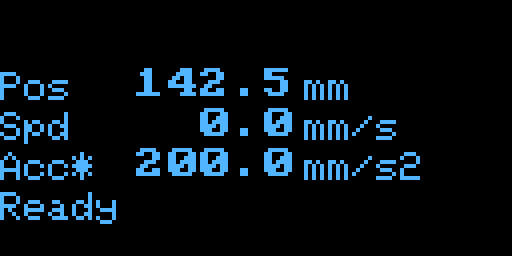
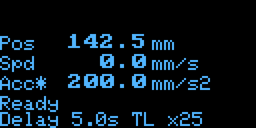
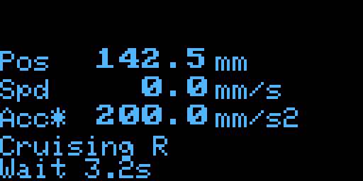
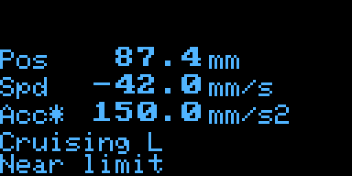
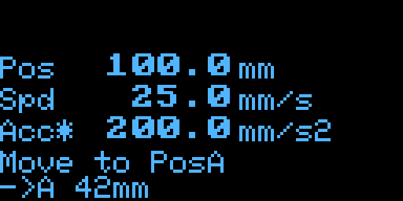
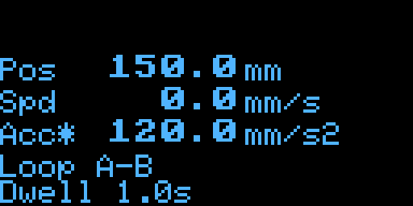
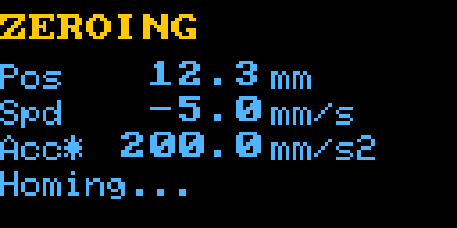
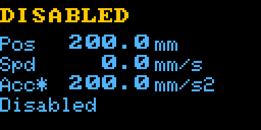
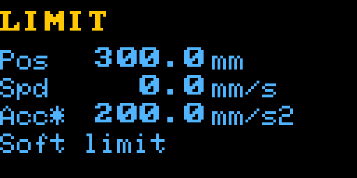
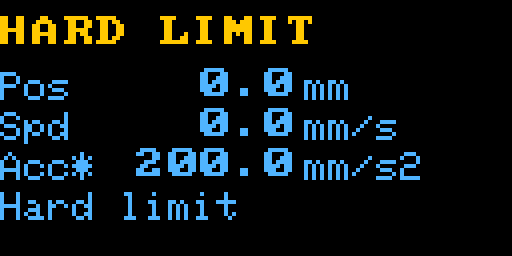

# JKSlider — User Manual

**JKSlider V1 by JK**

How to operate a **ready-configured** JKSlider on set.  
For wiring, panel variants, and config files, see [JKSlider_Technical_Manual.md](JKSlider_Technical_Manual.md) ([Panel](JKSlider_Technical_Manual_Panel.md), [Config](JKSlider_Technical_Manual_Config.md)).  
One-page set card: [JKSlider_Cheat_Sheet.pdf](JKSlider_Cheat_Sheet.pdf) ([HTML source](JKSlider_Cheat_Sheet.html)).

Your panel may not include every control below (joystick, DELAY, TIMELAPSE, OLED, …). Missing hardware simply means those actions are unavailable.

The panel Pico talks to a separate **motion board** (SliderMC) over UART. If that link is unplugged or the motion board is off, the UI may still start, but moves / homing will not work — see [Technical Manual — Link](JKSlider_Technical_Manual_Link.md#communication-mc--uic).

## Getting started

1. Power on — OLED (if fitted) shows **JKSlider V1 by JK**; status LED does a short rainbow.
2. **Unlock** — OLED shows **Unlock: OPTION or STOP**; LED keeps rainbow until you press **OPTION** or **STOP**. (Can be disabled in config.)
3. If the display says **Release …**, release that control (and the hardware DRV_ERROR / E-stop if shown).
4. Wait for **homing** (LED blinks red).
5. When you see **Ready** / **Homed**, you can shoot.

**PosA / PosB / PosC**, timelapse divider, MSM/continuous mode, camera FPS, left/right swap, delay, and joystick centre are remembered after power-off when they were saved before.

**OPTION** is a modifier: hold it together with another control. Alone it does nothing.

On **keypad** panels, the **Key** column shows the recommended silk labels (e.g. `` ` < ` for MOVE_L). Button panels use the Action names only.

## Knobs

### SPEED

- Left → speed 0; right → faster (finer at the low end).
- Can be changed while moving.
- If SPEED is ~0, cruise / goto / loop show **Set SPEED** and will not start.

### ACCEL

- How quickly the slider speeds up and slows down.
- Left → gentler; right → snappier.

## Move

Cruise, jog, stop, boost, halt, home, soft travel chords, and mid-move pause.

| Action | Key | Result |
|--------|-----|--------|
| **(MOVE_L / MOVE_R)** tap ≤⅓ s | ` < ` / ` > ` tap | Start cruise at SPEED; **locked** until STOP, same MOVE tip, reverse, another function, or a limit |
| **(MOVE_L / MOVE_R)** hold >⅓ s | ` < ` / ` > ` hold | Hold-to-run: moves while pressed; stops on release |
| Same **MOVE** tip while locked | ` < ` or ` > ` tip | Stop cruise |
| Opposite **MOVE** while cruising | ` < ` or ` > ` | Reverse immediately |
| **OPTION + (MOVE_L / MOVE_R)** hold | ` * ` (` < ` / ` > `) hold | Boost to panel **max speed + max accel** while OPTION held |
| **(FAST_L / FAST_R)** hold | ` << ` / ` >> ` hold | Max speed/accel jog **while held** (no lock) |
| Matching **FAST** while cruising | ` << ` or ` >> ` hold | Boost to max; release FAST → back to pots |
| **STOP** tap | ` 0 ` tap | Smooth stop (keeps Delay setting) |
| **STOP** tap while already slowing | ` 0 ` tap | Fast halt |
| **STOP** hold ≥ 1 s | ` 0 ` hold ≥ 1 s | Fast halt |
| **OPTION + STOP** (keypad, both ` * `) | ` * ` ` 0 ` ` * ` | Emergency halt (same as STOP hold ≥ 1 s) |
| **STOP + A** | ` 0 ` ` A ` | Go to soft min (`slider_min`) |
| **STOP + B** | ` 0 ` ` B ` | Go to midpoint of soft min/max |
| **STOP + C** | ` 0 ` ` C ` | Go to soft max (`slider_max`) |
| **OPTION + STOP + A** | ` * ` ` 0 ` ` A ` | Homing |
| **DELAY** hold while moving | ` D ` hold | Soft-stop **pause** (mode kept; OLED **Paused**) |
| **DELAY** release while paused | ` D ` release | **Resume** the same move (incl. continue to PosA/B/C) |

Tap vs hold uses `JKS_MOVE_TAP_MS` (default **333 ms**). Locked cruise also ends on STOP, A/B/C goto, FAST, joystick, soft limit, or the hard-limit home switch. OPTION alone does not stop cruise.

During pause, goto elapsed time keeps counting (wall clock). In **TL ×1 video** and **continuous**, `CTRL_CAMERA` **stays high** while soft-paused (recording continues). In **MSM**, pause freezes the take (no extra pulses) until you release DELAY. STOP ends the move, clears pause, and drops the camera pin (idle).

## A / B / C

Defaults until you overwrite them: **A** ≈ start, **B** ≈ middle, **C** ≈ end of travel.

| Action | Key | Result |
|--------|-----|--------|
| **(A / B / C)** tap | (` A ` / ` B ` / ` C `) tap | Go there at SPEED. While moving: elapsed time and remaining ETA on two lines; yellow badge `->A` / `->B` / `->C`. |
| **(A / B / C)** hold ≥ 1 s | (` A ` / ` B ` / ` C `) hold ≥ 1 s | Save current position as PosA / PosB / PosC. OLED then shows mark badge + ETAs to the other marks (same as arriving there). |
| **OPTION + (A / B / C)** tap | ` * ` (` A ` / ` B ` / ` C `) tap | Go there at **max speed + max accel** |
| **(A + B) / (A + C) / (B + C)** | (` A ` ` B `) / (` A ` ` C `) / (` B ` ` C `) | Start or stop that loop (first leg = 2nd letter: AB→B, AC→C, BC→C) |
| **OPTION + (A + B) / (A + C) / (B + C)** | ` * ` + (` A ` ` B `) / (` A ` ` C `) / (` B ` ` C `) | Same loop; still starts at the 2nd letter |
| **A + B + C** hold ≥ 1 s | ` A ` ` B ` ` C ` hold ≥ 1 s | Reset A/B/C to defaults |
| **OPTION + STOP** (TL ×1 or continuous) | ` * ` ` 0 ` | Peek PosA / PosB / PosC on OLED (no stop; FPS not changed) |

When idle **at** PosA / PosB / PosC (after goto or after storing), the yellow badge shows **`A`** / **`B`** / **`C`** (alongside **`D`** / **`TL`** if those modes are on). The two status lines show live travel times to the other marks from the SPEED and ACCEL pots, e.g. `->B 10.0 s` / `->C 5.0 s`. Turning the pots updates the times.

Loops pause briefly at each end before reversing.

## Delay (if fitted)

Idle arming only here; mid-move pause/resume is under [Move](#move).

| Action | Key | Result |
|--------|-----|--------|
| **DELAY** tap | ` D ` tap | Delay off |
| **DELAY** hold N s, release | ` D ` hold N s, release | Next move waits N s first |
| **DELAY** hold | ` D ` hold | OLED shows preview while arming |
| **OPTION + DELAY** tap | ` * ` ` D ` tap | Arm a fixed short delay (often 5 s) |
| **OPTION + DELAY** hold | ` * ` ` D ` hold | Time counts ×5 while arming |
| **STOP** tap (during wait) | ` 0 ` tap | Cancel wait (keeps Delay) |

Armed delay: cyan idle LED; OLED keeps showing **Delay**.

## Timelapse (if present)

| Action | Key | Result |
|--------|-----|--------|
| **TIMELAPSE** tap | ` T ` tap | Cycle divider: 1 → 5 → 10 → 25 → 30 → 50 → 60 → 100 → … |
| **TIMELAPSE** hold ≥ 1 s | ` T ` hold ≥ 1 s | Back to ×1 |
| **OPTION + TIMELAPSE** tap | ` * ` ` T ` tap | +1 step |
| **OPTION + TIMELAPSE** hold ≥ 1 s | ` * ` ` T ` hold ≥ 1 s | Jump to favourite (often ×25) |
| **OPTION + DELAY + TIMELAPSE** | ` * ` ` D ` ` T ` | Toggle **MSM ↔ continuous** (saved) |
| **OPTION + STOP** (MSM, TL ≠ 1) | ` * ` ` 0 ` | Cycle camera FPS: 24 → 25 → 30 → 48 → 50 → 60 |

**TL ×1 (video)** — `CTRL_CAMERA` high while moving; stays high during DELAY soft-pause; low when idle.

**TL ≠ 1** — style from saved `tl_mode` (default **`msm`**; toggle with **OPTION + DELAY + TIMELAPSE**):

| Mode | Behaviour |
|------|-----------|
| **MSM** (default) | Stop–shoot–move: pulse while stopped, then hop with full SPEED/ACCEL. Interval = N/FPS. OLED **`MSM xN @Ffps`** + video time + frame count. RGB LED off during each shutter pulse. |
| **continuous** | ÷N crawl (SPEED/ACCEL ÷ N); `CTRL_CAMERA` **hold-high** like video (not pulses). OLED **`Cont xN @Ffps`** + video time = wall-time÷TL. |

Yellow badge **TL** whenever N ≠ 1; idle LED magenta (between MSM pulses).

If an MSM hop cannot fit in the interval (accel too slow / TL too aggressive), start is refused (**`TL too fast`**). If a hop runs long at runtime, the take **stretches** and OLED flashes **`Step slow`**.

## Display

| Action | Key | Result |
|--------|-----|--------|
| **OPTION + FAST_L + FAST_R** hold ≥ 1 s | ` * ` ` << ` ` >> ` hold ≥ 1 s | Dim LED + OLED (full ↔ 25%) |

## Joystick (if present)

| Action | Key | Result |
|--------|-----|--------|
| Centre | — | Stop |
| Deflect | — | Move; full deflection = SPEED knob |
| While deflected | — | Overrides MOVE / FAST / loop |
| **OPTION** + joystick hold | ` * ` hold | Full deflection = max speed; accel = max accel while OPTION held |
| **OPTION + A + B + C** hold ≥ 1 s | ` * ` ` A ` ` B ` ` C ` hold ≥ 1 s | Calibrate centre (stick at rest, slider stopped) → **Joy 0 set** (or **Stop first** if still moving) |
| **FAST_L + FAST_R** hold ≥ 1 s | ` << ` ` >> ` hold ≥ 1 s | Swap L/R including joystick (same swap as under Move) |

## Other

| Action | Key | Result |
|--------|-----|--------|
| **STOP** hold ≥ 2 s | ` 0 ` hold ≥ 2 s | Disable motor driver |
| **STOP** tap when disabled | ` 0 ` tap | Enable driver |
| **FAST_L + FAST_R** hold ≥ 1 s | ` << ` ` >> ` hold ≥ 1 s | Swap left/right |
| **MOVE_L + MOVE_R** hold ≥ 1 s | ` < ` ` > ` hold ≥ 1 s | Swap left/right |
| **OPTION + MOVE_L + MOVE_R** hold ≥ 1 s | ` * ` ` < ` ` > ` hold ≥ 1 s | Swap left/right for MOVE, FAST, and joystick |

## Typical Workflows

### Locked cruise (tap MOVE)

1. Dial **SPEED** / **ACCEL** pots.
2. **Tap** **MOVE_R** and release within ~⅓ s — carriage starts cruising in that direction and stays locked until you stop it or it hits a limit.
3. The simple rule is: short tap = start cruise; same side again = stop; opposite side = reverse.
4. If **OPTION** is already held before you press **MOVE_L** / **MOVE_R**, the move starts at the panel’s **max speed and max accel**.
5. If **OPTION** is pressed while the move is already running, it acts as a speed boost only: **speed jumps to max_speed**, while **accel stays at the pot/set value** until OPTION is released.
6. Release OPTION and the move falls back to the current pot values.
7. **Tip** **MOVE_R** again to stop (or press **STOP** / opposite MOVE / A/B/C).

### Hold cruise (hold MOVE)

1. **Hold** **MOVE_R** longer than ~⅓ s — carriage continues moving while the key is down.
2. **Release** — cruise stops smoothly and the movement ends.
3. This is the “jog while held” mode. It is different from the short tap locked-cruise mode above.
4. If you keep **OPTION** down while holding **MOVE_L** / **MOVE_R**, the carriage still runs with the pot accel and only the speed is boosted to max_speed; it does not switch to max_accel during the move.

### FAST jog

1. Hold **FAST_L** or **FAST_R** — jogs at panel max speed/accel (no lock).
2. Release — stops.

### Joystick + OPTION boost

1. Deflect the stick — speed scales from the SPEED pot; ACCEL pot sets acceleration (live while moving).
2. Hold **OPTION** — full deflection uses **max speed**; **accel stays at the pot value** while the boost is active.
3. Release **OPTION** — back to pot values.

### FAST jog

1. Hold **FAST_L** or **FAST_R** — jogs at panel max speed/accel (no lock).
2. Release — stops.

### Joystick + OPTION boost

1. Deflect the stick — speed scales from the SPEED pot; ACCEL pot sets acceleration (live while moving).
2. Hold **OPTION** — full deflection uses max speed; accel switches to max accel.
3. Release **OPTION** — back to pot values.

### OPTION + AB loop (starts at B)

1. Store PosA / PosB if needed.
2. Hold **OPTION** and press **A + B** — loop starts toward **PosB** first (same as A+B without OPTION).
3. Press the same pair again to stop the loop.

### Soft travel + home

1. **STOP + A** → soft min; **STOP + B** → midpoint; **STOP + C** → soft max.
2. **OPTION + STOP + A** → homing.
3. After **STOP** hold ≥ 2 s (Disabled), **STOP** tap re-enables the driver (Idle).

### Time a move with SPEED + ETA

Directors often want “A→B in 8 seconds.” JKSlider does not take a duration number — you **dial SPEED until the OLED ETA matches** the planned time:

1. Decide the move time (e.g. **8 s**).
2. Store **PosA** and **PosB** (**(A / B)** hold ≥ 1 s at the ends of the shot).
3. **A** tap to go to PosA (or already be there after storing).
4. At PosA, read the status line **`->B … s`**. Turn **SPEED** until that ETA is about **8 s**. Tweak **ACCEL** if needed (sine ramps change the time slightly).
5. Start the camera, then **B** tap.

While moving, elapsed + remaining ETA confirm the dial-in. Rehearse at **TL ×1**, then enable TL (MSM or continuous) for the take if you need timelapse.

The same idea works for any two marks (A→C, B→C, …): stand at the start mark and dial until the ETA to the destination fits.

### Timelapse shot workflow

#### Timelapse - Plan the path

Use TL ×1 first so you can *see* the move at real speed, then decide how that motion should look when compressed into the final timelapse video:

1. **Frame the shot** — Store PosA / PosB (and PosC if needed). Jog or goto until composition is right at both ends.
2. **Find the speed intuitively** — At TL ×1, dial **SPEED** (and **ACCEL**) until the move *feels* like the pacing you want in the finished clip once time-lapsed. Use mark ETAs (`->B … s`) as a guide for “how long this pass takes live.”
3. **Think final look** — In **MSM**, that SPEED is how fast each hop runs between frames (interval is N/FPS, not SPEED). In **continuous**, the carriage crawls at SPEED÷N, so a faster live rehearsal means a faster-looking final video for the same TL.
4. **Choose mode** — Toggle **MSM ↔ continuous** with **OPTION + DELAY + TIMELAPSE**, set the TL divider, then shoot (see workflows below).

#### Timelapse - MSM mode

1. **Wire the camera** — GP22 (`CTRL_CAMERA`) through a 4-pin optocoupler to the remote shutter (see Technical Manual). Manual exposure / focus as needed.
2. **Plan the path** — Rehearse A→B at TL ×1. SPEED/ACCEL set how fast each MSM hop runs (not the frame interval).
3. **Optional DELAY** — Arm a walk-in delay if needed. During the take, **DELAY** hold to soft-pause (freezes MSM); release to resume.
4. **Enable MSM + TL** — Ensure mode is MSM (**OPTION + DELAY + TIMELAPSE** if needed). **TIMELAPSE** tap to the divider. OLED **`MSM x25 @30fps`**. Set playback FPS with **OPTION + STOP**. Interval between frames = N/FPS.
5. **Start recording on the camera** — Arm stills / intervalometer on the body as required for your shutter cable (slider pulses `CTRL_CAMERA` each frame).
6. **Shoot** — **B** tap (or MOVE / loop). Carriage shoots, waits exposure, hops, settles, repeats until the mark (or STOP). OLED shows video **`MM:SS`** and frame count.
7. **Stop recording on the camera** — When the take ends or after STOP. **TIMELAPSE** hold ≥ 1 s for ×1 video mode if needed.

#### Timelapse - Continuous mode

1. **Wire the camera** — Same GP22 optocoupler path; continuous uses **hold-high** (like video REC), not shutter pulses.
2. **Plan the path** — Rehearse at TL ×1; dial SPEED so the crawl (SPEED÷N) will match the final timelapse look you want.
3. **Match camera TL to the slider** — Set the **camera’s own timelapse / interval setting to the same TL** as the slider (e.g. both ×25). Mismatched TL makes the clip and the move disagree.
4. **Enable continuous + TL** — Toggle continuous with **OPTION + DELAY + TIMELAPSE**. **TIMELAPSE** tap to the divider. OLED **`Cont x25 @30fps`**. **OPTION + STOP** peeks marks (does **not** change FPS).
5. **Start recording on the camera** — Start the camera recording / timelapse **before** the move (`CTRL_CAMERA` will go high while moving and stay high during DELAY soft-pause).
6. **Shoot** — **B** tap (or MOVE / loop). Carriage crawls at SPEED÷N. OLED video time = wall-time ÷ TL.
7. **Stop recording on the camera** — When idle after the move, or after STOP (pin goes low).

## OLED (if present)

| Area | Meaning |
|------|---------|
| Yellow top left | `HOMING` / `HARD LIMIT` / `DISABLED` / `LIMIT` |
| Yellow top right | **`D`** Delay · **`TL`** timelapse · **`A`/`B`/`C`** at mark · **`->A`/`->B`/`->C`** during goto (concatenated, e.g. `D TL ->B`) |
| Blue numbers | Idle: **Spd** / **Acc** from pots (live). Moving (incl. accel/decel): **Spd*** / **Acc*** from live verbose status. Units mm or inch (`JKS_DSP_UNIT`) |
| Blue bottom | Status; or at mark: ETAs to other marks; or during A/B/C goto: elapsed + remaining time; or TL: **`MSM`/`Cont xN @Ffps`** and video **`MM:SS`** (+ frame count in MSM) |
| Extra line | Wait · Near limit · Dwell · Delay · remain (when higher priority) |

### Example screens

Idle:

Delay + TL:

Wait countdown:

Near limit while cruising:

Goto remain:

Loop dwell:

Homing:

Driver off:

Soft limit:

Hard limit (home switch):

## Status LED (if present)

PWM RGB and optional NeoPixel (WS2812) show the **same** colors. Soft-limit blues are **added** onto the motion/idle base (shared [`UIC_Base`](../UIC_base.py)); Delay / TL / loop panel colors come from the app via `ledPingPong` / `ledAddColor`. See [API — RGB status LED](../docs/API.md#rgb-status-led-led_r--led_g--led_b--optional-neopixel).

| Color | Meaning |
|--------|---------|
| Rainbow (short) | Power-on |
| Rainbow (loop) | Boot unlock until OPTION or STOP |
| Dim orange | Driver off |
| Dim white | Idle, ready |
| Dim cyan | Delay armed |
| Cyan blink | Delay wait / armed while holding a move key |
| Dim magenta | Timelapse (TL ≠ 1), idle |
| Dim white ↔ dim blue | Loop idle (AB / AC / BC dwell) |
| Off (brief) | MSM shutter pulse (`CTRL_CAMERA` high) |
| Yellow | Speeding up or slowing down |
| Green | Steady speed |
| Base + ~30% blue | Near soft limit |
| Base + 100% blue | At soft limit |
| Base + ~10% blue | Loop running |
| Red fast blink | Hard limit (home switch) |
| Red blink | Homing |
| Red | Hardware DRV_ERROR / E-stop |
| Red flash | Halt confirm |
