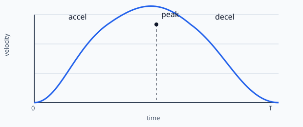
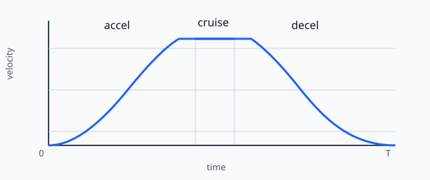
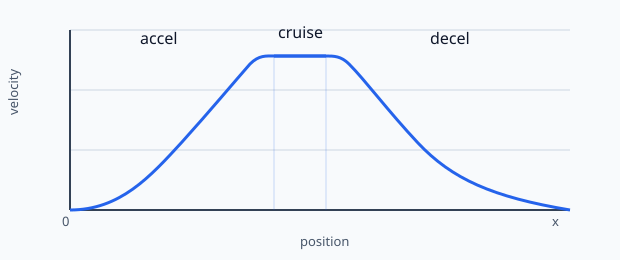
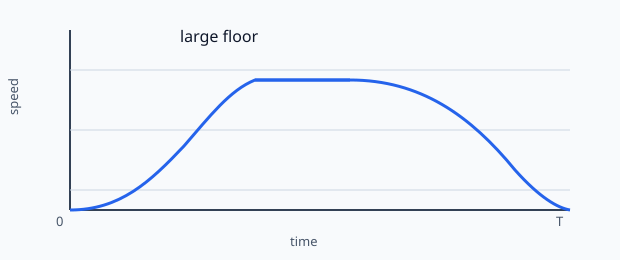
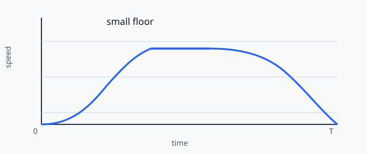
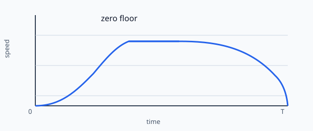
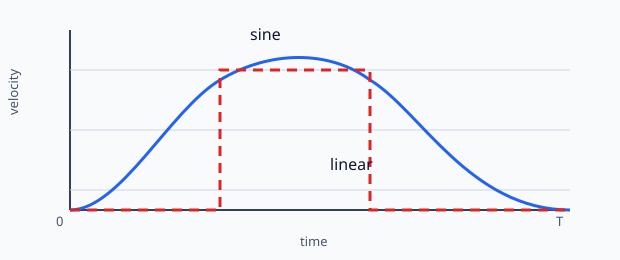

<link rel="stylesheet" type="text/css" href="SliderCtrl.css">

# Motion technique notes

This note collects the motion math used by the sine-ramp planner in a single place.
It is intentionally restricted to the motion model itself: velocity profile, ramp form,
role of the floor parameters, and the equations used to size a move.

## Glossary

| Symbol | Meaning | Typical units |
| --- | --- | --- |
| $v_{cmd}$ | commanded velocity from `SS` | mm/s |
| $a_{cmd}$ | commanded acceleration from `SA` | mm/s² |
| $t$ | time | s |
| $v_0$ | starting velocity of a ramp segment | mm/s |
| $v_1$ | ending velocity of a ramp segment | mm/s |
| $\Delta v$ | change in velocity over a ramp segment | mm/s |
| $\Delta x$ | move distance or segment distance | mm |
| $T$ | ramp segment duration | s |
| $\phi$ | normalized phase of the sine ramp | 0..1 |
| $d_{stop}$ | distance required to stop from the current speed | mm |
| $v_{peak}$ | peak velocity reached during a move | mm/s |
| $t_{accel}$ | time spent accelerating | s |
| $t_{decel}$ | time spent decelerating | s |
| $t_{cruise}$ | time spent at constant speed | s |
| `ramp_start_hz` | minimum starting velocity floor when leaving rest | Hz / step rate equivalent |
| `stop_approach_hz` | low-speed end-of-move floor while braking | Hz / step rate equivalent |

## 1. Ramp form

The planner uses a raised-cosine / half-sine velocity profile during acceleration.
For a ramp from $v_0$ to $v_1$ over phase $\phi \in [0, 1]$:

$$
 v(\phi) = v_0 + (v_1 - v_0) \cdot \frac{1 - \cos(\pi \phi)}{2}
$$

Equivalent form:

$$
 v(\phi) = v_0 + \Delta v \cdot \frac{1 - \cos(\pi \phi)}{2}
$$

with

$$
\Delta v = v_1 - v_0
$$

The phase advance is tied to a half-sine duration:

$$
T = \frac{\pi |\Delta v|}{2 a}
$$

where $a$ is the effective acceleration in mm/s².

The planner advances the phase by

$$
\phi \leftarrow \phi + \frac{\Delta t}{T}
$$

so the velocity rises smoothly from the start speed to the target speed and then
decays smoothly to the next commanded velocity when braking.

### Over time

A sine ramp over time has the characteristic shape:

- zero slope at start if the ramp begins from rest
- smooth increase in speed
- a flat cruise section in the middle when the move is long enough
- smooth reduction in speed toward the end
- zero slope near the final target when the ramp is complete

### Over position

Because speed changes with the sine blend, the speed-vs-position plot is also
rounded. The apex is not a sharp corner: it is a smooth maximum.

The accel-to-cruise and cruise-to-decel joins should be continuous in speed, with the
slope dropping to zero at the plateau and then rising again smoothly as braking starts.
This means a cruise plateau is flat and the join is not a discontinuity; it is a
zero-slope transition, not a spike or a corner.

For a pure accel/decel profile, the curve is a rounded hump. If the move is long
enough to include a cruise segment, the speed plateau appears between the accel and
decel halves.

---

## 2. Role of ramp_start_hz and stop_approach_hz

These are not both “same kind of floor.” They serve different roles.

### ramp_start_hz

This is a launch floor.

It prevents the axis from immediately beginning at a zero-speed or near-zero-speed
STEP rate when leaving standstill. Without it, a ramp from 0 can start so quietly
that the first part of motion feels like a crawl or a tiny stall before the motion
really builds up.

Practical role:

- only relevant while leaving standstill
- keeps the ramp from starting in a near-stuck region
- does not define the end of the move

The planner uses a launch floor as a minimum velocity while accelerating away from
rest.

### stop_approach_hz

This is an approach / tail floor used near the end of a move.

It keeps the final approach from stopping abruptly from a too-high rate. Instead of
snapping to zero from a nonzero speed, the planner lets the speed taper down to the
approach floor and then decays cleanly.

Practical role:

- only relevant while braking or when the remaining distance is short
- prevents a final snap-stop from a still-too-fast speed
- controls how long the final low-speed tail lasts

The tradeoff is simple:

- larger `stop_approach_hz` = shorter low-speed tail, more abrupt final approach
- smaller `stop_approach_hz` = longer low-speed tail, smoother final approach
- value `0` = no approach floor; the profile is allowed to decay directly toward zero
  without a dedicated low-speed tail

With `stop_approach_hz = 0`, the planner effectively removes the end-floor clamp:
there is no intentional plateau or taper at a nonzero floor before the final stop.
The final braking still remains smooth because the sine ramp itself reduces velocity
continuously, but the low-speed tail is absent and the motion reaches zero more
directly.

In other words, `ramp_start_hz` is for leaving the zero-speed region, while
`stop_approach_hz` is for entering the zero-speed region.

---

## 3. Actual sine-ramp timing

The planner is not a classic trapezoid. It follows a half-sine velocity ramp.
For a single accel half-ramp from $0$ to $v_{peak}$ over time $T$:

$$
 v(t) = \frac{v_{peak}}{2}\left(1 - \cos\left(\frac{\pi t}{T}\right)\right)
\quad \text{for } 0 \le t \le T
$$

The corresponding equivalent acceleration parameter is:

$$
 a_{eff} = \frac{\pi v_{peak}}{2T}
$$

so the half-ramp duration is:

$$
 T = \frac{\pi v_{peak}}{2 a_{eff}}
$$

The distance traveled during that half-ramp is:

$$
 x_{accel} = \int_0^T v(t)\,dt = \frac{v_{peak} T}{2}
 = \frac{\pi v_{peak}^2}{4 a_{eff}}
$$

For a symmetric move that accelerates from rest to $v_{peak}$ and then decelerates
back to rest, the total time is:

$$
 T_{total} = 2T = \frac{\pi v_{peak}}{a_{eff}}
$$

This is the correct sine-ramp timing for one accel+decel cycle.

### 3.1 Comparison to a linear trapezoid / triangle

A linear accel/decel profile with the same peak speed and the same acceleration
limit would have:

$$
 T_{linear,half} = \frac{v_{peak}}{a_{eff}}
$$

for one half-ramp and

$$
 T_{linear,total} = \frac{2 v_{peak}}{a_{eff}}
$$

for the full accel+decel cycle.

Therefore the sine profile is longer by the factor:

$$
 \frac{T_{sine}}{T_{linear}} = \frac{\pi/2}{1} = \frac{\pi}{2} \approx 1.57
$$

So the same peak speed and the same effective acceleration take about 57% longer
with a sine ramp than with a linear trapezoid ramp.

This is why the accel/decel halves can look visually longer in logs or scope views
when the motion is genuinely half-sine shaped.

---

## 4. Motion formulas for a classic trapezoid / triangle profile

The planner uses a sine ramp, but the classic geometry is still useful as an
approximation for sizing a move and for understanding what the commanded speed and
acceleration imply.

### 4.1 Distance to stop from speed $v$

The stop-distance law for constant acceleration is:

$$
 d_{stop} = \frac{\pi v^2}{4 a}
$$

This is the distance required to bring a speed $v$ down to zero under a symmetric
sine-like decel law with acceleration magnitude $a$.

Equivalent inversion:

$$
 v_{max}(d) = \sqrt{\frac{4 a d}{\pi}}
$$

This is the maximum speed that can be supported by the remaining distance $d$.

### 4.2 Move time for accel/decel only

For a symmetric accel/decel profile with no cruise segment, the total move time is
roughly:

$$
 t_{total} = \frac{\pi v_{cmd}}{a}
$$

where $v_{cmd}$ is the commanded peak speed and $a$ is the acceleration magnitude.

This is for a pure triangle / half-sine move with equal accel and decel.

### 4.3 Constant-speed segment time

If the move is long enough to reach a commanded cruise speed $v_{cmd}$ and keep it
for some distance, then the constant-speed portion is:

$$
 t_{cruise} = \frac{\Delta x_{cruise}}{v_{cmd}}
$$

where $\Delta x_{cruise}$ is the distance traveled while at constant speed.

The full move time is then:

$$
 t_{total} = t_{accel} + t_{cruise} + t_{decel}
$$

with accel and decel time defined by the chosen speed/accel profile.

---

## 5. Math for a move with given delta position, speed command, and accel command

Let:

- $\Delta x$ = total move distance in mm
- $v_{cmd}$ = commanded speed in mm/s = command `SS`
- $a$ = acceleration magnitude in mm/s² = command `SA`
- $\Delta x > 0$

The move is a standard acceleration/deceleration problem.

### 5.1 Minimum distance needed to reach a speed

The distance required to accelerate from 0 to $v_{cmd}$ under acceleration $a$ is:

$$
 d_{accel} = \frac{\pi v_{cmd}^2}{4 a}
$$

for the same sine/half-sine shaped profile.

### 5.2 If the distance is long enough for cruise

A move that is long enough to reach the command speed and then hold it has a cruise
segment only when:

$$
 \Delta x > 2 d_{accel}
$$

Then the distance available for constant speed is:

$$
 \Delta x_{cruise} = \Delta x - 2 d_{accel}
$$

and the total move time is:

$$
 t_{total} = \frac{\pi v_{cmd}}{a} + \frac{\Delta x_{cruise}}{v_{cmd}}
$$

because each half of the move takes one half-sine duration:

$$
 t_{accel} = t_{decel} = \frac{\pi v_{cmd}}{2 a}
$$

and therefore

$$
 t_{accel} + t_{decel} = \frac{\pi v_{cmd}}{a}
$$

### 5.3 If the move is shorter than the accel/decel distance

If

$$
 \Delta x \le 2 d_{accel}
$$

then the profile is a pure accel/decel triangle / no cruise. The peak speed is
limited by the distance:

$$
 v_{peak} = \sqrt{\frac{4 a \Delta x}{2\pi}} = \sqrt{\frac{2 a \Delta x}{\pi}}
$$

and the total time is:

$$
 t_{total} = \frac{\pi v_{peak}}{a}
$$

which is also the same as the half-sine accel/decel time expression evaluated at the
reduced peak.

---

## 6. Inverse problem: given time, distance, accel, compute command speed

This is the inverse of the previous section.

### 6.1 Pure accel/decel move

For a move with no cruise segment, the peak speed is:

$$
 v_{cmd} = \frac{a t_{total}}{\pi}
$$

if the move is dominated by the accel+decel symmetric ramp.

This is the simplest time-based inversion when the move is a pure sine triangle.

### 6.2 Move with cruise allowance

If a cruise interval exists, then the total move time satisfies:

$$
 t_{total} = \frac{\pi v_{cmd}}{a} + \frac{\Delta x - 2 d_{accel}}{v_{cmd}}
$$

with

$$
 d_{accel} = \frac{\pi v_{cmd}^2}{4 a}
$$

This equation can be solved numerically for $v_{cmd}$ given $\Delta x$, $a$, and
$t_{total}$.

There is no closed-form elementary solution in general because the cruise term and
accel distance term are coupled.

---

## 7. Time split: accel vs decel vs constant speed

For a commanded speed $v_{cmd}$ and acceleration $a$, the symmetric sine ramp gives:

$$
 t_{accel} = \frac{\pi v_{cmd}}{2a}
$$

$$
 t_{decel} = \frac{\pi v_{cmd}}{2a}
$$

These are equal when the accel and decel magnitudes are equal.

The constant-speed time, if present, is:

$$
 t_{cruise} = \frac{\Delta x_{cruise}}{v_{cmd}}
$$

with

$$
 \Delta x_{cruise} = \Delta x - 2\,d_{accel}
$$

if that quantity is positive.

---

## 8. Infinite-distance assumption

If the move distance is effectively infinite, then the motion reaches the commanded
speed and continues at that speed with no decel constraint. In that case:

$$
 t_{accel} = \frac{\pi v_{cmd}}{2 a}
$$

and

$$
 t_{decel} = \frac{\pi v_{cmd}}{2 a}
$$

if the same acceleration magnitude applies in both directions.

That is the geometric accel/decel time for a symmetrical sine ramp.

---

## 9. Constant moving time without accel and decel

If the move is a pure constant-speed travel over distance $\Delta x$ and the
acceleration/deceleration phases are ignored or considered negligible, then:

$$
 t_{const} = \frac{\Delta x}{v_{cmd}}
$$

This is the zero-accel approximation.

Once the accel/decel phases are included, the total move time becomes the sum of the
accel, cruise, and decel portions as above.

---

## 10. Summary

The planner uses a couple of core ideas:

- acceleration and deceleration are both sine-shaped
- the peak is not a hard corner, but a rounded maximum
- the midpoint is not forced to a fixed distance; it is geometry-driven
- `ramp_start_hz` is a launch floor
- `stop_approach_hz` is an end-of-move floor
- stop distance and remaining distance determine when the brake begins

The most important identities are:

$$
 d_{stop} = \frac{\pi v^2}{4 a}
$$

$$
 v_{max}(d) = \sqrt{\frac{4 a d}{\pi}}
$$

$$
 t_{accel} = t_{decel} = \frac{\pi v_{cmd}}{2 a}
$$

$$
 t_{total} = t_{accel} + t_{cruise} + t_{decel}
$$

These equations give the motion envelope used by the planner and explain why the
final approach looks like a low-speed taper instead of a sudden stop.

---

## 11. Phase-domain planner implementation

The planner does not keep a separate velocity table for every pulse. Instead, it keeps
an internal phase state and computes the current target rate from that phase.

### 11.1 State machine

A move is usually viewed as a small state machine:

- accel: move from the current speed toward the commanded speed
- cruise: hold a constant speed, if the remaining distance allows it
- decel: reduce the speed to the end speed or to zero
- done: stop and settle

The important point is that the planner does not jump between a few hard-coded speed
levels. It ramps continuously through a phase variable.

### 11.2 Phase and time

For a sine ramp segment, the phase advances with:

$$
\phi \leftarrow \phi + \frac{\Delta t}{T_{seg}}
$$

where $T_{seg}$ is the segment duration for the current ramp.

For accel or decel using a half-sine law:

$$
T_{seg} = \frac{\pi |\Delta v|}{2 a}
$$

During cruise, the speed is effectively constant, so the phase is no longer a sine
blend; it is simply a constant-speed hold until the next decel decision.

### 11.3 Target velocity from the phase

For a segment that transitions from $v_0$ to $v_1$, the planner computes:

$$
 v(\phi) = v_0 + (v_1 - v_0) \cdot \frac{1 - \cos(\pi \phi)}{2}
$$

This gives the instantaneous target speed at the current phase. As $\phi$ advances
from 0 to 1, the speed rises smoothly from $v_0$ to $v_1$ and then, in the decel
case, falls smoothly again.

### 11.4 Why this matters in firmware

The planner uses the same phase progression to compute:

- the target step rate for the current cycle
- the segment duration to the next step update
- the time used to pack step words into the step queue

This keeps the internal motion law and the emitted pulse timing consistent. If the
phase is advanced correctly, the resulting rate profile follows the intended sine
shape. If the rate is computed from stale or mismatched timing, the graph can show a
small apparent asymmetry even though the underlying ramp law is still sine-based.

---

## 12. Stop distance and brake trigger logic

The brake decision is where the motion shape meets the remaining distance.

### 12.1 Distance needed to stop

For a sine-like decel profile, the distance needed to reduce speed from $v$ to zero is:

$$
 d_{stop} = \frac{\pi v^2}{4 a}
$$

This is the fundamental brake-distance law used by the planner.

### 12.2 When to begin decel

The planner compares the remaining distance with the brake distance required at the
current speed:

$$
 d_{remaining} \le d_{stop}(v)
$$

When this becomes true, it starts the decel phase early enough to stop smoothly.

This is the reason the planner can appear to “switch to brake” before the final zero
speed is actually reached: the motion is not waiting for a fixed speed threshold, but
for the remaining distance to match the energy that must be dissipated in the decel
ramp.

### 12.3 Why the low-speed tail exists

The end-of-move floor, `stop_approach_hz`, does not define the brake trigger itself.
It defines the low-speed tail near zero.

When `stop_approach_hz` is larger than zero, the planner keeps the final phase from
falling too abruptly into zero speed. This creates a short taper or tail near the end.
When it is zero, the planner is allowed to decay directly toward zero without an
explicit low-speed floor.

### 12.4 Practical interpretation

The real practical rule is:

- use the remaining-distance calculation to decide when decel begins
- use `stop_approach_hz` to shape the final low-speed approach
- use the sine profile itself to keep the transition smooth

This is why a good stop is both distance-aware and velocity-aware at the same time.

---

## Suggested next chapters

The document is already solid as a motion-model primer. The following are good next
additions if you want to deepen it further:

### A. Phase-domain planner implementation

Explain how the planner stores and advances phase $\phi$, how a move is split into
accel / cruise / decel states, and how the phase clock is converted into delay
values for the step generator. This would bridge the math to the firmware logic.

### B. Step timing and FIFO / shadow behavior

Describe how delay-based step output is queued, how the PIO FIFO shadow is kept in
sync, and why a tiny timing mismatch can look like a ramp asymmetry even when the
motion law is correct. This is especially valuable when working with logs.

### C. Stop distance and brake trigger logic

Go deeper into the remaining-distance calculation, the brake decision point, and
why the final stop must be triggered using the true distance-to-stop estimate rather
than a stale speed comparison. This chapter is ideal for the “why the move stops
cleanly” story.

### D. Minimum speed / end-of-move floor tuning

Explain how `ramp_start_hz` and `stop_approach_hz` interact with micro-stepping,
mechanical backlash, and final positioning quality. This is the best chapter for
practical tuning advice.

### E. Real-world validation and log interpretation

Show how to read verbose motion logs (`#A`, `#B`, `#I`, etc.), how to compare the
planned phase and the emitted step delay, and how to detect whether a move is being
limited by geometry, floor logic, or queue/PIO timing.

### F. Nonlinear effects and limits

Document the practical limits of the model: maximum step frequency, transition
between acceleration zones, jerk-like non-smoothness near boundaries, and the effect
of insufficient distance on the peak speed. This is a good place to discuss the
limits of a pure analytical model.

### G. Worked examples

Add a few concrete examples, such as:

- short move with no cruise
- medium move with a cruise plateau
- long move with strong braking close to the end
- tuning `stop_approach_hz` to reduce a low-speed tail

These examples turn the equations into something immediately useful when setting up a
new axis or tuning a profile.

If you want to expand the manuscript in a more tutorial style, these are the most
useful chapters to add next. They map directly to how the firmware is implemented and
how real motion problems are diagnosed.
