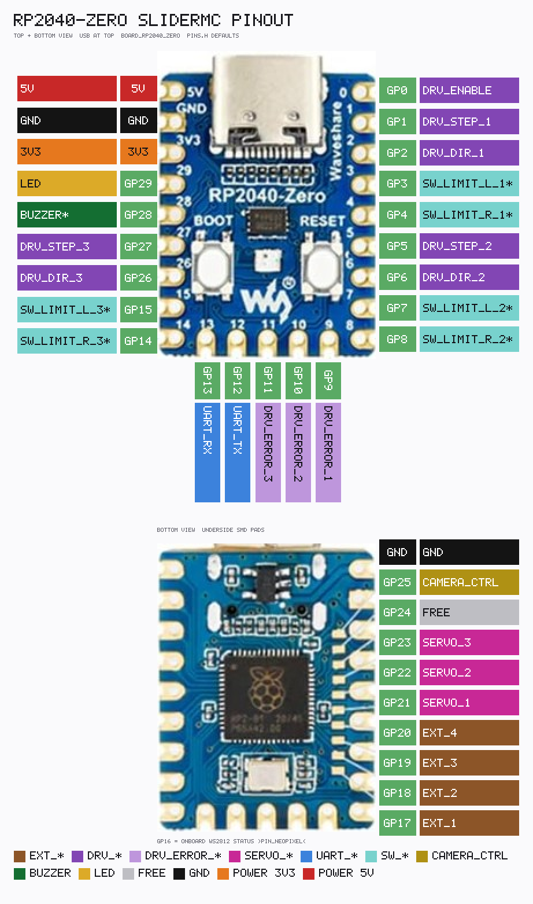

<link rel="stylesheet" type="text/css" href="../tools/SliderCtrl.css">
<style>
:root {
  --doc-title: "Pin map";
  --doc-path: ".\\SliderDoc\\mc\\pins.md";
}
</style>

# Pin map

Pins are fixed in `include/pins.h` at compile time and cannot be changed by protocol commands.
Select a board with PlatformIO envs `pico` (default), `picow`, `rp2040zero`, `pico2`, `pico2w`, or `rp2350mini` (see [BUILD.md](BUILD.md)). Pico 2 uses the Pico header map at **150 MHz**; Pico 2 W uses the Pico W map (LED GP28); RP2350 Mini uses the Zero map. STEP PIO SM stays **50 MHz** on all boards (sysclk 133 MHz on RP2040, 150 MHz on RP2350).

Live dumps on the device:

- `VG` / `VersionGPIO` — machine-readable `PIN_*=GPIO` lines
- `IG` / `IsGPIO` — ASCII table of GP number, name, and brief description (≤80 columns)

Extra-axis rows (`DRV_*2` / `SW_*2`, `DRV_*3` / `SW_*3`) appear in `IG` / `VG` **only when** that motor is live (`CS motors 2` or `3`). Servo rows appear when `servos>=1`. `PIN_CAMERA_CTRL` is always listed (`CT` pulse / OC listen).

---

## Raspberry Pi Pico (`BOARD_PICO`, env `pico`) / Pico 2 (`pico2`)


Regenerate: `python tools/render_pico_pinout_SliderMC.py` → [`MC_Pico_pinout.txt`](../assets/MC_Pico_pinout.txt) + PNG. Pico 2 reuses this header map.

| Symbol | GPIO | Role |
|--------|------|------|
| `PIN_DRV_STEP_1` | 0 | Motor 1 STEP |
| `PIN_DRV_DIR_1` | 1 | Motor 1 DIR |
| `PIN_SW_LIMIT_L_1` | 2 | Motor 1 hard limit left (`SW_LIMIT_L_1_use=1`) |
| `PIN_SW_LIMIT_R_1` | 3 | Motor 1 hard limit right |
| `PIN_DRV_STEP_2` | 4 | Motor 2 STEP (`motors>=2`) |
| `PIN_DRV_DIR_2` | 5 | Motor 2 DIR |
| `PIN_SW_LIMIT_L_2` | 6 | Motor 2 hard limit left |
| `PIN_SW_LIMIT_R_2` | 7 | Motor 2 hard limit right |
| `PIN_DRV_STEP_3` | 8 | Motor 3 STEP (`motors>=3`; polarity follows motor 2) |
| `PIN_DRV_DIR_3` | 9 | Motor 3 DIR |
| `PIN_SW_LIMIT_L_3` | 10 | Motor 3 hard limit left |
| `PIN_SW_LIMIT_R_3` | 11 | Motor 3 hard limit right |
| `PIN_DRV_ERROR_1` | 12 | Motor 1 fault / E-stop (always polled) |
| `PIN_DRV_ERROR_2` | 13 | Motor 2 fault / E-stop |
| `PIN_DRV_ERROR_3` | 14 | Motor 3 fault / E-stop |
| `PIN_DRV_ENABLE` | 15 | Shared driver enable |
| `PIN_UART_TX` | 16 | UART TX to UI controller |
| `PIN_UART_RX` | 17 | UART RX from UI controller |
| `PIN_EXT_4` / `PIN_SERVO_3` | 18 | Extender `EO4`; **SERVO_3 when `servos>=3`** (steals EXT_4) |
| `PIN_EXT_3` | 19 | Extender `EO3` |
| `PIN_EXT_2` | 20 | Extender `EO2` |
| `PIN_EXT_1` | 21 | Extender `EO1` |
| `PIN_CAMERA_CTRL` | 22 | Camera OC sink (`CT`) / listen, low-active |
| `PIN_LED` | `LED_BUILTIN` (GP25) | Status / heartbeat LED (onboard) |
| `PIN_NEOPIXEL` | same as `PIN_LED` (25) | WS2812 skipped (GPIO LED only). Override in `pins.h` to a free GPIO to drive a pixel in parallel. |
| `PIN_SERVO_1` | 26 | RC servo 1 PWM (100 Hz, wrap 65535; ~1.25′ / 0.021° per count over ±135° at 500–2500 µs) |
| `PIN_SERVO_2` | 27 | RC servo 2 PWM |
| `PIN_BUZZER` | 28 | Optional piezo (`BE` / Beep); gated by `BUZZER_use` (default off) |

UART baud rate: **115 200**. GP16/GP17 are **UART0** (`Serial1` via `PIN_UART_SERIAL`).

---

## Raspberry Pi Pico W (`BOARD_PICO_W`, env `picow`) / Pico 2 W (`pico2w`)

Same header pin map as classic Pico, except the status LED:

| Symbol | GPIO | Role |
|--------|------|------|
| *(all other pins)* | *(same as Pico)* | Same as table above |
| `PIN_LED` | **28** | External status / heartbeat LED |

`PIN_NEOPIXEL` defaults to the same GPIO, so only the GPIO LED is driven. Point `PIN_NEOPIXEL` at a free pin in `pins.h` to add a WS2812.

The Pico W / Pico 2 W onboard LED is on the CYW43 WiFi chip — do not drive `LED_BUILTIN` under FreeRTOS. Use env `picow` or `pico2w` and wire an external LED to **GP28**. That aliases `PIN_BUZZER`; firmware will **not** pulse the buzzer (heartbeat LED wins). Use a different compile-time GPIO if a piezo is needed.

---

## Waveshare RP2040-Zero (`BOARD_RP2040_ZERO`, env `rp2040zero`) / RP2350 Mini (`rp2350mini`)



Regenerate: `python tools/render_rp2040zero_pinout_SliderMC.py` → [`MC_RP2040zero_pinout.txt`](../assets/MC_RP2040zero_pinout.txt) + PNG. RP2350 Mini reuses this map.

| Symbol | GPIO | Role |
|--------|------|------|
| `PIN_DRV_ENABLE` | 0 | Shared driver enable |
| `PIN_DRV_STEP_1` | 1 | Motor 1 STEP |
| `PIN_DRV_DIR_1` | 2 | Motor 1 DIR |
| `PIN_SW_LIMIT_L_1` | 3 | Motor 1 hard limit left |
| `PIN_SW_LIMIT_R_1` | 4 | Motor 1 hard limit right |
| `PIN_DRV_STEP_2` | 5 | Motor 2 STEP |
| `PIN_DRV_DIR_2` | 6 | Motor 2 DIR |
| `PIN_SW_LIMIT_L_2` | 7 | Motor 2 hard limit left |
| `PIN_SW_LIMIT_R_2` | 8 | Motor 2 hard limit right |
| `PIN_DRV_ERROR_1` | 9 | Motor 1 fault / E-stop |
| `PIN_DRV_ERROR_2` | 10 | Motor 2 fault / E-stop |
| `PIN_DRV_ERROR_3` | 11 | Motor 3 fault / E-stop |
| `PIN_UART_TX` | 12 | UART TX to UIC |
| `PIN_UART_RX` | 13 | UART RX from UIC |
| `PIN_SW_LIMIT_R_3` | 14 | Motor 3 hard limit right |
| `PIN_SW_LIMIT_L_3` | 15 | Motor 3 hard limit left |
| `PIN_NEOPIXEL` | 16 | Onboard WS2812 status (JKSlider-style colours; pio1) |
| `PIN_EXT_1` | 17 | Extender `EO1` |
| `PIN_EXT_2` | 18 | Extender `EO2` |
| `PIN_EXT_3` | 19 | Extender `EO3` |
| `PIN_EXT_4` | 20 | Extender `EO4` |
| `PIN_SERVO_1` | 21 | RC servo 1 PWM (100 Hz, wrap 65535; ~1.25′ / 0.021° per count over ±135° at 500–2500 µs) |
| `PIN_SERVO_2` | 22 | RC servo 2 PWM |
| `PIN_SERVO_3` | 23 | RC servo 3 PWM |
| `PIN_CAMERA_CTRL` | 25 | Camera OC sink (`CT`) / listen, low-active |
| `PIN_DRV_DIR_3` | 26 | Motor 3 DIR |
| `PIN_DRV_STEP_3` | 27 | Motor 3 STEP (polarity follows motor 2) |
| `PIN_BUZZER` | 28 | Optional piezo (`BE`; `BUZZER_use`) |
| `PIN_LED` | 29 | External status / heartbeat LED |

`motors` 1\|2\|3 and `servos` 0..3 are supported on Zero / Mini.

---

## Shared notes

GPIO numbers are fixed in `pins.h` (not changeable via protocol).  
Pad drive: STEP / DIR / EXT / SERVO **8 mA**; `PIN_DRV_ENABLE` and `PIN_CAMERA_CTRL` **12 mA**.  
Status LED: GPIO blink on `PIN_LED` always. If `PIN_NEOPIXEL` is a **different** GPIO, a single WS2812 is driven from the protocol task (pio1, brightness 32). Pico defaults `PIN_NEOPIXEL` to `PIN_LED` (classic LED only). See [CONFIG.md](CONFIG.md#watchdog-wdt_use-and-status-led).  
Active levels for all pins except UART are config keys (`DRV_STEP_1_active`, `SW_LIMIT_L_1_active`, …): `0` = low-active, `1` = high-active. Digit is **before** the suffix (`SW_LIMIT_R_3_use`).  
Hard-limit **usage** is gated by `SW_LIMIT_L_N_use` / `SW_LIMIT_R_N_use` (default off). Homing modes 1/2 use those same limit pins.  
Optional **buzzer** is gated by `BUZZER_use` (default off); `BE [<ms>]` pulses `PIN_BUZZER` (GP28); bare 100 ms, clamp 1..1000. On Pico W / Pico 2 W GP28 is `PIN_LED`, so the buzzer is not claimed.  
`PIN_DRV_ERROR` is always polled (`DRV_ERROR_1_active`); assert → emergency halt + command gate, except during stall-home (`home_mode_N` 3/4). See [CONFIG.md](CONFIG.md) / [MOTION.md](MOTION.md).

### `PIN_CAMERA_CTRL` (low-active open-collector)

The UIC camera pad is unused (Pico GP22 / Zero GP29 stay **free** on JKS and B4S pinouts). Camera is **MC-only**: Pico **GP22** / Zero **GP25**. Rest = `INPUT_PULLUP` (released). `CT` / `CT [ms]` sinks **LOW** (pad **12 mA**), then releases. Bare `CT` is 100 ms (clamp 1..60000).

**Optocoupler (camera remote):** 4-pin e.g. PC817. Drive the IR LED at **≈ 5 mA**. The LED is high-side (inverted vs a sourcing UIC GPIO):

`R = (3.3 V − Vf) / 5 mA` — typical Vf ≈ 1.2 V → ≈ 420 Ω → **390 Ω** E12 (~5.4 mA).

```
  3.3V --- 390Ω --- opto LED+
                     LED- ----+---- PIN_CAMERA_CTRL
  GND --- momentary key ------+     pull-up; CT sinks LOW
  phototransistor: camera remote (tip/ring/sleeve per body)
```

The phototransistor stays **floating vs the Pico** unless that remote is designed to share grounds. Tip/ring/sleeve depends on the camera body. (JKSlider panel wiring is the same opto on the *camera* side; LED polarity on the MC pin is inverted.)

`CT` turning the LED on closes the camera contact. Motion continues; other commands stay legal.

**FET level-shifter (5 V logic):** non-isolated alternative when the camera or box wants **5 V TTL/CMOS**, not a floating contact. Shared GND. Same topology as cheap BSS138 I2C shifter boards (one channel is enough). Through-hole stand-in: **2N7000**. Pull-up **10 kΩ** to 5 V (4.7 kΩ is fine). 5 V from VBUS / driver rail, not from a GPIO.

```
        3.3 V                         5 V
          |                            |
          |                           10k
          |                            |
          +---- G (BSS138 / 2N7000)    |
                    S -------- D ------+---- camera logic in
                    |
            PIN_CAMERA_CTRL
            (Pico GP22 / Zero GP25)

  Pico GND -------------------------------- camera GND
```

Idle (pad released ~3.3 V): Vgs ≈ 0 → FET off → output **5 V**. `CT` sinks LOW: Vgs ≈ 3.3 V → FET on → output **0 V**. Gate is tied to **3.3 V**, source to the pad — that is what makes it a shifter rather than an inverter. Pico pin stays ≤ 3.3 V.


| Part | Package | Pinout (datasheet view) |
|------|---------|-------------------------|
| **2N7000** | TO-92 | Flat toward you, leads down: **1 S · 2 G · 3 D** |
| **BSS138** | SOT-23 | Top view, marking up: **1 D · 2 S · 3 G** |

Some no-name 2N7000 clones swap S/D — if it does not shift, check the marking datasheet.

**Out-side max voltage:** intended pull-up is **5 V**. FET drain ratings (`V_DS`): BSS138 **50 V**, 2N7000 **60 V** — the MOSFET can sit on a 12 V accessory rail; many camera TTL/CMOS inputs cannot. Do not raise the pull-up above what the camera input is rated for. **`PIN_CAMERA_CTRL` is 3.3 V only** (RP2040 pads are not 5 V-tolerant). Never tie the 5 V pull-up (or camera 5 V) to the Pico pad. The optocoupler path has no 5 V clamp on the phototransistor side (isolated); this FET path is not.

**Opto vs FET:** PC817 = isolated dry contact (typical shutter cable tip/sleeve). FET = 5 V logic, shared GND. Do not use the FET if the remote must stay galvanically isolated.

**External key (momentary only):** non-latching switch from this pin to **GND** (never to 3.3 V, never a toggle that stays down). Falling edge: MC listen → one-shot status **`T`**. A UIC can map that to **stop-motion (MSM)** or **start an A/B move**. If the opto is fitted on the same node, the key also fires the shutter (usual remote). `CT` pulls the same pin: a UIC that treats every `T` as “key” will also see command triggers (duration `T` while `CT` is down when verbose is on). Verbose off → no `#T` push; `#` while low still `#T`.

`PIN_EXT_1`…`4` default to **input + pull-up** (`ED n I`). `ED n O` is push-pull; `ED n T` is open-collector + pull-up. Logical `EO1`…`EO4` set output level when mode is O or T. `EI0`…`EI3` read the pin in any mode. Polarity via `EXT_n_active`. On Pico, **GP18 is SERVO_3 when `servos>=3`** (EXT_4 stolen). **`EO5`… is rejected.**

STEP polarity (`DRV_STEP_1_active` / `DRV_STEP_2_active`) selects one of two PIO programs. Motor 3 STEP follows motor 2 (no `DRV_STEP_3_active`). See [MOTION.md](MOTION.md).

RC servos use hardware PWM at **100 Hz**, wrap **65535**. Envelope ±135° maps linearly onto `SERVO_N_min_pulse`…`max_pulse` (default **500–2500 µs**; analog often 1000–2000). Default span resolution ≈ **1.25 arc minutes (′)** / 0.021° per count. `SERVO_N_swap` reverses sense; `SERVO_N_active` inverts the pulse. `SE 0` stops PWM (limp).

Oscilloscope `DEBUG_HW` pins are **off by default** (commented out in `pins.h`) and are not shown on the pinout images. Define `DEBUG_HW` at compile time if you need them; they then appear in `IG`/`VG` only.
