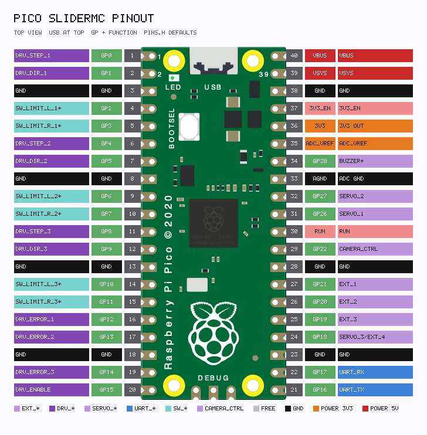
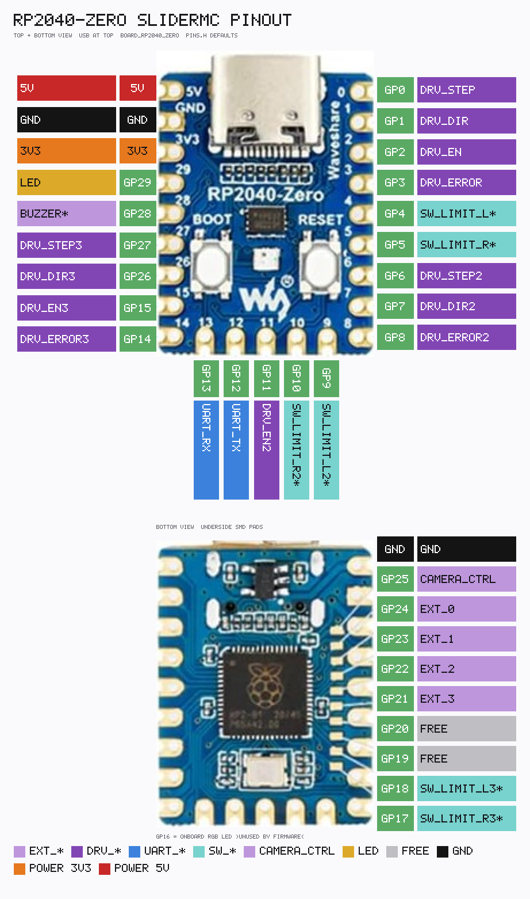

<link rel="stylesheet" type="text/css" href="../tools/SliderCtrl.css">

# Pin map

Pins are fixed in `include/pins.h` at compile time and cannot be changed by protocol commands.
Select a board with PlatformIO envs `pico` (default), `picow`, or `rp2040zero` (see [BUILD.md](BUILD.md)).

Live dumps on the device:

- `VG` / `VersionGPIO` — machine-readable `PIN_*=GPIO` lines
- `IX` / `Pinout` — ASCII table of GP number, name, and brief description (≤80 columns)

Axis-2 rows (`DRV_*2` / `SW_*2`) appear in `IX` / `VG` **only when** `axis2_use=1` (and the board supports it). On Pico, overlapping `DBG_*` rows are omitted while axis2 is on; on Zero, DBG and axis2 can appear together.

---

## Raspberry Pi Pico (`BOARD_PICO`, env `pico`)

Regenerate: `python tools/render_pico_pinout_SliderMC.py` → [`pico_pinout_mc.txt`](../assets/pico_pinout_mc.txt) + PNG.

| Symbol | GPIO | Role |
|--------|------|------|
| *(free)* | 0, 1 | Unused |
| `PIN_EXT_0` … `PIN_EXT_3` | 2…5 | General-purpose outputs (`X0`…`X3`; inactive at boot) |
| `PIN_SW_LIMIT_R2` | 6 | Axis-2 hard limit right (`axis2_use=1`) |
| `PIN_SW_LIMIT_L2` | 7 | Axis-2 hard limit left |
| *(free)* | 8 | Unused |
| `PIN_SW_HOME2` | 9 | Axis-2 home / reference |
| `PIN_DRV_ERROR2` / `PIN_DBG_FIFO` | 10 | Axis2 fault **or** DBG (mutually exclusive) |
| `PIN_DRV_EN2` / `PIN_DBG_MOV` | 11 | Axis2 enable **or** DBG |
| `PIN_DRV_DIR2` / `PIN_DBG_MOV_CONST` | 12 | Axis2 DIR **or** DBG |
| `PIN_DRV_STEP2` / `PIN_DBG_CMD` | 13 | Axis2 STEP **or** DBG |
| `PIN_DBG_IRQ` | 14 | Oscilloscope: PIO TX-not-full IRQ pulse (`DEBUG_HW`) |
| `PIN_DBG_UNDERRUN` | 15 | Oscilloscope: FIFO underrun pulse (`DEBUG_HW`) |
| `PIN_UART_TX` | 16 | UART TX to UI controller |
| `PIN_UART_RX` | 17 | UART RX from UI controller |
| `PIN_DRV_STEP` | 18 | STEP to driver (axis 1) |
| `PIN_DRV_DIR` | 19 | DIR (axis 1) |
| `PIN_DRV_EN` | 20 | Enable (axis 1) |
| `PIN_DRV_ERROR` | 21 | Driver fault / E-stop (always polled) |
| `PIN_SW_HOME` | 22 | Homing / reference (if `SW_HOME_use=1`) |
| `PIN_LED` | `LED_BUILTIN` (GP25) | Status / heartbeat LED (onboard) |
| `PIN_SW_LIMIT_L` | 26 | Hard limit left (if `SW_LIMIT_L_use=1`) |
| `PIN_SW_LIMIT_R` | 27 | Hard limit right (if `SW_LIMIT_R_use=1`) |
| `PIN_BUZZER` | 28 | Optional piezo (`Z` / `Buzzer`); gated by `BUZZER_use` (default off) |

When `axis2_use=1`, HW debug on GP10–13 is **not driven** (`PIN_DBG_OVERLAPS_AXIS2`). GP14–15 DBG remain available.

UART baud rate: **115 200**. GP16/GP17 are **UART0** (`Serial1` via `PIN_UART_SERIAL`).

---

## Raspberry Pi Pico W (`BOARD_PICO_W`, env `picow`)

Same header pin map as classic Pico, except the status LED:

| Symbol | GPIO | Role |
|--------|------|------|
| *(all other pins)* | *(same as Pico)* | Same as table above |
| `PIN_LED` | **28** | External status / heartbeat LED |

The Pico W onboard LED is on the CYW43 WiFi chip — do not drive `LED_BUILTIN` under FreeRTOS. Use env `picow` and wire an external LED to **GP28**. That aliases `PIN_BUZZER`; firmware will **not** pulse the buzzer on Pico W (heartbeat LED wins). Use a different compile-time GPIO if a piezo is needed.

---

## Waveshare RP2040-Zero (`BOARD_RP2040_ZERO`, env `rp2040zero`)

Regenerate: `python tools/render_rp2040zero_pinout_SliderMC.py` → [`rp2040zero_pinout_mc.txt`](../assets/rp2040zero_pinout_mc.txt) + PNG.

| Symbol | GPIO | Role |
|--------|------|------|
| `PIN_DRV_STEP` | 0 | STEP (axis 1) |
| `PIN_DRV_DIR` | 1 | DIR (axis 1) |
| `PIN_DRV_EN` | 2 | Enable (axis 1) |
| `PIN_DRV_ERROR` | 3 | Driver fault / E-stop |
| `PIN_SW_HOME` | 4 | Home / reference |
| `PIN_DRV_STEP2` | 5 | STEP axis2 |
| `PIN_DRV_DIR2` | 6 | DIR axis2 |
| `PIN_DRV_ERROR2` | 7 | Fault / E-stop axis2 |
| `PIN_SW_HOME2` | 8 | Home axis2 |
| `PIN_SW_LIMIT_R` | 9 | Hard limit right (axis 1) |
| `PIN_SW_LIMIT_L` | 10 | Hard limit left (axis 1) |
| `PIN_UART_TX` | 12 | UART TX to UIC |
| `PIN_UART_RX` | 13 | UART RX from UIC |
| `PIN_EXT_3` | 14 | Extender output 3 (`X3`) |
| `PIN_EXT_2` | 15 | Extender output 2 (`X2`) |
| *(unused)* | 16 | Onboard WS2812 data — unused by firmware |
| `PIN_DRV_EN2` | 17 | Enable axis2 |
| `PIN_DBG_UNDERRUN` … `PIN_DBG_FIFO` | 18…23 | Oscilloscope (`DEBUG_HW`; **usable with axis2**) |
| `PIN_SW_LIMIT_R2` | 24 | Hard limit right axis2 |
| `PIN_SW_LIMIT_L2` | 25 | Hard limit left axis2 |
| `PIN_EXT_1` | 26 | Extender output 1 (`X1`) |
| `PIN_EXT_0` | 27 | Extender output 0 (`X0`) |
| `PIN_BUZZER` | 28 | Optional piezo (`Z`; `BUZZER_use`) |
| `PIN_LED` | 29 | External status / heartbeat LED |

**`axis2_use` is supported on Zero.** DBG GPIOs do not overlap axis2 (`PIN_DBG_OVERLAPS_AXIS2=0`).

---

## Shared notes

GPIO numbers are fixed in `pins.h` (not changeable via protocol).  
Active levels for all pins except UART are config keys (`DRV_STEP_active`, `SW_HOME_active`, …): `0` = low-active, `1` = high-active.  
Hard-limit **usage** is gated by `SW_LIMIT_L_use` / `SW_LIMIT_R_use` (default off).  
Home-switch **usage** is gated by `SW_HOME_use` (homing input only, no halt).  
Optional **buzzer** is gated by `BUZZER_use` (default off); `Z` pulses `PIN_BUZZER` (GP28) ~0.1 s. On Pico W GP28 is `PIN_LED`, so the buzzer is not claimed.  
`PIN_DRV_ERROR` is always polled (`DRV_ERROR_active`); assert → emergency halt + command gate. See [CONFIG.md](CONFIG.md) / [MOTION.md](MOTION.md).

`PIN_EXT_0`…`3` are always outputs. Polarity via `EXT_n_active`; boot level is **inactive**. Logical on/off: `X0`…`X3` / `Ext0`…`Ext3`. **`X4`…`X9` are rejected.**

STEP polarity (`DRV_STEP_active`) selects one of two PIO programs. See [MOTION.md](MOTION.md).

## Hardware debug pins (`DEBUG_HW`)

Oscilloscope outputs when `#define DEBUG_HW` is present in `pins.h` (currently `1`). They are fixed **active-high**, not configurable via `CS`. On Pico, when `axis2_use=1`, DBG pins that overlap axis2 (GP10–13) are **not initialized or driven** and are omitted from `IX`/`VG`. On Zero, DBG stays active with axis2.

| Pin | Meaning |
|-----|---------|
| `DBG_FIFO` | 1 after a word is put into the PIO TX FIFO; 0 when the FIFO is empty |
| `DBG_MOV` | 1 while moving or homing |
| `DBG_MOV_CONST` | 1 when consecutive FIFO word delays match (cruise); 0 during accel/decel |
| `DBG_CMD` | 1 around each protocol command segment (not realtime `?` / `!`) |
| `DBG_IRQ` | brief pulse in the PIO TX-not-full IRQ handler |
| `DBG_UNDERRUN` | brief pulse when TX stalls empty while moving |

GPIO numbers depend on the board variant (tables above).
