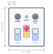

<link rel="stylesheet" type="text/css" href="../../../tools/SliderCtrl.css">
<style>
:root {
  --doc-title: "B4Slider — User Manual";
  --doc-path: ".\\SliderDoc\\uic\\projects\\b4slider\\user-manual.md";
}
</style>

# B4Slider — User Manual

**B4Slider** — four- or six-button camera slider panel

How to operate a **ready-configured** B4Slider on set.  
App: [`B4Slider.py`](https://github.com/fablab-wue/SliderCtrl/blob/main/B4Slider.py) · config: [`B4SliderConfig.py`](https://github.com/fablab-wue/SliderCtrl/blob/main/B4SliderConfig.py) (`B4S_*`).  
Shared motion / LED stack: [../../api/overview.md](../../api/overview.md). Installer hub: [../jkslider/technical/README.md](../jkslider/technical/README.md).  
One-page set card: [cheat-sheet/cheat-sheet.pdf](cheat-sheet/cheat-sheet.pdf) ([HTML source](cheat-sheet/cheat-sheet.html)).

B4Slider is a **minimal** UIC: **MOVE_L**, **MOVE_R**, **OPTION**, **SET**, one **SPEED** pot, and an RGB status LED. On a **2-axis** build add optional *MOVE_L2* and *MOVE_R2* (GP8/GP9) when SliderMC `axis2_use=1` — typical **linear travel + pan**. There is no keypad A/B/C, STOP key, DELAY, or TIMELAPSE. Soft travel limits **are** the A/B working window per axis (see [Workflow: A / B](#workflow-a--b-working-window)).

> *Italic* in this manual = optional **2nd axis** (pan). Skip those rows if your build is 1-axis only.

Optional second pot (**ACCEL**) when `B4S_USE_ACCEL_POT=1`. OLED is not required.

The panel Pico talks to a **motion board** (SliderMC) over UART, or to an MKS SERVO via [MC_MKS_Client](../../libraries/mks-servo-rs485.md). If that link is unplugged, the UI may still start, but moves will not work — see [Technical Manual — Link](../../../contract/link-and-handshake.md#communication-mc--uic).

**2-axis:** enable `axis2_use` on SliderMC and reboot (`RB`). B4Slider auto-detects `axis_count==2`, homes axis 1 then axis 2 at boot (`B4S_HOMING_ENABLED`), and exposes *MOVE_L2/R2* with the same tap/hold/latch semantics as axis 1. Dual moves (*MOVE_L*+*MOVE_L2* or *MOVE_R*+*MOVE_R2*) are [time-synced](../../../mc/dual-movement.md) after both *pan* soft limits are marked — see [2-axis mode](#2-axis-mode-pan). Wire: [protocol.md](../../../contract/protocol.md#optional-2nd-axis-axis2_use).

## Getting started

1. Power on — status LED does a rainbow while locked (if unlock is enabled).
2. **Unlock** — press **OPTION** (` * `). (Disable with `B4S_BOOT_UNLOCK = False`.)
3. **Homing** (if `B4S_HOMING_ENABLED`) — axis 1, then *axis 2* when `axis_count==2`.
4. Soft limits start at **full slider travel** (MC session window = `slider_min` / `slider_max` per axis). The shot window lives on the MC (`SL` / `SR`) until reboot — nothing is written to `mc.ini`.
5. Dial **SPEED**, then use MOVE / SET as below.

**OPTION** is a modifier: hold it with another control. Alone it does nothing (except unlock at boot).

The **Key** column uses silk labels: ` < ` MOVE_L, ` > ` MOVE_R, ` * ` OPTION, ` S ` SET. On 2-axis builds: *` <2 ` MOVE_L2*, *` >2 ` MOVE_R2* (silk may vary).

## Panel layout

**1-axis** — recommended 6U × 6U (72 × 72 mm) discrete plate on a 12 mm grid. ACCEL is optional (`B4S_USE_ACCEL_POT`).


Silk: `S` SET, `<` MOVE_L, `>` MOVE_R, `*` OPTION.

**2-axis** — same 6U width; plate height **6.5U (78 mm)** — +0.5U below the 1-axis layout. *MOVE_L2* and *MOVE_R2* sit on the row below *OPTION*, directly under *MOVE_L* / *MOVE_R*. SET, SPEED pot, and ACCEL unchanged.



Silk: axis 1 `<` / `>`; center `*`; axis 2 *`<2` / `>2`* (example labels).

## Knobs

### SPEED

- Left → slower floor; right → faster (finer at the low end; `B4S_SPEED_CURVE_GAMMA`).
- Can be changed while moving (unless OPTION is held for max-speed boost).
- Full-scale ceiling is the panel/MC max (`B4S_SPEED_MAX_MM_S` / MC `max_speed`).

### ACCEL (optional)

Only if `B4S_USE_ACCEL_POT = 1`:

- Left → gentler; right → snappier (same idea as JKSlider ACCEL).
- When the ACCEL pot is enabled, **SET hold** gestures for accel presets / learn are **off**.

Without an ACCEL pot, use **SET** holds for presets **L** (low) / **H** (high) — not related to A/B soft ends.

## Move

Cruise, jog, boost, stop, halt.

| Action | Key | Result |
|--------|-----|--------|
| **(MOVE_L / MOVE_R)** tap ≤⅓ s | ` < ` / ` > ` tap | **Locked cruise** toward that soft end at SPEED until stop, reverse, SET, halt, or arrival |
| **(MOVE_L / MOVE_R)** hold >⅓ s | ` < ` / ` > ` hold | Hold-to-run: moves while pressed; soft-stops on release |
| Same **MOVE** tip while locked | ` < ` or ` > ` tip | Soft-stop |
| Opposite **MOVE** while cruising | ` < ` or ` > ` | Reverse / retarget to the other soft end |
| **OPTION + (MOVE_L / MOVE_R)** tap / hold | ` * ` + ` < ` / ` > ` | Same as MOVE, but at panel **max speed** |
| **OPTION** hold while moving | ` * ` hold | Boost to max speed; release → back to SPEED pot |
| **SET** while moving | ` S ` | Soft-stop |
| **MOVE_L + MOVE_R** | ` < ` ` > ` | **Halt** (emergency stop); driver disabled until any key |
| **MOVE_L + MOVE_R** hold ≥ 1 s | ` < ` ` > ` hold ≥ 1 s | Swap left/right |
| **All four** (L+R+OPTION+SET) | ` < ` ` > ` ` * ` ` S ` | Halt + **reset like power-up** (full soft limits, loop off, accel preset L) |
| *MOVE_L2 / MOVE_R2* tap ≤⅓ s | *` <2 ` / ` >2 ` tap* | *Locked cruise on **axis 2** (pan) toward that soft end* |
| *MOVE_L2 / MOVE_R2* hold >⅓ s | *` <2 ` / ` >2 ` hold* | *Hold-to-run on axis 2* |
| *MOVE_L + MOVE_L2* or *MOVE_R + MOVE_R2* tap | *` < `+` <2 ` / ` > `+` >2 ` tap* | *Dual locked cruise — both axes (see [2-axis mode](#2-axis-mode-pan))* |
| *MOVE_L + MOVE_L2* or *MOVE_R + MOVE_R2* hold >⅓ s | *both held* | *Dual hold-to-run; coupled stop when **either** button released* |
| *MOVE_L2 + MOVE_R2* | *` <2 ` ` >2 `* | *Halt (same as L+R)* |
| *MOVE_L2 + MOVE_R2* hold ≥ 1 s | *` <2 ` ` >2 ` hold ≥ 1 s* | *Swap pan left/right* |

Tap vs hold uses `B4S_MOVE_TAP_MS` (default **333 ms**). *Dual chords:* timer starts when the **second** button joins — the first button alone does not start motion while you are assembling *L*+*L2*. Left is toward decreasing position when `B4S_LEFT_IS_NEGATIVE` is True (default); *axis 2* uses `B4S_LEFT2_IS_NEGATIVE` (default same).

## Soft limits (A / B window)

There are no separate PosA / PosB buttons. The two soft ends **are** the working window (A/B). MOVE cannot leave that window until you reset it. Marks vs this window: [Architecture — Marks vs working window](../../../architecture/marks-vs-working-window.md).

| Action | Key | Result |
|--------|-----|--------|
| **SET + MOVE_L** tap | ` S ` ` < ` tap | Set **soft_limit_L** = current position (white blip) |
| **SET + MOVE_R** tap | ` S ` ` > ` tap | Set **soft_limit_R** = current position (white blip) |
| **SET + MOVE_L** hold ≥ 1 s | ` S ` ` < ` hold ≥ 1 s | Reset soft_limit_L → full slider min |
| **SET + MOVE_R** hold ≥ 1 s | ` S ` ` > ` hold ≥ 1 s | Reset soft_limit_R → full slider max |
| **SET + L + R** hold ≥ 1 s | ` S ` ` < ` ` > ` hold ≥ 1 s | Reset **both** ends to full slider |
| *SET + MOVE_L2* tap | *` S ` ` <2 ` tap* | *Set **soft_limit_L2** (pan A) = current position* |
| *SET + MOVE_R2* tap | *` S ` ` >2 ` tap* | *Set **soft_limit_R2** (pan B) = current position* |
| *SET + MOVE_L2* hold ≥ 1 s | *` S ` ` <2 ` hold ≥ 1 s* | *Reset soft_limit_L2 → full pan min* |
| *SET + MOVE_R2* hold ≥ 1 s | *` S ` ` >2 ` hold ≥ 1 s* | *Reset soft_limit_R2 → full pan max* |
| *SET + L2 + R2* hold ≥ 1 s | *` S ` ` <2 ` ` >2 ` hold ≥ 1 s* | *Reset **both** pan ends to full travel* |

Travel is allowed **only** between soft_limit_L and soft_limit_R on axis 1 (*and soft_limit_L2 / soft_limit_R2 on axis 2*). MOVE cruise targets those ends (the old “goto A / B”).

## SET and OPTION

| Action | Key | Result |
|--------|-----|--------|
| **SET** tap (idle) | ` S ` tap | Nothing (avoids accidental presses) |
| **SET** hold ≥ 1 s (idle) | ` S ` hold ≥ 1 s | Accel **preset L** (low) — only if no ACCEL pot |
| **SET** hold ≥ 3 s (idle) | ` S ` hold ≥ 3 s | Accel **preset H** (high) — only if no ACCEL pot |
| **SET** hold ≥ 5 s (idle) | ` S ` hold ≥ 5 s | **Accel learn**: SPEED pot maps to accel while held; release latches into the active preset — only if no ACCEL pot |
| **OPTION + SET** tap | ` * ` ` S ` tap | Disable motor driver (dim orange LED) |
| **OPTION + SET** hold ≥ 1 s (idle) | ` * ` ` S ` hold ≥ 1 s | Toggle **loop** armed (single ↔ ping-pong between soft ends) |
| Any button while disabled | — | Re-enable driver |

While holding SET for accel, the LED flashes **white once per second** so you can count 1 / 3 / 5 without a display. Preset L / H / learn confirm with violet flashes (1 / 2 / 3).

**Loop:** arming does **not** start motion. Next MOVE cruise starts; on arrival at a soft end the carriage auto-retargets to the other end until you stop (SET / same MOVE tip / halt / all-four).

## 2-axis mode (pan)

Requires SliderMC `axis2_use=1` and a reboot. B4Slider wires *MOVE_L2* (GP8) and *MOVE_R2* (GP9).

### Sync vs setup

| Mode | When | Dual chord (*L*+*L2* / *R*+*R2*) |
|------|------|----------------------------------|
| **Setup** | Before both *pan* soft limits are marked | Both axes run at **SPEED pot** speed (independent finish times) |
| **Time-sync** | After **SET+MOVE_L2** and **SET+MOVE_R2** taps (both pan ends marked) | Both axes **finish together**; pan speed scaled by SliderMC |

Mark pan A and B with *SET+MOVE_L2/R2*; then *L+L2* / *R+R2* moves are cinematic. Before that, dual chords still work but feel like two independent jogs at pot speed.

### OPTION on dual moves (sync mode)

- **Axis 1 (travel):** `max_speed` while OPTION held.
- **Axis 2 (pan):** scaled to `max_speed × distance_ratio` so both axes still finish together.

## Color codes

RGB status LED (shared [`UIC_Base`](https://github.com/fablab-wue/SliderCtrl/blob/main/UIC_base.py)). Docs use **percent**; API uses 0…255 — see [API — RGB status LED](../../api/overview.md#rgb-status-led-led_r--led_g--led_b--optional-neopixel).

| Color / pattern | Meaning |
|------------------|---------|
| Rainbow | Boot unlock (until OPTION) |
| Dim white | Idle, enabled, single-run |
| Dim white ↔ dim blue | **Loop armed** (idle) |
| Yellow | Accelerating or decelerating |
| Green | Moving at cruise speed |
| Green / yellow + ~30% blue | Near a soft end (`B4S_NEAR_SOFT_MM`, default 3 mm) |
| Green / yellow + 100% blue | At a soft end |
| + ~10% blue while looping | Ping-pong running |
| *+ ~10% blue (idle, pan window set)* | *Dual chords will time-sync (2-axis)* |
| Dim orange | Driver **disabled** |
| Red fast blink | Hard limit |
| Red blink | Homing (if used on the motion board) |
| Solid red | DRV_ERROR / EMO |
| White blip | Soft limit set or reset confirm |
| White flash /s | SET hold second counter |
| Violet ×1 / ×2 / ×3 | Accel preset L / H / learn latched |
| Red flash (+ white ×3) | Halt / all-four power-up reset |

## Cheat card

One-page set card: [cheat-sheet/cheat-sheet.pdf](cheat-sheet/cheat-sheet.pdf) ([HTML](cheat-sheet/cheat-sheet.html)).

## Workflow: normal moving

1. **Unlock** with OPTION.
2. Dial **SPEED** (and ACCEL pot or SET presets L/H if no ACCEL pot).
3. **Tap** **MOVE_L** / **MOVE_R** for a short burst move: release within ~⅓ s and the slider continues cruising toward that soft end until you stop it, reverse it, or reach the limit.
4. **Hold** **MOVE_L** / **MOVE_R** longer than ~⅓ s for hold-to-run. The carriage moves while the button is down; release stops it.
5. **Same-side tap while cruising** stops the cruise; **opposite-side tap** reverses direction. This makes the move buttons behave like a left/right lock-and-stop control rather than a raw jog.
6. **OPTION before MOVE_L / MOVE_R** changes the start condition: when OPTION is already down before the move starts, the slider launches with **max speed + max accel**.
7. **OPTION during movement** is a speed boost only: **speed goes to max_speed**, while **accel stays at the current pot/preset value** until OPTION is released.
8. If you want to keep the current pot accel but make the move faster, hold OPTION after the move is already running. If you want the full startup acceleration burst, press OPTION before the move.
9. **SET** while moving soft-stops the carriage. **MOVE_L + MOVE_R** is the emergency halt; any button re-enables the driver after a disabled state.
10. **All four** (MOVE_L + MOVE_R + OPTION + SET) resets the session like power-up and clears the soft-limit / loop state.

## Workflow: A / B (working window)

Use the two working-window ends as A and B.

1. **Unlock** — press OPTION if the LED is still rainbow.
2. **Open the window** (optional) — if limits were shrunk earlier: **SET + L + R** hold ≥ 1 s to restore full travel.
3. **Frame end A** — MOVE or hold-jog to the first pose. Press **SET + MOVE_L** tap → soft_limit_L saved (white blip).
4. **Frame end B** — move to the second pose. **SET + MOVE_R** tap → soft_limit_R saved.
5. **Rehearse** — dial SPEED; **MOVE_L** or **MOVE_R** tap to cruise to that end. Same tip stops; opposite tip reverses.
6. **Loop (optional)** — idle: **OPTION + SET** hold ≥ 1 s (LED white↔blue). Then MOVE tap; carriage ping-pongs until SET / same tip / L+R.
7. **Boost** — hold OPTION while moving, or start with OPTION+MOVE, for max speed.
8. **Reset ends** — SET+MOVE hold ≥ 1 s resets that side to full slider; or all-four for a full session reset.

## Workflow: pan A / B (*2-axis*)

1. **Unlock** and complete boot homing (axis 1, then axis 2).
2. **Frame pan A** — *MOVE_L2* or *MOVE_R2* to the first pan pose. **SET + MOVE_L2** tap → *soft_limit_L2* (white blip).
3. **Frame pan B** — move to the second pan pose. **SET + MOVE_R2** tap → *soft_limit_R2*.
4. LED shows a steady *+blue* tint when both pan limits are marked — dual chords will time-sync.
5. **Rehearse** — **MOVE_L + MOVE_L2** tap (assemble both within ~⅓ s, release both) for a coordinated travel+pan move.
6. **OPTION** during sync move boosts travel to max speed; pan keeps pace automatically.

## Config entries

Edit [`B4SliderConfig.py`](https://github.com/fablab-wue/SliderCtrl/blob/main/B4SliderConfig.py) defaults, or overlay via `SliderPins.py`:

```python
B4Slider = { ... }      # consumed by B4SliderConfig.py
UIC_config = { ... }    # shared LED / OLED / camera (UIC_Base)
MC_config = { ... }     # UART / floors (MC_Client)
```

### Panel (`B4S_*` / pins)

| Key | Default | Meaning |
|-----|---------|---------|
| `PIN_BTN_MOVE_L` / `MOVE_R` | 6 / 7 | `<` / `>` |
| *`PIN_BTN_MOVE_L2` / `MOVE_R2`* | *8 / 9* | *`<2` / `>2` (axis 2)* |
| `PIN_BTN_OPTION` | 13 | `*` |
| `PIN_BTN_SET` | 5 | `S` (was STOP on JKSlider discrete map) |
| `PIN_POT_SPEED` | 26 | SPEED ADC |
| `PIN_POT_ACCEL` | 27 | ACCEL ADC if used |
| `B4S_USE_ACCEL_POT` | `0` | `1` = ACCEL pot on; disables SET accel holds |
| `B4S_ACCEL_PRESET_L` / `_H` | 100 / 400 | mm/s² presets (no ACCEL pot) |
| `B4S_SPEED_MIN_MM_S` | 1.0 | SPEED pot floor |
| `B4S_SPEED_MAX_MM_S` | 100.0 | Panel ceiling (also clamped by MC) |
| `B4S_ACCEL_MIN_MM_S2` / `_MAX_` | 50 / 500 | ACCEL pot range / learn range |
| `B4S_MOVE_TAP_MS` | 333 | Tap vs hold threshold (~⅓ s) |
| *`B4S_CHORD_TAP_MS`* | *333* | *Dual-chord tap threshold (defaults to MOVE_TAP)* |
| `B4S_LONG_PRESS_MS` | 1000 | ≥ 1 s |
| `B4S_EXTRA_LONG_MS` | 3000 | ≥ 3 s |
| `B4S_LEARN_HOLD_MS` | 5000 | ≥ 5 s accel learn |
| `B4S_LEFT_IS_NEGATIVE` | `True` | Left toward decreasing mm |
| *`B4S_LEFT2_IS_NEGATIVE`* | *`True`* | *Pan left toward decreasing units* |
| *`B4S_HOMING_ENABLED`* | *`True`* | *Boot homing axis 1, then axis 2* |
| `B4S_NEAR_SOFT_MM` | 3.0 | Near-soft LED distance (also sets UIC warn) |
| `B4S_LOOP_BLUE_ADD` | 26 | ~10% blue while looping (0…255) |
| *`B4S_SYNC_BLUE_ADD`* | *26* | *~10% blue when pan window defined (idle)* |
| `B4S_BOOT_UNLOCK` | `True` | Require OPTION before enable |
| `B4S_LED_FLASH_ON_MS` / `_OFF_` | 80 | Flash timing |
| `B4S_LED_BLIP_MS` | 120 | Soft-limit confirm blip |
| `B4S_LED_PINGPONG_MS` | 600 | Loop-armed white↔blue period |

### Shared LED (`UIC_config`)

| Key | Default | Meaning |
|-----|---------|---------|
| `SOFT_LIMIT_WARN_MM` | 10.0 | Near-soft distance (B4Slider overwrites from `B4S_NEAR_SOFT_MM` at run) |
| `LED_SOFT_NEAR_BLUE_ADD` | 76 | ~30% blue add (0…255) |
| `LED_SOFT_AT_BLUE_ADD` | 255 | 100% blue add at soft end |
| `LED_DIM_WHITE` / `LED_DIM_ORANGE` | 0.12 | Idle / disabled duty (0…1) |
| `LED_BLINK_HARD_LIMIT_MS` | 80 | Hard-limit red blink half-period |

Deep wiring, SliderMC, and library details: [Technical Manual](../../../uic/projects/jkslider/technical/README.md), [API](../../api/overview.md), [ARCHITECTURE](../../../architecture/overview.md).
