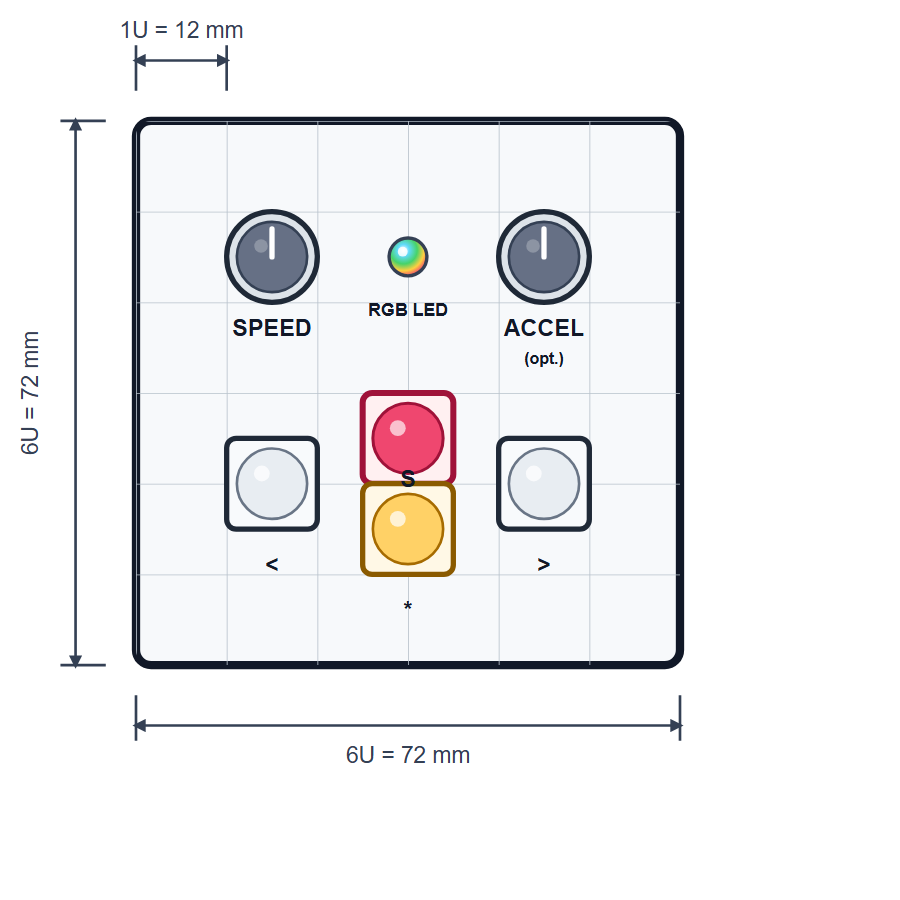

<link rel="stylesheet" type="text/css" href="../../../tools/SliderCtrl.css">
<style>
:root {
  --doc-title: "B4Slider — User Manual";
  --doc-path: ".\\SliderDoc\\uic\\projects\\b4slider\\user-manual.md";
}
</style>

# B4Slider — User Manual

**B4Slider** — AXIS-select camera slider panel (1–5 packed axes)

How to operate a **ready-configured** B4Slider on set.  
App: [`B4Slider.py`](https://github.com/fablab-wue/SliderCtrl/blob/main/B4Slider.py) · config: [`B4SliderConfig.py`](https://github.com/fablab-wue/SliderCtrl/blob/main/B4SliderConfig.py) (`B4S_*`).  
Shared motion / LED stack: [../../api/overview.md](../../api/overview.md). Installer hub: [../jkslider/technical/README.md](../jkslider/technical/README.md).  
One-page set card: [cheat-sheet/cheat-sheet.pdf](cheat-sheet/cheat-sheet.pdf) ([HTML source](cheat-sheet/cheat-sheet.html)).

B4Slider is a **minimal** UIC: **MOVE_L**, **MOVE_R**, **OPTION**, **SET**, **AXIS_1..5**, SPEED/ACCEL (pot or rotary), RGB LED, optional OLED. There is no keypad A/B/C, STOP key, DELAY, or TIMELAPSE. Soft travel limits **are** the A/B working window on the **selected** axes (see [Workflow: A / B](#workflow-a--b-working-window)).

Firmware always wires **AXIS_1..5**. A chord is legal iff every held key `k` is `≤ mc.getAxisCount()` (packed motors+servos, up to 6). There is **no AXIS_6** button. Illegal chords flash **blue** and keep the last valid mask. Boot selection is axis **1**. OLED shows `Ax 1+5` (and similar).

**Recommended silk** is `1` `2` `3` on [`B4S_button_layout_3axis.svg`](../../../assets/img/B4S_button_layout_3axis.svg) — typical slider + pan + tilt. AXIS_4/5 are optional extras on the pinout; they are **not** drawn on this plate.

MOVE_L/R apply to the **current selection**. One `moveTo` uses skip `_` on unselected slots so SliderMC [time-syncs](../../../mc/dual-movement.md) the selected axes. Homing at boot is motors `1..getMotorCount()` only (no servos).

The panel Pico talks to a **motion board** (SliderMC) over UART, or to an MKS SERVO via [MC_MKS_Client](../../libraries/mks-servo-rs485.md). If that link is unplugged, the UI may still start, but moves will not work — see [Technical Manual — Link](../../../contract/link-and-handshake.md#communication-mc--uic).

**Shutter** is SliderMC `CT` / `PIN_CAMERA_CTRL` — not a UIC GPIO. Pico **GP22** and Zero **GP29** are free on the B4 pinout.

## Getting started

1. Power on — status LED does a rainbow while locked (if unlock is enabled).
2. **Unlock** — press **OPTION** (` * `). (Disable with `B4S_BOOT_UNLOCK = False`.)
3. **Homing** (if `B4S_HOMING_ENABLED`) — motors `1..getMotorCount()` in order. Servos are not homed.
4. Soft limits start at the MC envelope per axis (`MOTOR_N_min` / `MOTOR_N_max`, or servo envelopes). If a side is missing, B4Slider uses **±2000** locally. The shot window lives on the MC (`SL` / `SR`) until reboot — nothing is written to `mc.ini`.
5. Boot AXIS selection is **1**. Hold AXIS keys to change it (white flash N times; OLED `Ax …`).
6. Dial **SPEED**, then use MOVE / SET as below.

**OPTION** is a modifier: hold it with another control. Alone it does nothing (except unlock at boot).

The **Key** column uses silk labels: ` < ` MOVE_L, ` > ` MOVE_R, ` * ` OPTION, ` S ` SET, `1`…`5` AXIS.

## Panel layout

**1-axis** — recommended 6U × 6U (72 × 72 mm) discrete plate on a 12 mm grid.



Silk: `S` SET, `<` MOVE_L, `>` MOVE_R, `*` OPTION.

**Typical 3-axis** — same 6U width; plate height **6.5U (78 mm)**. AXIS `1` `2` `3` are a glued row centred under OPTION (½U gap). SET, SPEED, and ACCEL unchanged. AXIS_4/5 are optional hardware, not on this silk.


## Axis selection

Selection is the set of **currently pressed** AXIS keys. Releasing all AXIS keys **keeps** the last valid mask.

| Situation | Result |
|-----------|--------|
| Boot | Axis 1 |
| Hold `1` | Axis 1 |
| Hold `1`+`3` | Axes 1 and 3 — OLED `Ax 1+3`, white flash twice |
| Hold `1`+`4`+`5` | Axes 1, 4, 5 if `getAxisCount() ≥ 5` |
| Hold `5` when `getAxisCount() == 2` | **Invalid** — blue fast blink; mask unchanged |
| All AXIS released | Keep last valid mask |

You may change the mask while moving. MOVE then retargets the new selection on the next cruise start.

## Knobs

### SPEED

- **Pot** (`B4S_SPEED_INPUT = "pot"`, default): left → slower floor; right → faster (finer at the low end; `B4S_SPEED_CURVE_GAMMA`).
- **Rotary** (`B4S_SPEED_INPUT = "rotary"`): quadrature encoder. Boot value is **vmax/8**. Limits `[vmax/128, vmax]`. Detents `(raw + 2) // 4`. Green blink only when the value **enters** a clamp (not while held at the rail).
- Pico encoder pads: ENC_SPEED **GP14/15**. Zero overlay: **GP24/25** (underside). `pin_b` must be `pin_a + 1`.
- Can be changed while moving (unless OPTION is held for max-speed boost).
- Full-scale ceiling is the panel/MC max (`B4S_SPEED_MAX_MM_S` / MC `max_speed_1`).

### ACCEL

`B4S_ACCEL_INPUT` is `"pot"` (default), `"rotary"`, or `"set"`. Legacy overlay `B4S_USE_ACCEL_POT=0` without `B4S_ACCEL_INPUT` keeps SET-button accel.

- **Pot:** left → gentler; right → snappier. SET hold presets / learn are **off**.
- **Rotary:** same encoder rules as SPEED. Pico ENC_ACCEL **GP18/19**; Zero **GP22/23**.
- **Set:** no ACCEL pot/encoder. Use **SET** holds for presets **L** (low) / **H** (high) — not related to A/B soft ends.

## Move

Cruise, jog, boost, stop, halt. MOVE always acts on the **current AXIS selection**.

| Action | Key | Result |
|--------|-----|--------|
| **(MOVE_L / MOVE_R)** tap ≤⅓ s | ` < ` / ` > ` tap | **Locked cruise** of selected axes toward that soft end at SPEED until stop, reverse, SET, halt, or arrival |
| **(MOVE_L / MOVE_R)** hold >⅓ s | ` < ` / ` > ` hold | Hold-to-run: moves while pressed; soft-stops on release |
| Same **MOVE** tip while locked | ` < ` or ` > ` tip | Soft-stop |
| Opposite **MOVE** while cruising | ` < ` or ` > ` | Reverse / retarget to the other soft end |
| **OPTION + (MOVE_L / MOVE_R)** tap / hold | ` * ` + ` < ` / ` > ` | Same as MOVE, but at panel **max speed** |
| **OPTION** hold while moving | ` * ` hold | Boost to max speed; release → back to SPEED |
| **SET** while moving | ` S ` | Soft-stop |
| **MOVE_L + MOVE_R** | ` < ` ` > ` | **Halt** (emergency stop); driver disabled until any key |
| **MOVE_L + MOVE_R** hold ≥ 1 s | ` < ` ` > ` hold ≥ 1 s | Swap left/right |
| **All four** (L+R+OPTION+SET) | ` < ` ` > ` ` * ` ` S ` | Halt + **reset like power-up** (full soft limits, loop off, accel preset L) |

Tap vs hold uses `B4S_MOVE_TAP_MS` (default **333 ms**). Unselected axes are sent as skip `_` in `MT`, so a 1+3 chord is time-synced travel+tilt while pan stays put. Left is toward decreasing position when `B4S_LEFT_IS_NEGATIVE` is True (default); axes 2–5 use `B4S_LEFT2_IS_NEGATIVE` … `B4S_LEFT5_IS_NEGATIVE` (default same).

## Soft limits (A / B window)

There are no separate PosA / PosB buttons. The two soft ends **are** the working window (A/B). MOVE cannot leave that window until you reset it. Marks vs this window: [Architecture — Marks vs working window](../../../architecture/marks-vs-working-window.md).

SET + MOVE applies to **selected** axes only.

| Action | Key | Result |
|--------|-----|--------|
| **SET + MOVE_L** tap | ` S ` ` < ` tap | Set **soft_limit_L** = current position on each selected axis (white blip) |
| **SET + MOVE_R** tap | ` S ` ` > ` tap | Set **soft_limit_R** = current position on each selected axis (white blip) |
| **SET + MOVE_L** hold ≥ 1 s | ` S ` ` < ` hold ≥ 1 s | Reset those left ends → envelope min (or **−2000** if missing) |
| **SET + MOVE_R** hold ≥ 1 s | ` S ` ` > ` hold ≥ 1 s | Reset those right ends → envelope max (or **+2000** if missing) |
| **SET + L + R** hold ≥ 1 s | ` S ` ` < ` ` > ` hold ≥ 1 s | Reset **both** ends on selected axes |

Travel is allowed **only** between the working-window ends on each selected axis. MOVE cruise targets those ends (the old “goto A / B”).

## SET and OPTION

| Action | Key | Result |
|--------|-----|--------|
| **SET** tap (idle) | ` S ` tap | Nothing (avoids accidental presses) |
| **SET** hold ≥ 1 s (idle) | ` S ` hold ≥ 1 s | Accel **preset L** (low) — only if `B4S_ACCEL_INPUT` is `"set"` |
| **SET** hold ≥ 3 s (idle) | ` S ` hold ≥ 3 s | Accel **preset H** (high) — only if `"set"` |
| **SET** hold ≥ 5 s (idle) | ` S ` hold ≥ 5 s | **Accel learn**: SPEED pot maps to accel while held; release latches into the active preset — only if `"set"` |
| **OPTION + SET** tap | ` * ` ` S ` tap | Disable motor driver (dim orange LED) |
| **OPTION + SET** hold ≥ 1 s (idle) | ` * ` ` S ` hold ≥ 1 s | Toggle **loop** armed (single ↔ ping-pong between soft ends) |
| Any button while disabled | — | Re-enable driver |

While holding SET for accel, the LED flashes **white once per second** so you can count 1 / 3 / 5 without a display. Preset L / H / learn confirm with violet flashes (1 / 2 / 3).

**Loop:** arming does **not** start motion. Next MOVE cruise starts; on arrival at a soft end the carriage auto-retargets to the other end until you stop (SET / same MOVE tip / halt / all-four).

## Multi-axis (packed)

Requires SliderMC packed channels (`CS motors` / `CS servos`; banner `{motors}+{servos} axis`). B4Slider uses `getAxisCount()`, not motors-only, for AXIS validity.

Select the axes you want, then MOVE. One skipped `MT` keeps idle axes still and [time-syncs](../../../mc/dual-movement.md) the rest.

Typical 3-axis kit: AXIS `1` travel, `2` pan, `3` tilt on the recommended plate. Larger kits add AXIS_4/5 on the extra GPIOs.

## Color codes

RGB status LED (shared [`UIC_Base`](https://github.com/fablab-wue/SliderCtrl/blob/main/UIC_base.py)). Docs use **percent**; API uses 0…255 — see [API — RGB status LED](../../api/overview.md#rgb-status-led-led_r--led_g--led_b--optional-neopixel).

| Color / pattern | Meaning |
|------------------|---------|
| Rainbow | Boot unlock (until OPTION) |
| Dim white | Idle, enabled, single-run |
| Dim white ↔ dim blue | **Loop armed** (idle) |
| Yellow | Accelerating or decelerating |
| Green | Moving at cruise speed |
| Green / yellow + ~30% blue | Near a soft end (`B4S_NEAR_SOFT_MM`, default 3 mm) |
| Green / yellow + 100% blue | At a soft end |
| + ~10% blue while looping | Ping-pong running |
| Dim orange | Driver **disabled** |
| Red fast blink | Hard limit |
| Red blink | Homing (if used on the motion board) |
| Solid red | DRV_ERROR / EMO |
| White flash ×N (N ≤ 5) | Valid AXIS selection changed (N = how many keys in the mask) |
| Blue fast blink | Illegal AXIS chord (kept previous mask) |
| Green blink | Rotary SPEED/ACCEL **entered** min or max clamp |
| White blip | Soft limit set or reset confirm |
| White flash /s | SET hold second counter |
| Violet ×1 / ×2 / ×3 | Accel preset L / H / learn latched |
| Red flash (+ white ×3) | Halt / all-four power-up reset |

## Cheat card

One-page set card: [cheat-sheet/cheat-sheet.pdf](cheat-sheet/cheat-sheet.pdf) ([HTML](cheat-sheet/cheat-sheet.html)).

## Workflow: normal moving

1. **Unlock** with OPTION.
2. Dial **SPEED** (and ACCEL pot/rotary or SET presets L/H if accel is `"set"`).
3. Select axes (or leave boot axis 1).
4. **Tap** **MOVE_L** / **MOVE_R** for a short burst move: release within ~⅓ s and the selection continues cruising toward that soft end until you stop it, reverse it, or reach the limit.
5. **Hold** **MOVE_L** / **MOVE_R** longer than ~⅓ s for hold-to-run. Release stops it.
6. **Same-side tap while cruising** stops the cruise; **opposite-side tap** reverses direction.
7. **OPTION before MOVE_L / MOVE_R** launches with **max speed + max accel**.
8. **OPTION during movement** is a speed boost only: **speed goes to max**, while **accel stays** at the current pot/rotary/preset until OPTION is released.
9. **SET** while moving soft-stops. **MOVE_L + MOVE_R** is the emergency halt; any button re-enables the driver after a disabled state.
10. **All four** (MOVE_L + MOVE_R + OPTION + SET) resets the session like power-up and clears the soft-limit / loop state.

## Workflow: A / B (working window)

Use the two working-window ends as A and B on the **selected** axes.

1. **Unlock** — press OPTION if the LED is still rainbow.
2. **Select** the axes you are framing (e.g. hold `1`+`2`).
3. **Open the window** (optional) — if limits were shrunk earlier: **SET + L + R** hold ≥ 1 s to restore the envelope (or ±2000 fallback).
4. **Frame end A** — MOVE or hold-jog to the first pose. Press **SET + MOVE_L** tap → left ends saved (white blip).
5. **Frame end B** — move to the second pose. **SET + MOVE_R** tap → right ends saved.
6. **Rehearse** — dial SPEED; **MOVE_L** or **MOVE_R** tap to cruise to that end. Same tip stops; opposite tip reverses.
7. **Loop (optional)** — idle: **OPTION + SET** hold ≥ 1 s (LED white↔blue). Then MOVE tap; selection ping-pongs until SET / same tip / L+R.
8. **Boost** — hold OPTION while moving, or start with OPTION+MOVE, for max speed.
9. **Reset ends** — SET+MOVE hold ≥ 1 s resets that side; or all-four for a full session reset.

## Config entries

Edit [`B4SliderConfig.py`](https://github.com/fablab-wue/SliderCtrl/blob/main/B4SliderConfig.py) defaults, or overlay via `SliderPins.py`:

```python
B4Slider = { ... }      # consumed by B4SliderConfig.py
UIC_config = { ... }    # shared LED / OLED (UIC_Base)
MC_config = { ... }     # UART / floors (MC_Client)
```

RP2040-Zero: also `B4Slider.update(RP2040_ZERO_B4Slider)` from [`SliderPins.example.py`](https://github.com/fablab-wue/SliderCtrl/blob/main/SliderPins.example.py).

There is **no** UIC camera pin and **no** MOVE_L2/R2.

### Panel (`B4S_*` / pins)

| Key | Default (Pico) | Meaning |
|-----|----------------|---------|
| `PIN_BTN_MOVE_L` / `MOVE_R` | 6 / 7 | `<` / `>` (Zero overlay: 1 / 2) |
| `PIN_BTN_AXIS_1` … `AXIS_5` | 12 / 11 / 10 / 9 / 8 | AXIS keys (Zero: GP3…7) |
| `PIN_BTN_OPTION` | 13 | `*` (Zero: GP8) |
| `PIN_BTN_SET` | 5 | `S` (Zero: GP0; was STOP on JKSlider discrete map) |
| `PIN_POT_SPEED` / `POT_ACCEL` | 26 / 27 | SPEED / ACCEL ADC |
| `PIN_ENC_SPEED_A` / `_B` | 14 / 15 | SPEED rotary (Zero: 24 / 25) |
| `PIN_ENC_ACCEL_A` / `_B` | 18 / 19 | ACCEL rotary (Zero: 22 / 23) |
| `B4S_SPEED_INPUT` | `"pot"` | `"pot"` \| `"rotary"` |
| `B4S_ACCEL_INPUT` | `"pot"` | `"pot"` \| `"rotary"` \| `"set"` |
| `B4S_SPEED_QD_MODE` / `B4S_ACCEL_QD_MODE` | 11 | 1..4 linear, 11..14 log |
| `B4S_ACCEL_PRESET_L` / `_H` | 100 / 400 | mm/s² presets when accel is `"set"` |
| `B4S_SPEED_MIN_MM_S` | 1.0 | SPEED pot floor |
| `B4S_SPEED_MAX_MM_S` | 100.0 | Panel ceiling (also clamped by MC) |
| `B4S_ACCEL_MIN_MM_S2` / `_MAX_` | 50 / 500 | ACCEL range |
| `B4S_SOFT_FALLBACK_MIN` / `_MAX` | −2000 / 2000 | Envelope side if MC has none |
| `B4S_MOVE_TAP_MS` | 333 | Tap vs hold threshold (~⅓ s) |
| `B4S_LONG_PRESS_MS` | 1000 | ≥ 1 s |
| `B4S_EXTRA_LONG_MS` | 3000 | ≥ 3 s |
| `B4S_LEARN_HOLD_MS` | 5000 | ≥ 5 s accel learn |
| `B4S_LEFT_IS_NEGATIVE` | `True` | Left toward decreasing mm |
| `B4S_LEFT2_IS_NEGATIVE` … `LEFT5` | `True` | Same per extra axis |
| `B4S_HOMING_ENABLED` | `True` | Boot homing motors `1..getMotorCount()` |
| `B4S_NEAR_SOFT_MM` | 3.0 | Near-soft LED distance (also sets UIC warn) |
| `B4S_LOOP_BLUE_ADD` | 26 | ~10% blue while looping (0…255) |
| `B4S_BOOT_UNLOCK` | `True` | Require OPTION before enable |
| `B4S_LED_FLASH_ON_MS` / `_OFF_` | 80 | Flash timing |
| `B4S_LED_BLIP_MS` | 120 | Soft-limit confirm blip |
| `B4S_LED_PINGPONG_MS` | 600 | Loop-armed white↔blue period |

### Shared LED (`UIC_config`)

| Key | Default | Meaning |
|-----|---------|---------|
| `SOFT_LIMIT_WARN_MM` | 10.0 | Near-soft distance (B4Slider overwrites from `B4S_NEAR_SOFT_MM` at run) |
| `LED_SOFT_NEAR_BLUE_ADD` | 76 | ~30% blue add (0…255) |
| `LED_SOFT_AT_BLUE_ADD` | 255 | 100% blue add at soft end |
| `LED_DIM_WHITE` / `LED_DIM_ORANGE` | 0.12 | Idle / disabled duty (0…1) |
| `LED_BLINK_HARD_LIMIT_MS` | 80 | Hard-limit red blink half-period |

Deep wiring, SliderMC, and library details: [Technical Manual](../../../uic/projects/jkslider/technical/README.md), [API](../../api/overview.md), [ARCHITECTURE](../../../architecture/overview.md).
